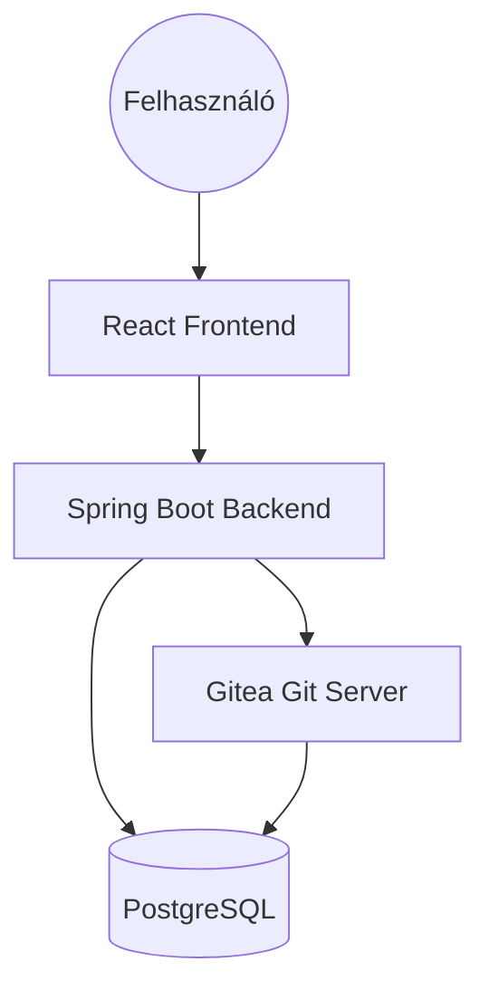

# 🚀 LégyMérnök.hu (Be an Engineer)

> *"A tudás határa a csillagos ég."*

A **LégyMérnök.hu** egy nyílt forráskódú, gamifikált oktatási platform, amelynek célja a mérnöki gondolkodásmód és gyakorlati készségek (szoftverfejlesztés, elektronika) átadása. A rendszer egy űr-témájú narratívára épül, ahol a hallgatók ("Kadétok") küldetéseket teljesítenek, valós kódot írnak, és áramköröket terveznek.

---

## 🛠️ Technológiai Stack

A projekt modern, ipari szabványokra épülő technológiákat használ:

### Backend (Mission Control)
*   **Nyelv:** Java 17
*   **Keretrendszer:** Spring Boot 3.x
*   **Adatbázis:** PostgreSQL 16
*   **Biztonság:** Spring Security, JWT (Stateless Authentication)
*   **API Dokumentáció:** SpringDoc OpenAPI (Swagger UI)
*   **Tesztelés:** JUnit 5, Mockito

### Frontend (Cockpit)
*   **Keretrendszer:** React 18
*   **Build Tool:** Vite
*   **Nyelv:** TypeScript
*   **Szerkesztő:** Monaco Editor (tervezett integráció)

### DevOps & Infrastruktúra
*   **Konténerizáció:** Docker & Docker Compose (Teljes környezet egy parancsra)
*   **Verziókezelés (Internal):** **Gitea** (Self-hosted Git Server) - *A rendszer lelke.* Minden feladat és minden diák megoldása dedikált Git repository-ban tárolódik.

---

## 🏗️ Architektúra

A rendszer mikroszerviz-jellegű, de monorepóban kezelt architektúrát követ. A komponensek Docker konténerekben futnak és egy belső hálózaton (`legymernok-net`) kommunikálnak.



### Kiemelt Funkció: Gitea Automatizáció
A rendszer nem csak tárolja a kódot, hanem **menedzseli** is a Git szervert.
*   **Admin Flow:** Amikor az oktató létrehoz egy feladatot, a Backend automatikusan létrehoz egy *Template Repository*-t Giteán, és feltölti a kezdő kódot.
*   **Student Flow (Terv):** Amikor a diák elindít egy feladatot, a rendszer "Smart Copy" módszerrel létrehoz neki egy privát repót, ami csak a megoldandó feladatot tartalmazza (a megoldókulcs nélkül).

---

## 💾 Adatbázis Séma

Az adatbázis (`legymernok` DB) a felhasználókat, kurzusokat és a haladást tárolja. A Git repository-k metaadatai (URL-ek) is itt vannak, de a forráskód a Gitea-ban lakik.

**Főbb Entitások:**
*   **`Cadet`**: Felhasználó (Admin / Cadet szerepkörrel).
*   **`StarSystem`**: Kurzus / Témakör (pl. "Java Alapok").
*   **`Mission`**: Egy konkrét lecke/feladat. Tartalmazza a leírást és a *Template Repo URL*-t.
*   **`CadetMission`**: A diák és a feladat kapcsolata (Status, *Student Repo URL*).

*Részletes leírás: [`plans/database_schema.md`](plans/database_schema.md)*

---

## 🚦 Projekt Státusz

A projekt jelenleg az **Adminisztrációs és Tartalomgyártó (Mérföldkő 1)** fázis végén jár.

### ✅ Megvalósítva (KÉSZ)
*   [x] **Infrastruktúra:** Stabil Docker Compose környezet.
*   [x] **Backend Core:** Rétegzett Spring Boot architektúra.
*   [x] **Biztonság:** Regisztráció, Login, JWT Tokenek (Role-based), Jelszó hash.
*   [x] **Gitea Integráció (Full CRUD):**
    *   User létrehozás/törlés.
    *   Repo létrehozás/törlés API-n keresztül.
    *   Fájl feltöltés API-n keresztül.
*   [x] **Tartalomkezelés:** Kurzusok és Feladatok létrehozása (a kód automatikus feltöltésével Giteára).
*   [x] **Dokumentáció:** Swagger UI (`/swagger-ui.html`).

### 🚧 Folyamatban / Tervezett
*   [ ] **Frontend Admin UI:** React felület a fenti backend funkciókhoz.
*   [ ] **Student Flow:** "Start Mission" gomb -> Diák repó generálása.
*   [ ] **Runner:** Docker alapú kódkiértékelő rendszer.

*Részletes ütemterv: [`plans/terv.md`](plans/terv.md)*

---

## 🚀 Getting Started (Telepítés és Futtatás)

### Előfeltételek
*   Docker és Docker Compose telepítve.
*   (Opcionális) Java 17+ és Node.js a helyi fejlesztéshez.

### Indítás
Egyetlen paranccsal elindítható a teljes rendszer:

```bash
docker compose up --build -d
```

Ez elindítja a következő szolgáltatásokat:
*   **Frontend:** `http://localhost:3000`
*   **Gitea:** `http://localhost:3001`
*   **Backend API:** `http://localhost:8080`
*   **Swagger UI:** `http://localhost:8080/swagger-ui/index.html`
*   **PostgreSQL:** `localhost:5432`

### Első Lépések (Setup)
1.  **Gitea Admin:** Az első indításkor nyisd meg a `localhost:3001`-et. A telepítőnél állítsd be az admin fiókot (`legymernok_admin`).
    *   *Tipp:* A `docker-compose.yml` és `application.properties` már előre konfigurált értékeket tartalmaz, ezeket használd!
2.  **Backend Admin:** Hozz létre egy admint a Backend oldalon is (vagy használd a Gitea szinkronizációt).

---

## 🧪 Fejlesztés és Tesztelés

### API Tesztelés (Bruno / Swagger)
A fejlesztéshez ajánlott a **Bruno** használata, vagy a beépített **Swagger UI**.
*   **Swagger UI:** [http://localhost:8080/swagger-ui/index.html](http://localhost:8080/swagger-ui/index.html) - Itt kipróbálhatod az összes végpontot.

### Backend Fejlesztés
A backend mappa egy szabványos Maven projekt.
*   Build: `./mvnw clean install`
*   Futtatás (lokálisan): `./mvnw spring-boot:run`
*   Tesztek: `./mvnw test`

### Frontend Fejlesztés
A frontend mappa egy Vite + React projekt.
*   Install: `npm install`
*   Dev Server: `npm run dev`

---

## 📂 Dokumentációk
A `plans` mappában találod a részletes tervezési dokumentumokat:
*   [`terv.md`](plans/terv.md) - Részletes roadmap.
*   [`api_spec.md`](plans/api_spec.md) - API specifikáció.
*   [`database_schema.md`](plans/database_schema.md) - Adatbázis terv.
*   [`CHANGELOG.md`](CHANGELOG.md) - Fejlesztési napló.
