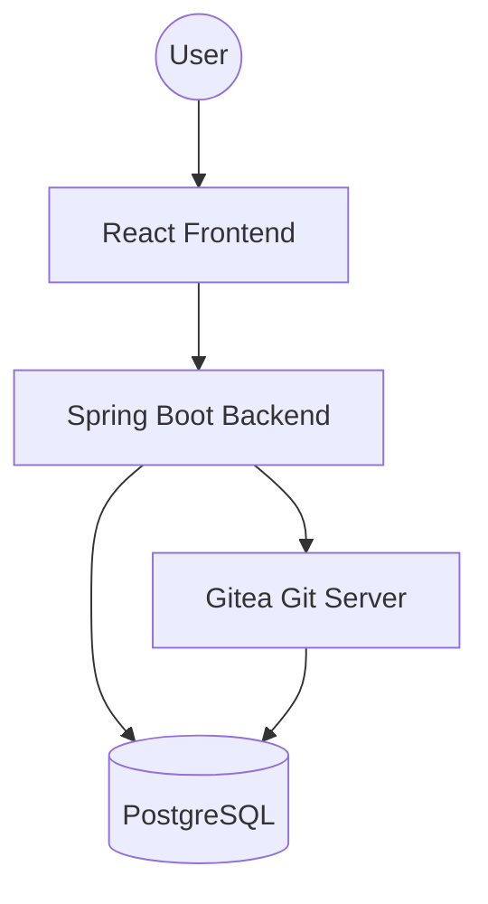

# LégyMérnök.hu (Be an Engineer)

> _"Knowledge has no limit but the stars."_

**LégyMérnök.hu** is a gamified education platform for teaching practical engineering skills — software development and, longer-term, electronics — built around a space-themed narrative. Learners ("Cadets") complete missions inside **star systems** (courses): they write real code, answer quizzes, and fill in structured exercises, with every submission tracked in a dedicated Git repository.

---

## Tech stack

### Backend (Mission Control)

- **Language:** Java 17
- **Framework:** Spring Boot 3.4
- **Database:** PostgreSQL 16 (with `pgvector` for semantic search)
- **Security:** Spring Security, stateless JWT auth, permission-based RBAC
- **API docs:** SpringDoc OpenAPI (Swagger UI)
- **Testing:** JUnit 5, Mockito

### Frontend (Cockpit)

- **Framework:** React 19
- **Build tool:** Vite 7
- **Language:** TypeScript
- **Editor:** Monaco Editor (for coding missions)

### DevOps & infrastructure

- **Containerization:** Docker & Docker Compose — the full stack comes up with one command.
- **Internal version control:** self-hosted **Gitea**, the backbone of the platform — every mission and every cadet's submission lives in its own Git repository, with Gitea Actions running the automated checks.

---

## Architecture

A monorepo housing a set of Docker services that talk to each other over an internal network (`legymernok-net`):


```mermaid
graph TD
    User((User)) --> Frontend
    Frontend[React Frontend] --> Backend[Spring Boot Backend]
    Backend --> DB[(PostgreSQL)]
    Backend --> Gitea[Gitea Git Server]
    Gitea --> DB
```

### Gitea automation

The backend doesn't just store code — it actively manages the Git server on the platform's behalf:

- **Admin flow:** when an instructor creates a coding mission through the Mission Forge editor, the backend automatically provisions a template repository on Gitea and pushes the starter code.
- **Cadet flow:** when a cadet starts a mission, the backend copies the relevant files into a repository the cadet has write access to, keeps solution files out of reach, and reports Gitea Actions results back to the platform as the mission's verification status.

---

## Data model

The core entities, in brief:

- **`Cadet`** — a platform user (Cadet or Admin role, RBAC-based permissions beyond that).
- **`StarSystem`** — a course/topic (e.g. "Java Fundamentals").
- **`Mission`** — a single lesson or exercise. Comes in several types — `CODING`, `QUIZ`, `FILL_IN_BLANK`, `CONTENT`, `CIRCUIT_SIMULATION` — each with its own dedicated data model and verification flow.
- **`CadetMission`** — links a cadet to a mission (status, repository URL, progress).

---

## Project status

The core platform is live and in active use: authentication, course/mission authoring (including the Mission Forge editor with Monaco), Gitea-backed coding missions with automated verification, quizzes, fill-in-the-blank exercises, and an admin dashboard are all implemented and covered by backend/frontend tests and Cypress E2E suites.

Development happens in small, frequent PRs — the day-to-day roadmap and design decisions are tracked in [`plans/`](plans/) rather than in this README, so check there for the current state of any specific feature rather than relying on this section, which we don't always remember to update in lockstep.

---

## Getting started

### Prerequisites

- Docker and Docker Compose.
- (Optional, for local development outside containers) Java 17+ and Node.js.

```bash
docker network create -d bridge legymernok-net
```

### Starting the stack

> **Note:** plain `docker compose up --build -d` **no longer starts the bundled `postgres`
> service on its own** — it now sits behind the `standalone` Compose profile, so that a
> shared server can point the backend/Gitea at one common Postgres instance instead. For a
> fresh clone with its own local database, use:

```bash
docker compose --build --profile standalone up -d
```

This brings up:

- **Frontend:** `http://localhost:3000`
- **Gitea:** `http://localhost:3001`
- **Backend API:** `http://localhost:8080`
- **Swagger UI:** `http://localhost:8080/swagger-ui/index.html`
- **PostgreSQL:** `localhost:5432`

#### Using a shared Postgres instance instead

On a server that already runs Postgres for other projects, `postgres` can be left out of the
Compose run entirely — the backend and Gitea connect to whatever instance the `.env`
`SPRING_DATASOURCE_*`/`GITEA_DATABASE_*` variables point to (see `.env.example`). This is
purely `.env`-driven, no profile flag needed: with those variables set, a plain
`docker compose up -d` (no `--profile`) does exactly that.

### First-time setup

1. **Gitea admin:** open `localhost:3001` on first boot and complete the install wizard, setting up the admin account (`legymernok_admin`). `docker-compose.yml`/`application.properties` already ship with matching default values — use them.
2. **Backend admin:** create an admin account on the backend side as well (or rely on the Gitea sync).

### Non-interactive setup (for scripts, CI, or a headless server)

The web install wizard above can be skipped entirely — Gitea's CLI plus the `docker compose`
env variables are enough to bring the whole system up non-interactively, which is what a
scripted or CI deployment needs.

**1. Skip the Gitea install wizard (`INSTALL_LOCK`)**

By default `INSTALL_LOCK` isn't set in `docker-compose.yml`, so the Gitea container starts in
an "uninstalled" state and refuses any CLI admin commands until the web wizard has run. Once
the stack is up once (`docker compose up --build -d`), the still-"uninstalled" container can
already generate the secrets it needs:

```bash
docker exec -u git legymernok-gitea gitea generate secret SECRET_KEY
docker exec -u git legymernok-gitea gitea generate secret INTERNAL_TOKEN
docker exec -u git legymernok-gitea gitea generate secret JWT_SECRET
```

Put the three resulting values into `.env` (`GITEA_SECRET_KEY`, `GITEA_INTERNAL_TOKEN`,
`GITEA_JWT_SECRET` — see `.env.example`); `docker-compose.yml` already references these env
vars, no code changes needed. Then:

```bash
docker compose up -d gitea
```

— the container restarts in an "installed" state without the web wizard (`INSTALL_LOCK = true`
in `app.ini` confirms it).

**2. Admin account + tokens via the CLI**

```bash
# Create the admin user (password from .env's GITEA_ADMIN_PASSWORD)
docker exec -u git legymernok-gitea gitea admin user create \
  --username legymernok_admin \
  --password "<GITEA_ADMIN_PASSWORD>" \
  --email admin@legymernok.local \
  --admin \
  --must-change-password=false

# Backend API token (goes into .env's GITEA_ADMIN_TOKEN)
docker exec -u git legymernok-gitea gitea admin user generate-access-token \
  --username legymernok_admin \
  --token-name backend-integration \
  --scopes all

# Actions runner registration token (goes into .env's REGISTRATION_TOKEN)
docker exec -u git legymernok-gitea gitea actions generate-runner-token
```

Put the two resulting tokens into `.env` (`GITEA_ADMIN_TOKEN`, `REGISTRATION_TOKEN`), then run
`docker compose up -d backend runner` — the backend picks up the Gitea API token, and the
runner registers successfully (`docker logs legymernok-gitea-runner` shows a `Runner
registered successfully` line).

With that, the whole stack (Postgres, Gitea, admin account, backend↔Gitea integration, Actions
runner) can be brought up as part of a script or CI job with zero manual clicking. Note that
`GITEA_SECRET_KEY`/`GITEA_INTERNAL_TOKEN`/`GITEA_JWT_SECRET`/tokens only ever go into `.env`
(git-ignored), never into the version-controlled `docker-compose.yml`.

---

## Development & testing

### API testing (Bruno / Swagger)

Either **Bruno** or the built-in **Swagger UI** works well for exercising the API during
development.

- **Swagger UI:** [http://localhost:8080/swagger-ui/index.html](http://localhost:8080/swagger-ui/index.html) — try out every endpoint from here.

### Backend development

Standard Maven project.

- Build: `./mvnw clean install`
- Run locally: `./mvnw spring-boot:run`
- Tests: `./mvnw test`

### Frontend development

Standard Vite + React project.

- Install: `npm install`
- Dev server: `npm run dev`

---

## Further documentation

The [`plans/`](plans/) directory holds the detailed design docs and planning history:

- [`terv.md`](plans/terv.md) — roadmap (some sections predate later milestones — treat as historical context more than a current TODO list).
- [`api_spec.md`](plans/api_spec.md) — API specification.
- [`database_schema.md`](plans/database_schema.md) — database design.
- [`CHANGELOG.md`](CHANGELOG.md) — development log.
