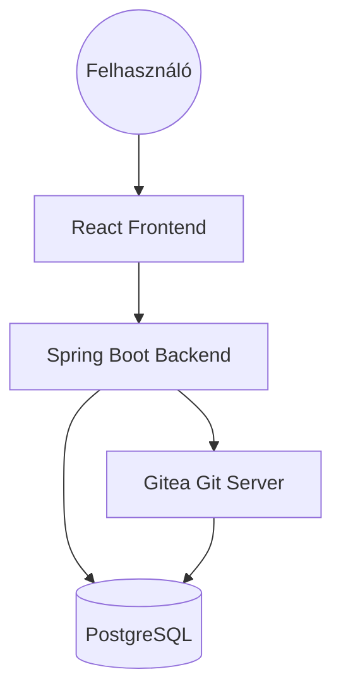

# 🚀 LégyMérnök.hu (Be an Engineer)

> _"A tudás határa a csillagos ég."_

A **LégyMérnök.hu** egy nyílt forráskódú, gamifikált oktatási platform, amelynek célja a mérnöki gondolkodásmód és gyakorlati készségek (szoftverfejlesztés, elektronika) átadása. A rendszer egy űr-témájú narratívára épül, ahol a hallgatók ("Kadétok") küldetéseket teljesítenek, valós kódot írnak, és áramköröket terveznek.

---

## 🛠️ Technológiai Stack

A projekt modern, ipari szabványokra épülő technológiákat használ:

### Backend (Mission Control)

- **Nyelv:** Java 17
- **Keretrendszer:** Spring Boot 3.x
- **Adatbázis:** PostgreSQL 16
- **Biztonság:** Spring Security, JWT (Stateless Authentication)
- **API Dokumentáció:** SpringDoc OpenAPI (Swagger UI)
- **Tesztelés:** JUnit 5, Mockito

### Frontend (Cockpit)

- **Keretrendszer:** React 18
- **Build Tool:** Vite
- **Nyelv:** TypeScript
- **Szerkesztő:** Monaco Editor (tervezett integráció)

### DevOps & Infrastruktúra

- **Konténerizáció:** Docker & Docker Compose (Teljes környezet egy parancsra)
- **Verziókezelés (Internal):** **Gitea** (Self-hosted Git Server) - _A rendszer lelke._ Minden feladat és minden diák megoldása dedikált Git repository-ban tárolódik.

---

## 🏗️ Architektúra

A rendszer mikroszerviz-jellegű, de monorepóban kezelt architektúrát követ. A komponensek Docker konténerekben futnak és egy belső hálózaton (`legymernok-net`) kommunikálnak.


```mermaid
graph TD
    User((Felhasználó)) --> Frontend
    Frontend[React Frontend] --> Backend[Spring Boot Backend]
    Backend --> DB[(PostgreSQL)]
    Backend --> Gitea[Gitea Git Server]
    Gitea --> DB
```

### Kiemelt Funkció: Gitea Automatizáció

A rendszer nem csak tárolja a kódot, hanem **menedzseli** is a Git szervert.

- **Admin Flow:** Amikor az oktató létrehoz egy feladatot, a Backend automatikusan létrehoz egy _Template Repository_-t Giteán, és feltölti a kezdő kódot.
- **Student Flow (Terv):** Amikor a diák elindít egy feladatot, a rendszer "Smart Copy" módszerrel létrehoz neki egy privát repót, ami csak a megoldandó feladatot tartalmazza (a megoldókulcs nélkül).

---

## 💾 Adatbázis Séma

Az adatbázis (`legymernok` DB) a felhasználókat, kurzusokat és a haladást tárolja. A Git repository-k metaadatai (URL-ek) is itt vannak, de a forráskód a Gitea-ban lakik.

**Főbb Entitások:**

- **`Cadet`**: Felhasználó (Admin / Cadet szerepkörrel).
- **`StarSystem`**: Kurzus / Témakör (pl. "Java Alapok").
- **`Mission`**: Egy konkrét lecke/feladat. Tartalmazza a leírást és a _Template Repo URL_-t.
- **`CadetMission`**: A diák és a feladat kapcsolata (Status, _Student Repo URL_).

_Részletes leírás: [`plans/database_schema.md`](plans/database_schema.md)_

---

## 🚦 Projekt Státusz

A projekt jelenleg az **Adminisztrációs és Tartalomgyártó (Mérföldkő 1)** fázis végén jár.

### ✅ Megvalósítva (KÉSZ)

- [x] **Infrastruktúra:** Stabil Docker Compose környezet.
- [x] **Backend Core:** Rétegzett Spring Boot architektúra.
- [x] **Biztonság:** Regisztráció, Login, JWT Tokenek (Role-based), Jelszó hash.
- [x] **Gitea Integráció (Full CRUD):**
  - User létrehozás/törlés.
  - Repo létrehozás/törlés API-n keresztül.
  - Fájl feltöltés API-n keresztül.
- [x] **Tartalomkezelés:** Kurzusok és Feladatok létrehozása (a kód automatikus feltöltésével Giteára).
- [x] **Dokumentáció:** Swagger UI (`/swagger-ui.html`).

### 🚧 Folyamatban / Tervezett

- [ ] **Frontend Admin UI:** React felület a fenti backend funkciókhoz.
- [ ] **Student Flow:** "Start Mission" gomb -> Diák repó generálása.
- [ ] **Runner:** Docker alapú kódkiértékelő rendszer.

_Részletes ütemterv: [`plans/terv.md`](plans/terv.md)_

---

## 🚀 Getting Started (Telepítés és Futtatás)

### Előfeltételek

- Docker és Docker Compose telepítve.
- (Opcionális) Java 17+ és Node.js a helyi fejlesztéshez.

```bash
docker network create -d bridge legymernok-net
```

### Indítás

> **⚠️ Fontos, ha korábbról ismered ezt a repót:** a sima `docker compose up --build -d`
> **önmagában már NEM indítja el a saját `postgres` service-t** — az a `standalone` Compose
> profil mögé került (2026-08-19, lásd lentebb), hogy a homelab szerver egy közös,
> több projektet kiszolgáló Postgres instance-t is használhasson helyette. Egy friss
> klónnál, saját lokális adatbázissal a következő paranccsal indítsd:

```bash
docker compose --build --profile standalone up -d
```

Ez elindítja a következő szolgáltatásokat:

- **Frontend:** `http://localhost:3000`
- **Gitea:** `http://localhost:3001`
- **Backend API:** `http://localhost:8080`
- **Swagger UI:** `http://localhost:8080/swagger-ui/index.html`
- **PostgreSQL:** `localhost:5432`

#### Közös (megosztott) Postgres instance használata — csak a homelab szerveren

A `legymernok.ujjweb.hu`-t futtató szerveren a `postgres` service **nem** fut — a backend és a
gitea egy külön, több projektet (legymernok, wrenchly) kiszolgáló Postgres instance-hoz
kapcsolódik a `.env`-ben beállított `SPRING_DATASOURCE_*`/`GITEA_DATABASE_*` változókon
keresztül (lásd `.env.example`). Ez **csak** a `.env`-en múlik, nincs profil-flag hozzá — ha
ezek a változók be vannak állítva, `docker compose up -d` (profil nélkül) pont ezt teszi.
A teljes indoklás, a hálózat/user/backup felépítése és a más projektekre való átültetés
menete: `~/homelab/SHARED-POSTGRES.md` (ez a szerver-szintű dokumentum, nem repó-specifikus,
ezért nincs itt a git-ben).

### Első Lépések (Setup)

1.  **Gitea Admin:** Az első indításkor nyisd meg a `localhost:3001`-et. A telepítőnél állítsd be az admin fiókot (`legymernok_admin`).
    - _Tipp:_ A `docker-compose.yml` és `application.properties` már előre konfigurált értékeket tartalmaz, ezeket használd!
2.  **Backend Admin:** Hozz létre egy admint a Backend oldalon is (vagy használd a Gitea szinkronizációt).

### Nem-interaktív / automatizált setup (szkriptekhez, CI-hez, home serverhez)

A fenti webes telepítő-varázsló kihagyható — a Gitea CLI-je és a `docker compose`
env változói teljesen non-interaktívan is felállítják a rendszert. Ez akkor hasznos,
ha egy szerveren (pl. otthoni home serveren) automatizáltan, kattintgatás nélkül
kell felhúzni a stacket.

**1. Gitea telepítés kihagyása (`INSTALL_LOCK`)**

Alapból a `docker-compose.yml`-ben a Gitea `INSTALL_LOCK` nincs beállítva, ezért a
konténer "nem telepített" állapotban indul, és a CLI parancsok (`gitea admin ...`)
elutasítják magukat, amíg a webes telepítő le nem fut. Ezt megkerülve — miután a
stack már fut egyszer (`docker compose up --build -d`) — a Gitea konténer még
"nem telepített" állapotban is tud titkokat generálni:

```bash
docker exec -u git legymernok-gitea gitea generate secret SECRET_KEY
docker exec -u git legymernok-gitea gitea generate secret INTERNAL_TOKEN
docker exec -u git legymernok-gitea gitea generate secret JWT_SECRET
```

A kapott 3 értéket írd be a `.env`-be (`GITEA_SECRET_KEY`, `GITEA_INTERNAL_TOKEN`,
`GITEA_JWT_SECRET` — lásd `.env.example`); a `docker-compose.yml` már ezekre az env
változókra hivatkozik, nem kell hozzá kódot módosítani. Majd:

```bash
docker compose up -d gitea
```

— a konténer a webes varázsló nélkül, "telepített" állapotban indul újra
(`INSTALL_LOCK = true` az `app.ini`-ben ellenőrizhető).

**2. Admin fiók + tokenek CLI-vel**

```bash
# Admin user létrehozása (jelszó a .env GITEA_ADMIN_PASSWORD-jából)
docker exec -u git legymernok-gitea gitea admin user create \
  --username legymernok_admin \
  --password "<GITEA_ADMIN_PASSWORD>" \
  --email admin@legymernok.local \
  --admin \
  --must-change-password=false

# Backend API token (ez kell a .env GITEA_ADMIN_TOKEN-jébe)
docker exec -u git legymernok-gitea gitea admin user generate-access-token \
  --username legymernok_admin \
  --token-name backend-integration \
  --scopes all

# Actions runner regisztrációs token (ez kell a .env REGISTRATION_TOKEN-jébe)
docker exec -u git legymernok-gitea gitea actions generate-runner-token
```

A két kapott tokent írd be a `.env`-be (`GITEA_ADMIN_TOKEN`, `REGISTRATION_TOKEN`),
majd `docker compose up -d backend runner` — a backend felveszi a Gitea API tokent,
a runner pedig sikeresen regisztrál (`docker logs legymernok-gitea-runner` mutatja
a `Runner registered successfully` sort).

Ezzel a teljes stack (Postgres, Gitea, admin fiók, backend↔Gitea integráció,
Actions runner) egyetlen script/CI job részeként, kattintgatás nélkül felállítható.
Fontos: a `GITEA_SECRET_KEY`/`GITEA_INTERNAL_TOKEN`/`GITEA_JWT_SECRET`/tokenek csak
a `.env`-be kerülnek (git-ignored), sosem a verziókezelt `docker-compose.yml`-be.

---

## 🧪 Fejlesztés és Tesztelés

### API Tesztelés (Bruno / Swagger)

A fejlesztéshez ajánlott a **Bruno** használata, vagy a beépített **Swagger UI**.

- **Swagger UI:** [http://localhost:8080/swagger-ui/index.html](http://localhost:8080/swagger-ui/index.html) - Itt kipróbálhatod az összes végpontot.

### Backend Fejlesztés

A backend mappa egy szabványos Maven projekt.

- Build: `./mvnw clean install`
- Futtatás (lokálisan): `./mvnw spring-boot:run`
- Tesztek: `./mvnw test`

### Frontend Fejlesztés

A frontend mappa egy Vite + React projekt.

- Install: `npm install`
- Dev Server: `npm run dev`

---

## 📂 Dokumentációk

A `plans` mappában találod a részletes tervezési dokumentumokat:

- [`terv.md`](plans/terv.md) - Részletes roadmap.
- [`api_spec.md`](plans/api_spec.md) - API specifikáció.
- [`database_schema.md`](plans/database_schema.md) - Adatbázis terv.
- [`CHANGELOG.md`](CHANGELOG.md) - Fejlesztési napló.
