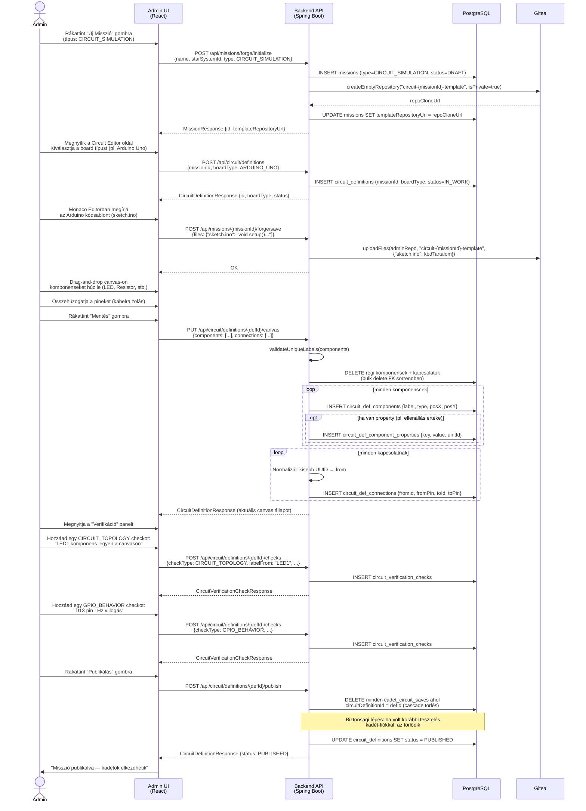
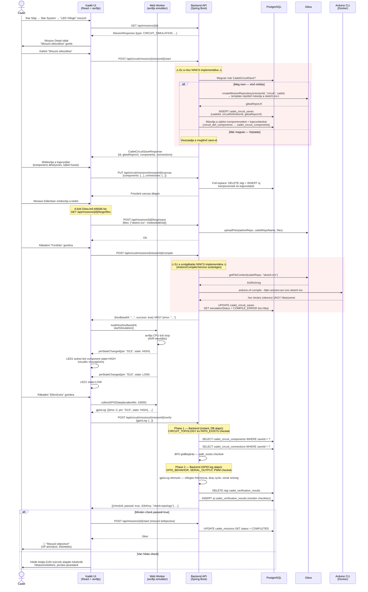
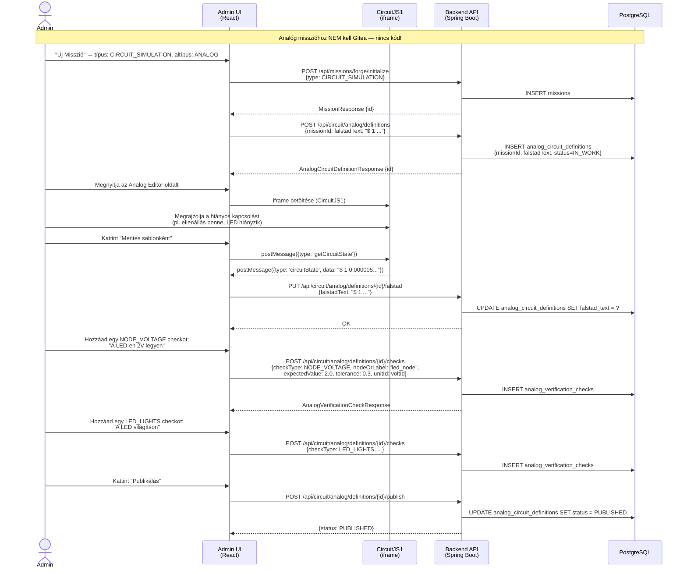
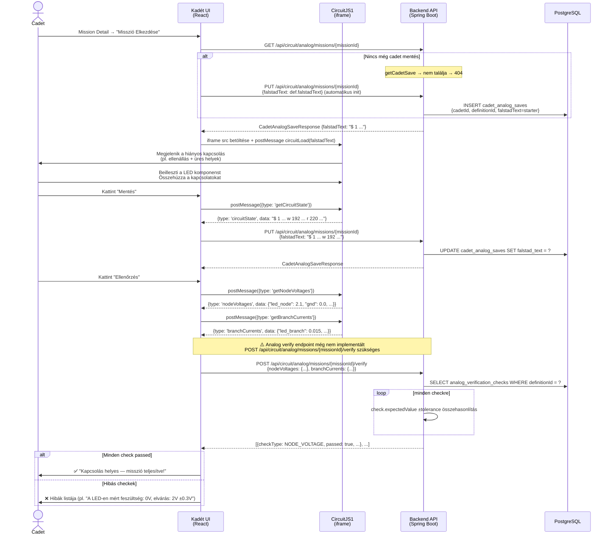

# Áramkör Szimuláció — Admin & Kadét Flow Dokumentum

> **Állapot:** Tervezési referencia
> **Kapcsolódó:** `circuit-simulation.md` (adatmodell), `mission-forge.md` (analóg Forge minta)

---

## Áttekintés — Mi él hol?

| Adat | Tárolás helye | Megjegyzés |
|---|---|---|
| Breadboard kapcsolás (template) | PostgreSQL (`circuit_def_components`, `_connections`) | Admin szerkeszti |
| Breadboard kapcsolás (kadét) | PostgreSQL (`cadet_circuit_components`, `_connections`) | Sablon másolata + kadét módosításai |
| **Arduino kód (template)** | **Gitea repo** (`circuit-mission-{id}-template`) | Admin szerkeszti Monaco Editorban |
| **Arduino kód (kadét)** | **Gitea repo** (`circuit-{missionId}-{cadetId}`) | Kadét szerkeszti Monaco Editorban |
| Verifikációs szabályok | PostgreSQL (`circuit_verification_checks`) | Admin definiálja |
| Verifikáció eredménye | PostgreSQL (`cadet_verification_results`) | Backend számolja |
| Fordítási kimenet (`.hex`) | **Nem tárolva** — minden fordításnál generálódik | Arduino CLI adja vissza |
| Analóg áramkör (Falstad szöveg) | PostgreSQL (`analog_circuit_definitions`, `cadet_analog_saves`) | Nincs Gitea-függőség |

> ⚠️ **Implementációs gap:** A jelenlegi `CadetCircuitService.startCircuitMission()` **nem hívja** a `GiteaService`-t.
> A `CadetCircuitSave` entitásból **hiányzik** a `giteaRepoUrl` mező.
> Ezeket a digitális (avr8js) flow-ban pótolni kell, mielőtt a szimuláció elkészül.

---

## I. Admin Flow — Digitális (avr8js) Misszió Létrehozása

### Összefoglaló lépések

```
1. Admin létrehoz egy CIRCUIT_SIMULATION típusú Mission-t
2. Admin létrehozza a CircuitDefinition-t (board típus kiválasztás)
3. Admin feltölti a kódsablont Monaco Editorba → Gitea template repóba kerül
4. Admin összerakja a sablon kapcsolást (drag-and-drop canvas)
5. Admin definiálja a verifikációs szabályokat
6. Admin publikálja → kadétok elkezdhetik
```

### UML Szekvencia Diagram



### Admin UI oldalnézet — Circuit Editor képernyők

```
┌─────────────────────────────────────────────────────────────────────┐
│  Circuit Mission Editor — "LED Villogó"                             │
│                                                                     │
│  ┌─ 1. BOARD ──────┐  ┌─ 2. CANVAS ──────────────────────────────┐ │
│  │ Arduino Uno  ▼  │  │                                           │ │
│  └─────────────────┘  │   [BOARD: arduino_main]                  │ │
│                       │        │D13           │GND               │ │
│  ┌─ Komponens ────────│        │              │                  │ │
│  │  palette      ──┐ │      [R1: resistor]──[LED1: led]         │ │
│  │  🟥 LED          │ │           220Ω         anode/cathode     │ │
│  │  ▭ Resistor      │ │                                          │ │
│  │  ⏺ Pushbutton    │ │   [+] Drag komponenseket ide             │ │
│  └──────────────────┘ └──────────────────────────────────────────┘ │
│                                                                     │
│  ┌─ 3. KÓD (Monaco Editor) ─────────────────────────────────────┐  │
│  │  void setup() { pinMode(13, OUTPUT); }                        │  │
│  │  void loop() { digitalWrite(13, HIGH); delay(500);           │  │
│  │               digitalWrite(13, LOW);  delay(500); }          │  │
│  └──────────────────────────────────────────────────────────────┘  │
│                                                                     │
│  ┌─ 4. VERIFIKÁCIÓ ──────────────────────────────────────────────┐  │
│  │  [+] Új check                                                  │  │
│  │  ✓ CIRCUIT_TOPOLOGY — "LED1 jelen legyen"          [🗑]       │  │
│  │  ✓ PATH_EXISTS — "D13 → GND összekötve LED+R-en át"  [🗑]   │  │
│  │  ✓ GPIO_BEHAVIOR — "D13: 1Hz villogás"               [🗑]   │  │
│  └──────────────────────────────────────────────────────────────┘  │
│                                                                     │
│  [Mentés]  [Tesztelés saját fiókkal]  [🚀 Publikálás]              │
└─────────────────────────────────────────────────────────────────────┘
```

---

## II. Kadét Flow — Digitális (avr8js) Misszió Teljesítése

### Összefoglaló lépések

```
1. Kadét megnyitja a Star System oldalt → látja a missziókat
2. Kadét rákattint a CIRCUIT_SIMULATION típusú missziókra → Mission Detail
3. Kadét rákattint "Misszió Elkezdése" → Gitea repo jön létre, sablon másolódik
4. Kadét az áramkör canvason módosíthat (ha allowSchematicEdit=true)
5. Kadét Monaco Editorban írja/módosítja az Arduino kódot
6. Kadét rákattint "Fordítás" → backend Arduino CLI → .hex vissza
7. A .hex betöltődik avr8js-be → szimuláció fut a böngészőben
8. Kadét rákattint "Verifikálás" → backend ellenőriz + frontend GPIO adatokat küld
9. Sikeres verifikáció → Misszió COMPLETED státuszba kerül
```

### UML Szekvencia Diagram



### Kadét UI oldalnézet — Circuit Simulator képernyők

```
┌─────────────────────────────────────────────────────────────────────┐
│  🔭 LED Villogó Misszió                           [⏱ 00:12:34]     │
│                                                                     │
│  ┌─ CANVAS (React Flow / @xyflow) ─────────────────────────────┐   │
│  │                                                               │   │
│  │    [🟦 arduino_main]                                          │   │
│  │     D13 ──── [▭ R1: 220Ω] ──── [🔴 LED1] ──── GND           │   │
│  │                                                               │   │
│  │  [+ Komponens hozzáadása] (ha allowSchematicEdit=true)        │   │
│  └───────────────────────────────────────────────────────────────┘   │
│                                                                     │
│  ┌─ KÓD EDITOR (Monaco) ──────────────────────────────────────┐    │
│  │  void setup() {                                              │    │
│  │    pinMode(13, OUTPUT);                                      │    │
│  │  }                                                           │    │
│  │  void loop() {                                               │    │
│  │    digitalWrite(13, HIGH); delay(500);  // ← kadét írja     │    │
│  │    digitalWrite(13, LOW);  delay(500);                       │    │
│  │  }                                                           │    │
│  └──────────────────────────────────────────────────────────────┘    │
│                                                                     │
│  [💾 Kód mentése]  [🔨 Fordítás]  [▶ Szimuláció]  [✅ Ellenőrzés]  │
│                                                                     │
│  ┌─ SZIMULÁTOR (wokwi-elements Web Components) ───────────────┐    │
│  │  <wokwi-arduino-uno />                                       │    │
│  │  <wokwi-led color="red" value={pin13State} />                │    │
│  │                                                               │    │
│  │  💡 LED villog (1Hz)     [⏸ Megállítás]  [4x gyorsítás]    │    │
│  └───────────────────────────────────────────────────────────────┘   │
│                                                                     │
│  ┌─ ELLENŐRZÉSI EREDMÉNYEK ─────────────────────────────────────┐   │
│  │  ✅  LED1 komponens megtalálható a canvason                   │   │
│  │  ✅  D13 összekötve GND-vel LED-en és ellenálláson át        │   │
│  │  ❌  D13 villogási frekvencia: 2Hz (elvárás: 1Hz ±20%)       │   │
│  └───────────────────────────────────────────────────────────────┘   │
└─────────────────────────────────────────────────────────────────────┘
```

---

## III. Admin Flow — Analóg (Falstad/CircuitJS1) Misszió Létrehozása

### Összefoglaló lépések

```
1. Admin létrehoz CIRCUIT_SIMULATION típusú Mission-t
2. Admin létrehozza az AnalogCircuitDefinition-t
3. Admin a Falstad iframeben megrajzolja a kezdő (hiányos) kapcsolást
4. Admin elmenti a Falstad szöveget (starter + solution)
5. Admin definiálja a verifikációs feltételeket (feszültség, áram tartományok)
6. Admin publikálja
```

### UML Szekvencia Diagram



---

## IV. Kadét Flow — Analóg (Falstad) Misszió Teljesítése

### Összefoglaló lépések

```
1. Kadét megnyitja az analóg missziókat
2. A Falstad iframe betöltődik a starter kapcsolással
3. Kadét kiegészíti a kapcsolást (LED, összeköttetések)
4. Kadét kattint "Mentés" → Falstad szöveg DB-be kerül
5. Kadét kattint "Ellenőrzés" → frontend lekéri a szimulációs értékeket
6. Frontend POST-olja az értékeket a backendnek → eredmény
```

### UML Szekvencia Diagram



### Kadét UI oldalnézet — Analog Circuit képernyő

```
┌─────────────────────────────────────────────────────────────────────┐
│  ⚡ Ohm-törvény Misszió — "Köss be egy LED-et az ellenállás után"   │
│                                                                     │
│  📋 FELADAT:                                                        │
│  Egészítsd ki a kapcsolást! Az ellenállás már be van kötve.         │
│  Adj hozzá egy LED-et, és kösd rá a feszültségforrásra!             │
│                                                                     │
│  ┌─ FALSTAD IFRAME ──────────────────────────────────────────────┐  │
│  │                                                                │  │
│  │   [+5V] ──── [220Ω] ──── [_ _ _] ──── [GND]                  │  │
│  │                          ↑ ide kell                           │  │
│  │                          a LED                                │  │
│  │                                                                │  │
│  │   ◉ Szimulálás fut   Feszültség: 3.0V  Áram: 13.6mA          │  │
│  └────────────────────────────────────────────────────────────────┘  │
│                                                                     │
│  [💾 Mentés]                                    [✅ Ellenőrzés]     │
│                                                                     │
│  ┌─ ELLENŐRZÉSI EREDMÉNYEK ─────────────────────────────────────┐   │
│  │  ✅  LED komponens megtalálható a kapcsolásban                 │   │
│  │  ✅  A LED-en mért feszültség: 2.1V (elvárás: 2.0V ±0.3V)    │   │
│  │  ✅  Ágáram: 13.6mA (elvárás: 10–30mA)                       │   │
│  └───────────────────────────────────────────────────────────────┘   │
└─────────────────────────────────────────────────────────────────────┘
```

---

## V. Hiányzó Implementációs Elemek (Gap Analízis)

| # | Hiányzó rész | Érintett fájl(ok) | Prioritás |
|---|---|---|---|
| 1 | `CadetCircuitSave.giteaRepoUrl` mező hiányzik | `CadetCircuitSave.java` | P1 — kötelező digitális flow-hoz |
| 2 | `startCircuitMission()` nem hívja `GiteaService`-t | `CadetCircuitService.java` | P1 — kötelező digitális flow-hoz |
| 3 | `ArduinoCompilerService` nincs megírva | Új fájl kellene | P1 — fordítás nélkül nincs szimuláció |
| 4 | `POST /api/circuit/missions/{id}/compile` endpoint hiányzik | Új controller metódus | P1 |
| 5 | `gpioLog` fogadása a `/verify` endpointban | `CadetCircuitController.java`, `CircuitVerificationService.java` | P1 — GPIO check most mindig false |
| 6 | Analóg `/verify` endpoint nincs megírva | Új controller metódus + service | P2 |
| 7 | `CadetMission` rekord létrehozása `start`-kor hiányzik | `CadetCircuitService.java` | P2 — misszió státusz tracking |
| 8 | Arduino CLI Docker image nem tartalmazza a `Dockerfile`-ban | `docker-compose.yml` / `Dockerfile` | P1 |

---

## VI. Komponent-szintű összefüggés térkép

```
ADMIN OLDAL                                     KADÉT OLDAL
────────────────────────────────────────────────────────────────

Mission                                         Mission
(CIRCUIT_SIMULATION)                            (CIRCUIT_SIMULATION)
     │                                               │
     ▼                                               ▼
CircuitDefinition ──── [sablon másolás] ──► CadetCircuitSave
  ├─ boardType                                  ├─ giteaRepoUrl ← ⚠️ HIÁNYZIK
  ├─ status (IN_WORK → PUBLISHED)               ├─ simulationStatus
  ├─ CircuitDefComponent[]                      ├─ CadetCircuitComponent[]
  │    └─ CircuitDefComponentProperty[]         │    └─ CadetCircuitComponentProperty[]
  ├─ CircuitDefConnection[]                     ├─ CadetCircuitConnection[]
  └─ CircuitVerificationCheck[]                 └─ CadetVerificationResult[]
                                                       └─ check (FK → CircuitVerificationCheck)

AnalogCircuitDefinition                         CadetAnalogSave
  ├─ falstadText (starter)                        ├─ falstadText (kadét módosítása)
  └─ AnalogVerificationCheck[]                    └─ simulationStatus

ComponentPinDefinition[] ─────────────────────────► Frontend PinResolver
  (Board pinout katalógus)                          (milyen pinre lehet kötni)

ComponentElectricalSpec[] ────────────────────────► Frontend circuit-engine
  (Elektromos szabályok)                            (real-time validáció mentéskor)
```
