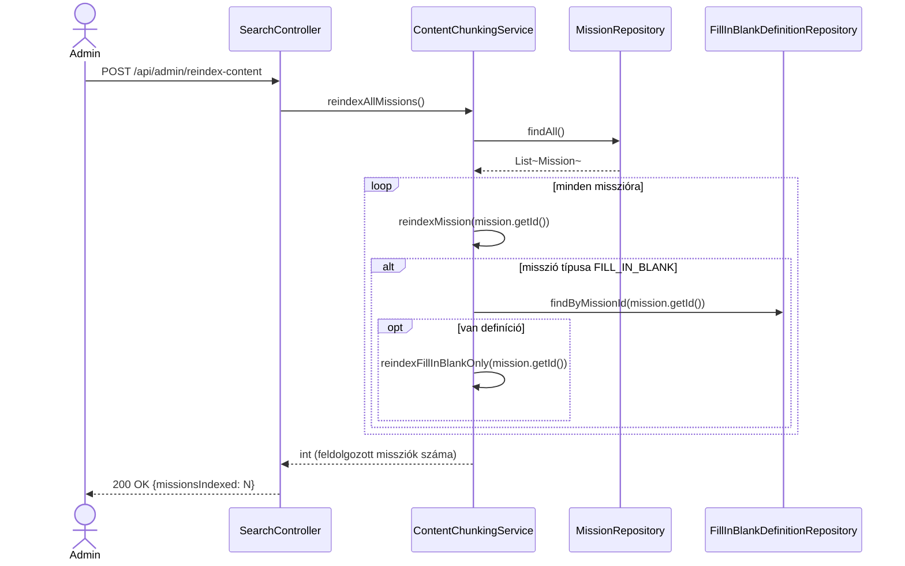

# PR #1 — RAG chunking: implementációs architektúra-terv

> Ez a dokumentum a `plans/ai_chatbot_upgrade_2026.md` PR #1 szakaszát bontja le
> osztály/metódus-szintre: pontos service-metódusok, repository-hívások, hook-pontok a
> meglévő kódban, class- és sequence-diagramok. Ugyanúgy **csak terv, nincs implementáció**
> ebben a körben — a cél, hogy implementáláskor ne kelljen tervezési döntést hozni menet
> közben, csak lekövetni ezt a dokumentumot.

## 1. ⚠️ Egy pontatlanság a fő tervben, amit itt tisztázunk

A `ai_chatbot_upgrade_2026.md` PR #1 szakasza ezt mondja a `reindexMission()`-ról:

> "törli a meglévő `MISSION` chunkokat, chunkol+embedel+beszúr. **Embed-hiba esetén csak
> warningot logol, a régi chunkok érintetlenül maradnak**"

Ez a két mondat **önmagában ellentmond egymásnak**: ha a metódus ELŐSZÖR törli a régi
chunkokat, majd UTÁNA próbál embedelni, és az embedelés menet közben elhasal — a régi
chunkok **már nincsenek meg**, tehát nem maradhatnak "érintetlenül". A garancia csak úgy
tartható, ha a sorrend fordított: **előbb minden új chunk sikeresen embedelődik, és csak
ha MINDEGYIK sikerült, akkor töröljük a régiket és írjuk be az újakat** egyetlen
tranzakcióban. Ez a dokumentum ezt a (helyes) sorrendet tervezi meg — lásd 4.2 szakasz.

**Kérdés hozzád**: egyetértesz ezzel a javított sorrenddel (embed-first, majd
delete+insert csak teljes sikeren), vagy inkább az legyen a szabály, hogy egy részlegesen
sikerült chunkolás is felülírja a régit (csak a sikeres chunkokkal)? Az utóbbi egyszerűbb,
de akkor a misszió tartalma részlegesen indexelt maradhat egy átmeneti ai-service-kiesés
után, amíg valaki újra nem futtatja a reindexet.

## 2. Új komponensek — csomag-elhelyezés

Követve a meglévő csomagstruktúrát (ld. `backend/CLAUDE.md`):

```
backend/src/main/java/com/legymernok/backend/
├── dto/rag/
│   └── ContentChunkDto.java                    (ÚJ, record)
├── service/rag/
│   └── ContentChunkingService.java             (ÚJ, @Service)
├── service/mission/
│   └── MissionService.java                     (MÓDOSUL — 3 hook-pont)
├── service/fillinblank/
│   └── FillInBlankService.java                 (MÓDOSUL — 1 hook-pont)
└── web/search/
    └── SearchController.java                   (MÓDOSUL — 1 új endpoint)
```

**Tudatos döntés: NINCS külön `ContentChunkRepository` Spring Data interfész.** A
`content_chunks` táblának nincs JPA entitása (a `docker/db-init`-hez hasonlóan, ahogy a
`star_systems.content_embedding` mezőt is a `StarSystemService` kezeli közvetlen
`JdbcTemplate`-tel, nem egy külön repository osztályon keresztül — ld.
`StarSystemService.generateAndSaveEmbedding()`/`searchByEmbedding()`). A
`ContentChunkingService` **ugyanezt a mintát követi**: a `JdbcTemplate`-et közvetlenül
injektáljuk bele, nincs plusz absztrakciós réteg. Ez konzisztens a kódbázis jelenlegi
szokásával — ha inkább egy külön repository-osztályt (nem Spring Data interfészt, hanem
sima `@Repository`-annotált, `JdbcTemplate`-et csomagoló osztályt) szeretnél a
tisztább rétegezésért, szólj, és átalakítom.

## 3. `ContentChunkDto` — pontos mezők

```java
package com.legymernok.backend.dto.rag;

import java.util.UUID;

public record ContentChunkDto(
    UUID id,
    String sourceType,      // "MISSION" | "MISSION_FILL_IN_BLANK"
    UUID sourceId,          // Mission.id (mindkét sourceType esetén — a FillInBlank
                             // definíció a mission_id-hoz kötött, nem saját ID-hoz)
    int chunkIndex,
    String chunkText,
    double score            // csak retrieval-válaszban töltött (RRF/rerank pontszám),
                             // reindexeléskor irreleváns, 0.0
) {}
```

## 4. `ContentChunkingService` — teljes metódustábla

| Metódus | Szignatúra | Tranzakció | Mit csinál |
|---|---|---|---|
| `chunkText` | `List<String> chunkText(String text)` | — (pure function) | 800 karakteres ablak, 150 karakteres átfedés, `\n\n` bekezdéshatárra törekedve. `null`/üres/whitespace-only input → üres lista. Rövidebb szöveg, mint 800 karakter → egyetlen chunk. |
| `reindexMission` | `void reindexMission(UUID missionId)` | `@Transactional` | Ld. 4.2 — a fő RAG-indexelési útvonal. |
| `reindexFillInBlankOnly` | `void reindexFillInBlankOnly(UUID missionId)` | `@Transactional` | Ugyanaz a logika, mint `reindexMission`, de csak a `FillInBlankDefinition.templateText`-re, `source_type = 'MISSION_FILL_IN_BLANK'`. |
| `deleteChunks` | `void deleteChunks(String sourceType, UUID sourceId)` | `@Transactional` | `DELETE FROM content_chunks WHERE source_type = ? AND source_id = ?`. |
| `reindexAllMissions` | `int reindexAllMissions()` | `@Transactional` | Végigmegy minden misszión (`missionRepository.findAll()`), mindegyikre meghívja a `reindexMission`-t (+ ha van `FillInBlankDefinition`-je, azt is), visszaadja a feldolgozott missziók számát. Ugyanaz a minta, mint `StarSystemService.reindexAllStarSystems()`. |

### 4.1 `chunkText()` — pontos algoritmus (pure function, mock nélkül tesztelhető)

```
bemenet: text (String, lehet null)
kimenet: List<String>

1. ha text == null vagy text.isBlank() → return List.of()
2. ha text.length() <= 800 → return List.of(text)  (egyetlen chunk, nincs vágás)
3. bekezdésekre bontás "\n\n" mentén
4. egy "aktuális chunk" StringBuilder-t építünk bekezdésenként:
   - ha egy bekezdés hozzáadása után az aktuális chunk hossza >= 800:
     - lezárjuk az aktuális chunkot (hozzáadjuk az eredménylistához)
     - az ÚJ chunk az előző chunk UTOLSÓ 150 karakterével kezdődik (átfedés),
       majd folytatódik a következő bekezdéssel
   - ha egyetlen bekezdés önmagában > 800 karakter (nincs mit "bekezdés-határon" vágni):
     - kemény vágás 800 karakternél, 150 karakteres átfedéssel, ciklikusan,
       amíg a bekezdés el nem fogy
5. az utolsó, még nem lezárt chunkot is hozzáadjuk (ha nem üres)
```

**Miért pure function**: nincs benne `JdbcTemplate`, `AiEmbeddingService`, semmilyen
side-effect — ez teszi lehetővé, hogy a `ContentChunkingServiceTest` mock nélkül,
közvetlen bemenet→kimenet assertekkel tesztelje (határeset: pontosan 800 karakteres
szöveg, bekezdés-határon éppen túlnyúló szöveg, egyetlen 2000 karakteres bekezdés).

### 4.2 `reindexMission()` — a javított (embed-first) sorrend

```
bemenet: missionId (UUID)

1. mission = missionRepository.findById(missionId)
   ha nincs ilyen mission → return (csendben, mint a StarSystemService.generateAndSaveEmbedding()
   mintája — nem dob kivételt, mert ez háttér-hívás egy másik service metódusából, nem
   önálló, felhasználó-facing endpoint)

2. text = buildMissionText(mission)
   = mission.getDescriptionMarkdown() + "\n\n" + mission.getContent()
   (mindkettő null-biztosan kezelve, ha valamelyik null, kihagyjuk)

3. chunks = chunkText(text)
   ha chunks üres → deleteChunks("MISSION", missionId); return
   (ha valaki kiürítette a tartalmat, az index is kiürül — ez NEM embed-hiba, hanem
   szándékos állapot, itt nem alkalmazandó az "őrizzük meg a régit" szabály)

4. embeddedChunks = new ArrayList<PendingChunk>()   // belső, nem-publikus rekord:
                                                      // (int index, String text, String vectorStr)
   for i, chunkText in chunks:
       vector = embeddingService.embed(chunkText)
       ha vector == null:
           log.warn("Embedding failed for mission {} chunk {}/{} — reindex megszakítva, " +
                     "a régi index-állapot változatlan marad", missionId, i, chunks.size())
           return   // <-- ITT a lényeg: a régi chunkok EDDIG A PONTIG nem lettek törölve
       embeddedChunks.add(new PendingChunk(i, chunkText, embeddingService.toVectorString(vector)))

5. csak ha a 4. lépés VÉGIG (minden chunk) sikeres volt:
   deleteChunks("MISSION", missionId)
   insertChunks("MISSION", missionId, embeddedChunks)   // batch INSERT, ld. 4.3

6. log.info("RAG index frissítve: mission {} → {} chunk", missionId, embeddedChunks.size())
```

### 4.3 `insertChunks()` — belső, privát helper

```java
private void insertChunks(String sourceType, UUID sourceId, List<PendingChunk> chunks) {
    jdbcTemplate.batchUpdate(
        """
        INSERT INTO content_chunks (source_type, source_id, chunk_index, chunk_text, content_embedding)
        VALUES (?, ?, ?, ?, ?::vector)
        """,
        chunks, chunks.size(),
        (ps, chunk) -> {
            ps.setString(1, sourceType);
            ps.setObject(2, sourceId);
            ps.setInt(3, chunk.index());
            ps.setString(4, chunk.text());
            ps.setString(5, chunk.vectorStr());
        }
    );
}
```

(`JdbcTemplate.batchUpdate` — nem `N` külön `update()` hívás, egy batch-ben megy, ahogy
egy 10+ chunkos misszónál ez számít.)

## 5. Hook-pontok a meglévő kódban — pontos fájl/sor-hivatkozások

| Fájl | Metódus | Hova kerül a hívás | Miért oda |
|---|---|---|---|
| `service/mission/MissionService.java:490` | `createMission()` | a `mapToResponse(saved)` return előtt, a `log.info(...)` sor után (534. sor környéke) | Új misszió → azonnal legyen indexelve, ugyanaz a minta, mint `StarSystemService.createStarSystem()` végén a `generateAndSaveEmbedding()` hívás. |
| `service/mission/MissionService.java:539` | `updateMission()` | a metódus végén, a `mapToResponse(...)`-t megelőzően | A `descriptionMarkdown` itt módosulhat — újra kell indexelni. |
| `service/mission/MissionService.java:731` | `updateMissionContent()` | a `mission.setContent(content)` utáni sorban, a `return mapToResponse(...)` előtt | Ez a `content` mező **kizárólagos** módosítási útvonala (pl. a Forge-szerkesztőből) — enélkül a hook nélkül a leggyakoribb tartalom-módosítás SOSEM indexelődne újra. |
| `service/fillinblank/FillInBlankService.java` | `saveDefinition()` | a metódus végén, a `return getDefinitionForUser(missionId)` előtt | Ez az egyetlen mentési útvonal a `templateText`-re — a régi definíció törlése+újra épebtése (40-59. sor) után hívjuk. |

**Új konstruktor-függőség mindkét service-ben**: `ContentChunkingService` bekerül a
`MissionService` és a `FillInBlankService` `@RequiredArgsConstructor`-ral generált
konstruktorába (egy új `private final ContentChunkingService contentChunkingService;`
mezőként) — Lombok automatikusan felveszi.

**Fontos, amit érdemes tisztázni**: a `MissionService.createMission()`/`updateMission()`
és a `FillInBlankService.saveDefinition()` metódusok jelenleg `@Transactional`-ok. Ha a
`ContentChunkingService.reindexMission()` (ami maga is `@Transactional`) ugyanabban a
kérésben, ugyanazon a tranzakción belül fut le, és az embedelés (`AiEmbeddingService.embed()`,
egy HTTP-hívás a `ai-service` felé) **lassú vagy időtúllépéses**, az a teljes misszió-mentés
tranzakcióját tartja nyitva/blokkolja feleslegesen hosszan. A `StarSystemService` ugyanezt a
kompromisszumot vállalja már ma is (`generateAndSaveEmbedding()` szinkron, a tranzakción
belül) — tehát ez **konzisztens a meglévő mintával**, nem egy új probléma, amit ennek a
PR-nak kellene megoldania. Ha ez élesben tényleges problémát okozna (lassú mentés), az egy
külön, jövőbeli optimalizáció (pl. async esemény-alapú reindex) — ebben a körben nem
foglalkozunk vele, a szinkron minta marad.

## 6. `SearchController` — új admin endpoint

```java
@PostMapping("/admin/reindex-content")
@PreAuthorize("hasAuthority('starsystem:edit_any')")
public ResponseEntity<ReindexContentResponse> reindexContent() {
    int count = contentChunkingService.reindexAllMissions();
    return ResponseEntity.ok(new ReindexContentResponse(count));
}

record ReindexContentResponse(int missionsIndexed) {}
```

Pontosan a meglévő `reindex-star-systems` (`SearchController.java`, jelenlegi 33-38. sor)
mintáját követi — ugyanaz a permission (`starsystem:edit_any`, mert ez egy admin-szintű,
tartalom-karbantartó művelet, nincs önálló "content:edit"-szerű permission bevezetve
emiatt), ugyanaz a `record`-alapú válasz-DTO minta.

## 7. Class diagram

```mermaid
classDiagram
    class ContentChunkingService {
        -MissionRepository missionRepository
        -FillInBlankDefinitionRepository definitionRepository
        -AiEmbeddingService embeddingService
        -JdbcTemplate jdbcTemplate
        +chunkText(String text) List~String~
        +reindexMission(UUID missionId) void
        +reindexFillInBlankOnly(UUID missionId) void
        +deleteChunks(String sourceType, UUID sourceId) void
        +reindexAllMissions() int
        -insertChunks(String sourceType, UUID sourceId, List~PendingChunk~ chunks) void
        -buildMissionText(Mission mission) String
    }

    class ContentChunkDto {
        <<record>>
        +UUID id
        +String sourceType
        +UUID sourceId
        +int chunkIndex
        +String chunkText
        +double score
    }

    class AiEmbeddingService {
        +embed(String text) float[]
        +toVectorString(float[] embedding) String
    }

    class MissionService {
        -ContentChunkingService contentChunkingService
        +createMission(CreateMissionRequest) MissionResponse
        +updateMission(UUID, CreateMissionRequest) MissionResponse
        +updateMissionContent(UUID, String) MissionResponse
    }

    class FillInBlankService {
        -ContentChunkingService contentChunkingService
        +saveDefinition(UUID, SaveFillInBlankRequest) FillInBlankUserResponse
    }

    class SearchController {
        -ContentChunkingService contentChunkingService
        +reindexContent() ResponseEntity~ReindexContentResponse~
    }

    MissionService --> ContentChunkingService : reindexMission()
    FillInBlankService --> ContentChunkingService : reindexFillInBlankOnly()
    SearchController --> ContentChunkingService : reindexAllMissions()
    ContentChunkingService --> AiEmbeddingService : embed()
    ContentChunkingService ..> ContentChunkDto : használja (retrieval-válaszokban, PR #2)
    ContentChunkingService --> "content_chunks tábla" : JdbcTemplate (nyers SQL)
```

## 8. Sequence diagram — misszió tartalom mentése → automatikus reindex

```mermaid
sequenceDiagram
    actor Admin
    participant MC as MissionController
    participant MS as MissionService
    participant CCS as ContentChunkingService
    participant AES as AiEmbeddingService
    participant AI as ai-service (FastAPI)
    participant DB as Postgres (content_chunks)

    Admin->>MC: POST /api/missions/{id}/forge/save (Forge-szerkesztő)
    MC->>MS: updateMissionContent(id, content)
    MS->>MS: mission.setContent(content); missionRepository.save(mission)
    MS->>CCS: reindexMission(missionId)
    CCS->>CCS: buildMissionText() + chunkText()
    loop minden chunk-ra
        CCS->>AES: embed(chunkText)
        AES->>AI: POST /embed
        AI-->>AES: {embedding: [...]}
        AES-->>CCS: float[]
    end
    alt mindegyik chunk embedelése sikeres
        CCS->>DB: DELETE FROM content_chunks WHERE source_type='MISSION' AND source_id=?
        CCS->>DB: batch INSERT (új chunkok + embeddingek)
        CCS-->>MS: (visszatér, siker)
    else valamelyik embed() null-t adott vissza
        CCS->>CCS: log.warn(...) — a DB-hez EGYÁLTALÁN nem nyúl
        CCS-->>MS: (visszatér, a régi chunkok változatlanok)
    end
    MS-->>MC: MissionResponse
    MC-->>Admin: 200 OK
```

## 9. Sequence diagram — admin "Teljes újraindexelés" gomb



## 10. Tesztterv (`ContentChunkingServiceTest.java`)

A meglévő `StarSystemServiceTest` mintáját követve (JUnit5 + Mockito, közvetlen
Java-határon mockolva, NEM HTTP-szerveren keresztül):

| Teszteset | Mit ellenőriz |
|---|---|
| `chunkText_shortText_returnsSingleChunk` | 800 karakternél rövidebb szöveg → 1 elemű lista, változatlan tartalommal |
| `chunkText_null_returnsEmptyList` | `null`/üres/whitespace bemenet → üres lista |
| `chunkText_longText_respectsOverlap` | Két egymást követő chunk között pontosan 150 karakteres az átfedés |
| `chunkText_prefersParagraphBoundary` | `\n\n`-nél vág, ha lehetséges, nem a szó közepén |
| `chunkText_singleHugeParagraph_hardCuts` | Egyetlen, 800-nál hosszabb bekezdés esetén is helyesen vágja |
| `reindexMission_allEmbedsSucceed_replacesOldChunks` | Mockolt `embeddingService.embed()` mindig nem-null → `jdbcTemplate` DELETE+INSERT hívások megtörténnek |
| `reindexMission_oneEmbedFails_keepsOldChunksUntouched` | Mockolt `embed()` a 2. hívásnál `null`-t ad vissza → **a `jdbcTemplate`-en EGYETLEN DELETE/INSERT hívás sem történik** (ez a kulcs-assert az 1. szakasz döntésére) |
| `reindexMission_missionNotFound_returnsWithoutError` | Ismeretlen `missionId` → nem dob kivételt, csendben visszatér |
| `reindexAllMissions_countsProcessedMissions` | Mockolt `missionRepository.findAll()` 3 elemmel → visszatérési érték 3, `reindexMission` 3× hívva |
| `deleteChunks_callsCorrectSql` | A DELETE SQL a helyes `source_type`/`source_id` paraméterekkel hívódik |

**Kézi ellenőrzés (Norbi, itt nem elvégezhető)**: V10 migráció alkalmazása egy valódi
Postgres ellen, a `reindex-content` végpont hívása Postmanből/curl-lel, majd
`SELECT count(*), source_type FROM content_chunks GROUP BY source_type;` — hogy a
várt darabszám jön-e ki egy ismert tartalmú misszión.

## 11. Nyitott kérdés hozzád

Az 1. szakaszban feltett kérdésen túl: a `chunkText()` jelenlegi terve **nem veszi
figyelembe a Markdown-struktúrát** (pl. egy kód-blokk `\`\`\`` határai közé eshet a vágás,
ami egy kódolási misszió leírásánál — `descriptionMarkdown` — problémás lehet, mert egy
félbevágott kódrészlet rontja a retrieval-minőséget). Ez a `FEATURE-MAPPING`-es projektnél
egy tudatosan ki nem fejtett részlet volt. Szeretnéd, hogy ezt a PR #1 scope-jába vegyük
(kód-blokk-tudatos vágás), vagy ez egy jövőbeli finomítás, és most az egyszerű,
bekezdés-alapú vágással indulunk?
