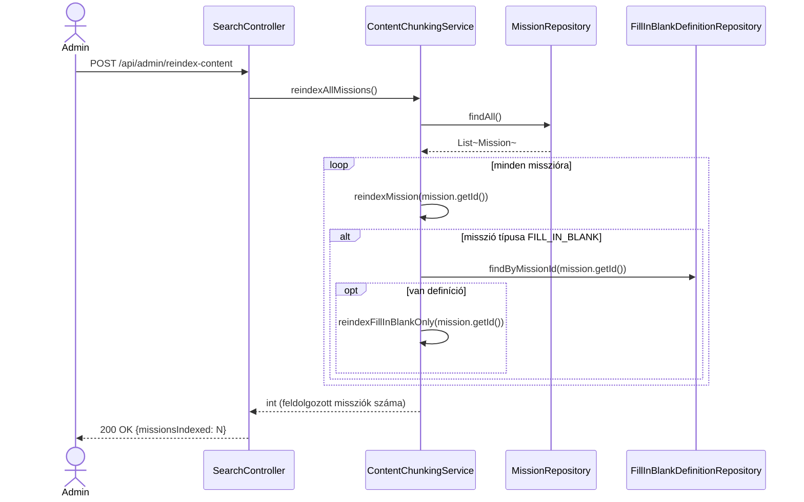
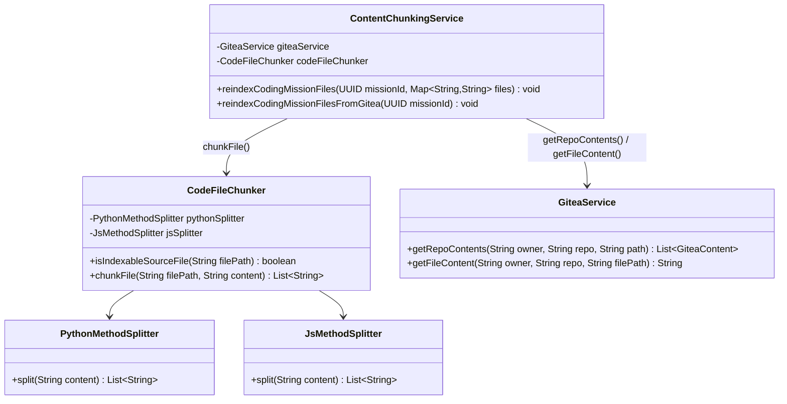

# PR #1 — RAG chunking: implementációs architektúra-terv

> Ez a dokumentum a `plans/ai_chatbot_upgrade_2026.md` PR #1 szakaszát bontja le
> osztály/metódus-szintre: pontos service-metódusok, repository-hívások, hook-pontok a
> meglévő kódban, class- és sequence-diagramok. Ugyanúgy **csak terv, nincs implementáció**
> ebben a körben — a cél, hogy implementáláskor ne kelljen tervezési döntést hozni menet
> közben, csak lekövetni ezt a dokumentumot.

## 1. ⚠️ Egy pontatlanság a fő tervben, amit itt tisztázunk

A `ai_chatbot_upgrade_2026.md` PR #1 szakasza ezt mondja a `reindexMission()`-ról:

> "törli a meglévő `MISSION` chunkokat, chunkol+embedel+beszúr. **Embed-hiba esetén csak
> warningot logol, a régi chunkok érintetlenül maradnak**"

Ez a két mondat **önmagában ellentmond egymásnak**: ha a metódus ELŐSZÖR törli a régi
chunkokat, majd UTÁNA próbál embedelni, és az embedelés menet közben elhasal — a régi
chunkok **már nincsenek meg**, tehát nem maradhatnak "érintetlenül". A garancia csak úgy
tartható, ha a sorrend fordított: **előbb minden új chunk sikeresen embedelődik, és csak
ha MINDEGYIK sikerült, akkor töröljük a régiket és írjuk be az újakat** egyetlen
tranzakcióban. Ez a dokumentum ezt a (helyes) sorrendet tervezi meg — lásd 4.2 szakasz.

**Kérdés hozzád**: egyetértesz ezzel a javított sorrenddel (embed-first, majd
delete+insert csak teljes sikeren), vagy inkább az legyen a szabály, hogy egy részlegesen
sikerült chunkolás is felülírja a régit (csak a sikeres chunkokkal)? Az utóbbi egyszerűbb,
de akkor a misszió tartalma részlegesen indexelt maradhat egy átmeneti ai-service-kiesés
után, amíg valaki újra nem futtatja a reindexet.

## 2. Új komponensek — csomag-elhelyezés

Követve a meglévő csomagstruktúrát (ld. `backend/CLAUDE.md`):

```
backend/src/main/java/com/legymernok/backend/
├── dto/rag/
│   └── ContentChunkDto.java                    (ÚJ, record)
├── service/rag/
│   └── ContentChunkingService.java             (ÚJ, @Service)
├── service/mission/
│   └── MissionService.java                     (MÓDOSUL — 3 hook-pont)
├── service/fillinblank/
│   └── FillInBlankService.java                 (MÓDOSUL — 1 hook-pont)
└── web/search/
    └── SearchController.java                   (MÓDOSUL — 1 új endpoint)
```

**Tudatos döntés: NINCS külön `ContentChunkRepository` Spring Data interfész.** A
`content_chunks` táblának nincs JPA entitása (a `docker/db-init`-hez hasonlóan, ahogy a
`star_systems.content_embedding` mezőt is a `StarSystemService` kezeli közvetlen
`JdbcTemplate`-tel, nem egy külön repository osztályon keresztül — ld.
`StarSystemService.generateAndSaveEmbedding()`/`searchByEmbedding()`). A
`ContentChunkingService` **ugyanezt a mintát követi**: a `JdbcTemplate`-et közvetlenül
injektáljuk bele, nincs plusz absztrakciós réteg. Ez konzisztens a kódbázis jelenlegi
szokásával — ha inkább egy külön repository-osztályt (nem Spring Data interfészt, hanem
sima `@Repository`-annotált, `JdbcTemplate`-et csomagoló osztályt) szeretnél a
tisztább rétegezésért, szólj, és átalakítom.

## 3. `ContentChunkDto` — pontos mezők

```java
package com.legymernok.backend.dto.rag;

import java.util.UUID;

public record ContentChunkDto(
    UUID id,
    String sourceType,      // "MISSION" | "MISSION_FILL_IN_BLANK"
    UUID sourceId,          // Mission.id (mindkét sourceType esetén — a FillInBlank
                             // definíció a mission_id-hoz kötött, nem saját ID-hoz)
    int chunkIndex,
    String chunkText,
    double score            // csak retrieval-válaszban töltött (RRF/rerank pontszám),
                             // reindexeléskor irreleváns, 0.0
) {}
```

## 4. `ContentChunkingService` — teljes metódustábla

| Metódus | Szignatúra | Tranzakció | Mit csinál |
|---|---|---|---|
| `chunkText` | `List<String> chunkText(String text)` | — (pure function) | 800 karakteres ablak, 150 karakteres átfedés, `\n\n` bekezdéshatárra törekedve. `null`/üres/whitespace-only input → üres lista. Rövidebb szöveg, mint 800 karakter → egyetlen chunk. |
| `reindexMission` | `void reindexMission(UUID missionId)` | `@Transactional` | Ld. 4.2 — a fő RAG-indexelési útvonal. |
| `reindexFillInBlankOnly` | `void reindexFillInBlankOnly(UUID missionId)` | `@Transactional` | Ugyanaz a logika, mint `reindexMission`, de csak a `FillInBlankDefinition.templateText`-re, `source_type = 'MISSION_FILL_IN_BLANK'`. |
| `deleteChunks` | `void deleteChunks(String sourceType, UUID sourceId)` | `@Transactional` | `DELETE FROM content_chunks WHERE source_type = ? AND source_id = ?`. |
| `reindexAllMissions` | `int reindexAllMissions()` | `@Transactional` | Végigmegy minden misszión (`missionRepository.findAll()`), mindegyikre meghívja a `reindexMission`-t (+ ha van `FillInBlankDefinition`-je, azt is), visszaadja a feldolgozott missziók számát. Ugyanaz a minta, mint `StarSystemService.reindexAllStarSystems()`. |

### 4.1 `chunkText()` — pontos algoritmus (pure function, mock nélkül tesztelhető)

```
bemenet: text (String, lehet null)
kimenet: List<String>

1. ha text == null vagy text.isBlank() → return List.of()
2. ha text.length() <= 800 → return List.of(text)  (egyetlen chunk, nincs vágás)
3. bekezdésekre bontás "\n\n" mentén
4. egy "aktuális chunk" StringBuilder-t építünk bekezdésenként:
   - ha egy bekezdés hozzáadása után az aktuális chunk hossza >= 800:
     - lezárjuk az aktuális chunkot (hozzáadjuk az eredménylistához)
     - az ÚJ chunk az előző chunk UTOLSÓ 150 karakterével kezdődik (átfedés),
       majd folytatódik a következő bekezdéssel
   - ha egyetlen bekezdés önmagában > 800 karakter (nincs mit "bekezdés-határon" vágni):
     - kemény vágás 800 karakternél, 150 karakteres átfedéssel, ciklikusan,
       amíg a bekezdés el nem fogy
5. az utolsó, még nem lezárt chunkot is hozzáadjuk (ha nem üres)
```

**Miért pure function**: nincs benne `JdbcTemplate`, `AiEmbeddingService`, semmilyen
side-effect — ez teszi lehetővé, hogy a `ContentChunkingServiceTest` mock nélkül,
közvetlen bemenet→kimenet assertekkel tesztelje (határeset: pontosan 800 karakteres
szöveg, bekezdés-határon éppen túlnyúló szöveg, egyetlen 2000 karakteres bekezdés).

### 4.2 `reindexMission()` — a javított (embed-first) sorrend

```
bemenet: missionId (UUID)

1. mission = missionRepository.findById(missionId)
   ha nincs ilyen mission → return (csendben, mint a StarSystemService.generateAndSaveEmbedding()
   mintája — nem dob kivételt, mert ez háttér-hívás egy másik service metódusából, nem
   önálló, felhasználó-facing endpoint)

2. text = buildMissionText(mission)
   = mission.getDescriptionMarkdown() + "\n\n" + mission.getContent()
   (mindkettő null-biztosan kezelve, ha valamelyik null, kihagyjuk)

3. chunks = chunkText(text)
   ha chunks üres → deleteChunks("MISSION", missionId); return
   (ha valaki kiürítette a tartalmat, az index is kiürül — ez NEM embed-hiba, hanem
   szándékos állapot, itt nem alkalmazandó az "őrizzük meg a régit" szabály)

4. embeddedChunks = new ArrayList<PendingChunk>()   // belső, nem-publikus rekord:
                                                      // (int index, String text, String vectorStr)
   for i, chunkText in chunks:
       vector = embeddingService.embed(chunkText)
       ha vector == null:
           log.warn("Embedding failed for mission {} chunk {}/{} — reindex megszakítva, " +
                     "a régi index-állapot változatlan marad", missionId, i, chunks.size())
           return   // <-- ITT a lényeg: a régi chunkok EDDIG A PONTIG nem lettek törölve
       embeddedChunks.add(new PendingChunk(i, chunkText, embeddingService.toVectorString(vector)))

5. csak ha a 4. lépés VÉGIG (minden chunk) sikeres volt:
   deleteChunks("MISSION", missionId)
   insertChunks("MISSION", missionId, embeddedChunks)   // batch INSERT, ld. 4.3

6. log.info("RAG index frissítve: mission {} → {} chunk", missionId, embeddedChunks.size())
```

### 4.3 `insertChunks()` — belső, privát helper

```java
private void insertChunks(String sourceType, UUID sourceId, List<PendingChunk> chunks) {
    jdbcTemplate.batchUpdate(
        """
        INSERT INTO content_chunks (source_type, source_id, chunk_index, chunk_text, content_embedding)
        VALUES (?, ?, ?, ?, ?::vector)
        """,
        chunks, chunks.size(),
        (ps, chunk) -> {
            ps.setString(1, sourceType);
            ps.setObject(2, sourceId);
            ps.setInt(3, chunk.index());
            ps.setString(4, chunk.text());
            ps.setString(5, chunk.vectorStr());
        }
    );
}
```

(`JdbcTemplate.batchUpdate` — nem `N` külön `update()` hívás, egy batch-ben megy, ahogy
egy 10+ chunkos misszónál ez számít.)

## 5. Hook-pontok a meglévő kódban — pontos fájl/sor-hivatkozások

| Fájl | Metódus | Hova kerül a hívás | Miért oda |
|---|---|---|---|
| `service/mission/MissionService.java:490` | `createMission()` | a `mapToResponse(saved)` return előtt, a `log.info(...)` sor után (534. sor környéke) | Új misszió → azonnal legyen indexelve, ugyanaz a minta, mint `StarSystemService.createStarSystem()` végén a `generateAndSaveEmbedding()` hívás. |
| `service/mission/MissionService.java:539` | `updateMission()` | a metódus végén, a `mapToResponse(...)`-t megelőzően | A `descriptionMarkdown` itt módosulhat — újra kell indexelni. |
| `service/mission/MissionService.java:731` | `updateMissionContent()` | a `mission.setContent(content)` utáni sorban, a `return mapToResponse(...)` előtt | Ez a `content` mező **kizárólagos** módosítási útvonala (pl. a Forge-szerkesztőből) — enélkül a hook nélkül a leggyakoribb tartalom-módosítás SOSEM indexelődne újra. |
| `service/fillinblank/FillInBlankService.java` | `saveDefinition()` | a metódus végén, a `return getDefinitionForUser(missionId)` előtt | Ez az egyetlen mentési útvonal a `templateText`-re — a régi definíció törlése+újra épebtése (40-59. sor) után hívjuk. |

**Új konstruktor-függőség mindkét service-ben**: `ContentChunkingService` bekerül a
`MissionService` és a `FillInBlankService` `@RequiredArgsConstructor`-ral generált
konstruktorába (egy új `private final ContentChunkingService contentChunkingService;`
mezőként) — Lombok automatikusan felveszi.

**Fontos, amit érdemes tisztázni**: a `MissionService.createMission()`/`updateMission()`
és a `FillInBlankService.saveDefinition()` metódusok jelenleg `@Transactional`-ok. Ha a
`ContentChunkingService.reindexMission()` (ami maga is `@Transactional`) ugyanabban a
kérésben, ugyanazon a tranzakción belül fut le, és az embedelés (`AiEmbeddingService.embed()`,
egy HTTP-hívás a `ai-service` felé) **lassú vagy időtúllépéses**, az a teljes misszió-mentés
tranzakcióját tartja nyitva/blokkolja feleslegesen hosszan. A `StarSystemService` ugyanezt a
kompromisszumot vállalja már ma is (`generateAndSaveEmbedding()` szinkron, a tranzakción
belül) — tehát ez **konzisztens a meglévő mintával**, nem egy új probléma, amit ennek a
PR-nak kellene megoldania. Ha ez élesben tényleges problémát okozna (lassú mentés), az egy
külön, jövőbeli optimalizáció (pl. async esemény-alapú reindex) — ebben a körben nem
foglalkozunk vele, a szinkron minta marad.

## 6. `SearchController` — új admin endpoint

```java
@PostMapping("/admin/reindex-content")
@PreAuthorize("hasAuthority('starsystem:edit_any')")
public ResponseEntity<ReindexContentResponse> reindexContent() {
    int count = contentChunkingService.reindexAllMissions();
    return ResponseEntity.ok(new ReindexContentResponse(count));
}

record ReindexContentResponse(int missionsIndexed) {}
```

Pontosan a meglévő `reindex-star-systems` (`SearchController.java`, jelenlegi 33-38. sor)
mintáját követi — ugyanaz a permission (`starsystem:edit_any`, mert ez egy admin-szintű,
tartalom-karbantartó művelet, nincs önálló "content:edit"-szerű permission bevezetve
emiatt), ugyanaz a `record`-alapú válasz-DTO minta.

## 7. Class diagram

```mermaid
classDiagram
    class ContentChunkingService {
        -MissionRepository missionRepository
        -FillInBlankDefinitionRepository definitionRepository
        -AiEmbeddingService embeddingService
        -JdbcTemplate jdbcTemplate
        +chunkText(String text) List~String~
        +reindexMission(UUID missionId) void
        +reindexFillInBlankOnly(UUID missionId) void
        +deleteChunks(String sourceType, UUID sourceId) void
        +reindexAllMissions() int
        -insertChunks(String sourceType, UUID sourceId, List~PendingChunk~ chunks) void
        -buildMissionText(Mission mission) String
    }

    class ContentChunkDto {
        <<record>>
        +UUID id
        +String sourceType
        +UUID sourceId
        +int chunkIndex
        +String chunkText
        +double score
    }

    class AiEmbeddingService {
        +embed(String text) float[]
        +toVectorString(float[] embedding) String
    }

    class MissionService {
        -ContentChunkingService contentChunkingService
        +createMission(CreateMissionRequest) MissionResponse
        +updateMission(UUID, CreateMissionRequest) MissionResponse
        +updateMissionContent(UUID, String) MissionResponse
    }

    class FillInBlankService {
        -ContentChunkingService contentChunkingService
        +saveDefinition(UUID, SaveFillInBlankRequest) FillInBlankUserResponse
    }

    class SearchController {
        -ContentChunkingService contentChunkingService
        +reindexContent() ResponseEntity~ReindexContentResponse~
    }

    MissionService --> ContentChunkingService : reindexMission()
    FillInBlankService --> ContentChunkingService : reindexFillInBlankOnly()
    SearchController --> ContentChunkingService : reindexAllMissions()
    ContentChunkingService --> AiEmbeddingService : embed()
    ContentChunkingService ..> ContentChunkDto : használja (retrieval-válaszokban, PR #2)
    ContentChunkingService --> "content_chunks tábla" : JdbcTemplate (nyers SQL)
```

## 8. Sequence diagram — misszió tartalom mentése → automatikus reindex

```mermaid
sequenceDiagram
    actor Admin
    participant MC as MissionController
    participant MS as MissionService
    participant CCS as ContentChunkingService
    participant AES as AiEmbeddingService
    participant AI as ai-service (FastAPI)
    participant DB as Postgres (content_chunks)

    Admin->>MC: POST /api/missions/{id}/forge/save (Forge-szerkesztő)
    MC->>MS: updateMissionContent(id, content)
    MS->>MS: mission.setContent(content); missionRepository.save(mission)
    MS->>CCS: reindexMission(missionId)
    CCS->>CCS: buildMissionText() + chunkText()
    loop minden chunk-ra
        CCS->>AES: embed(chunkText)
        AES->>AI: POST /embed
        AI-->>AES: {embedding: [...]}
        AES-->>CCS: float[]
    end
    alt mindegyik chunk embedelése sikeres
        CCS->>DB: DELETE FROM content_chunks WHERE source_type='MISSION' AND source_id=?
        CCS->>DB: batch INSERT (új chunkok + embeddingek)
        CCS-->>MS: (visszatér, siker)
    else valamelyik embed() null-t adott vissza
        CCS->>CCS: log.warn(...) — a DB-hez EGYÁLTALÁN nem nyúl
        CCS-->>MS: (visszatér, a régi chunkok változatlanok)
    end
    MS-->>MC: MissionResponse
    MC-->>Admin: 200 OK
```

## 9. Sequence diagram — admin "Teljes újraindexelés" gomb



## 10. Tesztterv (`ContentChunkingServiceTest.java`)

A meglévő `StarSystemServiceTest` mintáját követve (JUnit5 + Mockito, közvetlen
Java-határon mockolva, NEM HTTP-szerveren keresztül):

| Teszteset | Mit ellenőriz |
|---|---|
| `chunkText_shortText_returnsSingleChunk` | 800 karakternél rövidebb szöveg → 1 elemű lista, változatlan tartalommal |
| `chunkText_null_returnsEmptyList` | `null`/üres/whitespace bemenet → üres lista |
| `chunkText_longText_respectsOverlap` | Két egymást követő chunk között pontosan 150 karakteres az átfedés |
| `chunkText_prefersParagraphBoundary` | `\n\n`-nél vág, ha lehetséges, nem a szó közepén |
| `chunkText_singleHugeParagraph_hardCuts` | Egyetlen, 800-nál hosszabb bekezdés esetén is helyesen vágja |
| `reindexMission_allEmbedsSucceed_replacesOldChunks` | Mockolt `embeddingService.embed()` mindig nem-null → `jdbcTemplate` DELETE+INSERT hívások megtörténnek |
| `reindexMission_oneEmbedFails_keepsOldChunksUntouched` | Mockolt `embed()` a 2. hívásnál `null`-t ad vissza → **a `jdbcTemplate`-en EGYETLEN DELETE/INSERT hívás sem történik** (ez a kulcs-assert az 1. szakasz döntésére) |
| `reindexMission_missionNotFound_returnsWithoutError` | Ismeretlen `missionId` → nem dob kivételt, csendben visszatér |
| `reindexAllMissions_countsProcessedMissions` | Mockolt `missionRepository.findAll()` 3 elemmel → visszatérési érték 3, `reindexMission` 3× hívva |
| `deleteChunks_callsCorrectSql` | A DELETE SQL a helyes `source_type`/`source_id` paraméterekkel hívódik |

**Kézi ellenőrzés (Norbi, itt nem elvégezhető)**: V10 migráció alkalmazása egy valódi
Postgres ellen, a `reindex-content` végpont hívása Postmanből/curl-lel, majd
`SELECT count(*), source_type FROM content_chunks GROUP BY source_type;` — hogy a
várt darabszám jön-e ki egy ismert tartalmú misszión.

## 11. ~~Nyitott kérdés hozzád~~ — MEGVÁLASZOLVA (2026-08-25), ld. 12. szakasz

~~Az 1. szakaszban feltett kérdésen túl: a `chunkText()` jelenlegi terve nem veszi
figyelembe a Markdown-struktúrát...~~ **Norbi döntése: több chunkolási stratégia legyen,
misszió-típusonként — CONTENT-missziónál marad a bekezdés-alapú `chunkText()`, CODING-
missziónál fájlonkénti + azon belül metódusonkénti vágás.** Ld. részletesen lent.

## 12. Kiegészítés (2026-08-25) — típusfüggő chunkolási stratégia

### 12.1 A kérés pontosítása

CONTENT-missziónál (a `descriptionMarkdown`/`content` mezők, sima szöveg) marad a 4.1
szakaszban leírt bekezdés-alapú `chunkText()`. **CODING-missziónál viszont NEM a
`descriptionMarkdown`/`content` mezőket kell így vágni** — a tényleges forráskód nem a DB-
ben, hanem a **Gitea repóban** él (`templateRepositoryUrl`, ld. `backend/CLAUDE.md` "Gitea
integráció" szakasz). Egy CODING-misszió "tartalma", amit a chatbotnak érdemes ismernie, a
**Forge-ban admin által megírt kiinduló/referencia kódfájlok** — ezeket kell fájlonként,
majd fájlon belül metódusonként chunkolni ("egy chunkba egy metódus").

### 12.2 Fontos, kimondott scope-döntés: KIZÁRÓLAG az admin Forge-repója, NEM a kadétok egyéni beadásai

A `backend/CLAUDE.md` "Gitea integráció" szakasza szerint minden mission-repo **admin-
tulajdonú**, a `CadetMission.repositoryUrl` mező pedig arra utal, hogy egy kadét indításkor
**saját másolatot** kap (`copyRepositoryContents`) — tehát potenciálisan **több ezer, egyénileg
eltérő repó** tartozhatna egyetlen misszióhoz, ha minden kadét-beadást indexelnénk. **Ez a terv
tudatosan KIZÁRÓLAG az admin saját, Forge-ban szerkesztett repóját indexeli** (a
`saveForgeMissionContent()`-tel mentett fájlokat) — ez az egyetlen, misszió-szintű, kanonikus
forrás, aminek van értelme a "segíts megérteni ezt a missziót" RAG-kontextusban. A kadétok
saját beadásainak indexelése (ha valaha felmerülne, pl. "nézd meg a saját korábbi
megoldásomat") **egy teljesen más, sokkal nagyobb, önálló feature lenne** — ez a PR nem
foglalkozik vele. **Kérlek erősítsd meg, hogy ez a scope helyes** — ha tévedek, és mégis a
kadét-repókra gondoltál, szólj, mert az a tervezést gyökeresen máshogy kellene felépítse
(adatvédelem, méretezés, per-kadét retrieval-szűrés).

### 12.3 Új komponensek

```
service/rag/
├── ContentChunkingService.java          (MÓDOSUL — 2 új publikus + 4 új privát metódus)
└── strategy/
    ├── CodeFileChunker.java              (ÚJ — nyelv-diszpécser + fájl-szűrés)
    ├── PythonMethodSplitter.java          (ÚJ — indentáció-alapú)
    └── JsMethodSplitter.java              (ÚJ — regex + zárójel-számláló)
```

**A `CodeFileChunker` egy önálló, `ContentChunkingService`-be injektált osztály** (nem a
`ContentChunkingService`-en belüli privát metódus), mert 3 konkrét felelőssége van
(fájlszűrés, nyelv-detektálás, diszpécselés a két splitter közt), amit külön egység-
tesztelni érdemes a fő service mockolása nélkül.

### 12.4 `CodeFileChunker` — metódustábla

| Metódus | Szignatúra | Mit csinál |
|---|---|---|
| `isIndexableSourceFile` | `boolean isIndexableSourceFile(String filePath)` | Kiterjesztés-alapú whitelist: `.py`, `.js`, `.jsx`, `.ts`, `.tsx`. Minden más (pl. `README.md`, `package.json`, `.gitea/workflows/ci.yml`, `requirements.txt`) → `false`, kihagyva — a misszió leírása (`descriptionMarkdown`) amúgy is indexelve van a `reindexMission()`-ön keresztül, nincs duplikáció. |
| `chunkFile` | `List<String> chunkFile(String filePath, String content)` | Kiterjesztés alapján diszpécsel a megfelelő splitterre. Ha a splitter **0 találatot** ad (nincs felismerhető függvény/metódus a fájlban — pl. egy konstans-definíciós fájl), **visszaesik a meglévő `chunkText()`-re** (4.1 szakasz) — így egyetlen indexelhető fájl sem marad kimaradva, csak esetleg nem metódus-pontosan vágva. |

### 12.5 `PythonMethodSplitter` — indentáció-alapú vágás

```
bemenet: fájltartalom (String)
kimenet: List<String> (egy elem = egy függvény/metódus, TOP-LEVEL indentációs
         szinten — a beágyazott/helper függvényeket a szülőjük chunkjában hagyjuk,
         tudatos egyszerűsítés, nem próbáljuk teljesen szét-lapítani a fát)

1. sorokra bontás
2. minden sorra: ha a (bal oldali whitespace-t levágva) sor "def " vagy "async def "-fel
   kezdődik ÉS az indentációs szintje MEGEGYEZIK az eddig látott legkisebb "def"-
   indentációs szinttel a fájlban (azaz ez egy top-level vagy osztály-metódus szintű
   def, nem egy beágyazott helper-függvény):
   → lezárjuk az eddigi puffert (ha nem üres, hozzáadjuk az eredményhez), és egy ÚJ
     puffert kezdünk ezzel a sorral
   egyébként: hozzáfűzzük az aktuális pufferhez (ide esik minden import, class-
     deklaráció, dekorátor, és minden beágyazott/helper def is)
3. a fájl VÉGÉN megmaradt puffert is hozzáadjuk
4. ha 0 "def" volt a fájlban → üres lista (a hívó `CodeFileChunker` ilyenkor
   visszaesik `chunkText()`-re)
```

### 12.6 `JsMethodSplitter` — regex-indítás + zárójel-számlálás

```
FÜGGVÉNY-KEZDET mintázatok (soronként illesztve, opcionális "export"/"async" prefixszel):
  - function NÉV(...) {
  - NÉV(...) {                          // class-metódus rövid szintaxis
  - const|let NÉV = (...) => {          // arrow function változó-hozzárendelésben
  - const|let NÉV = async (...) => {

algoritmus:
1. sorokra bontás
2. soronként: ha illeszkedik egy FÜGGVÉNY-KEZDET mintázatra:
     - jegyezzük a kezdő sor indexét
     - számláljuk a nyitott/zárt kapcsos zárójelek egyenlegét a sortól kezdve,
       soronként haladva, amíg az egyenleg vissza nem esik 0-ra (= a függvénytörzs vége)
     - az érintett sorok (kezdő ... záró) egy chunk
   egyébként: következő sor
3. ha 0 találat → üres lista (fallback `chunkText()`-re)
```

**⚠️ Fontos, kimondott korlát**: ez a zárójel-számlálás **NEM string-/komment-tudatos** — egy
`"valami { furcsa }"` stringliterál vagy egy `// { comment` sor tévesen befolyásolhatja a
mélység-számlálást, és rosszul vághatja a chunk-határt. Ez egy **heurisztika**, nem egy
valódi JavaScript-parser (egy pontos megoldáshoz egy tényleges AST-parser kellene, pl. egy
Node-alapú `@babel/parser` subprocess-hívás a Java-ból — ez explicit KÍVÜL esik ennek a
PR-nak a keretein, tudatos kompromisszum, nem felejtés). Gyakorlati hatás: néhány fájlnál a
chunk-határ pontatlan lehet (pl. egy stringben lévő `{` miatt egy metódus "korábban lezár",
mint kellene) — ez a retrieval-minőséget rontja, DE nem okoz hibát/crash-t, és a `chunkText()`
fallback mindig garantálja, hogy legalább VALAMILYEN, kb. 800 karakteres granularitású index
legyen minden fájlról.

### 12.7 `ContentChunkingService` — új/módosult metódusok

| Metódus | Szignatúra | Tranzakció | Hívó |
|---|---|---|---|
| `reindexCodingMissionFiles` | `void reindexCodingMissionFiles(UUID missionId, Map<String, String> files)` | `@Transactional` | `MissionService.saveForgeMissionContent()` — **a fájlok már memóriában vannak a hívás pillanatában** (a Forge-mentés `request.getFiles()`-e), nincs szükség extra Gitea-hívásra ezen az útvonalon. |
| `reindexCodingMissionFilesFromGitea` | `void reindexCodingMissionFilesFromGitea(UUID missionId)` | `@Transactional` | `reindexAllMissions()` belső ága, CODING-típusú missziókra — itt NINCS memóriában lévő fájl-map, tehát `GiteaService.getRepoContents()`-t hív rekurzívan (a `dir` típusú bejegyzéseken bejárva), majd minden `file`-nak `GiteaService.getFileContent()`-et, hogy megkapja a tényleges tartalmat (a lista-végpont csak metaadatot ad, tartalmat nem). |

Mindkettő ugyanazt a belső logikát futtatja (a különbség csak a fájlok forrása): minden
fájlra `codeFileChunker.isIndexableSourceFile()` → ha igen, `codeFileChunker.chunkFile()` →
minden visszakapott chunkra `embeddingService.embed()` (ugyanaz az **embed-first**
biztonsági szabály, mint a 4.2 szakaszban — ha BÁRMELYIK fájl BÁRMELYIK chunkja embed-hibát
ad, a teljes CODING-fájl-reindex megszakad a jelenlegi állapoton, a régi `MISSION_CODE_FILE`
chunkok változatlanok maradnak), majd csak teljes sikeren `deleteChunks("MISSION_CODE_FILE",
missionId)` + batch insert, a `file_path` oszlopot is kitöltve.

**Új konstruktor-függőség**: `GiteaService` bekerül a `ContentChunkingService`
konstruktorába (csak a `reindexCodingMissionFilesFromGitea` úton használt).

### 12.8 Hook-pont kiegészítés

| Fájl | Metódus | Hova kerül a hívás |
|---|---|---|
| `service/mission/MissionService.java:180` (`saveForgeMissionContent`) | a `giteaService.uploadFiles(...)` hívás UTÁN, a `mission.setVerificationStatus(...)` előtt/után (sorrend mindegy, mindkettő ugyanabban a tranzakcióban fut) | `contentChunkingService.reindexCodingMissionFiles(mission.getId(), request.getFiles())` — csak akkor, ha `mission.getMissionType() == MissionType.CODING` (a metódus más misszió-típusra is meghívható lehet, bár ma gyakorlatilag CODING-ra használt — védekező típus-ellenőrzés indokolt). |

### 12.9 Frissített class diagram (csak az új rész)



### 12.10 Sequence diagram — Forge-mentés → kódfájlok chunkolása

```mermaid
sequenceDiagram
    actor Admin
    participant MC as MissionController
    participant MS as MissionService
    participant GS as GiteaService
    participant CCS as ContentChunkingService
    participant CFC as CodeFileChunker
    participant AES as AiEmbeddingService
    participant DB as Postgres (content_chunks)

    Admin->>MC: POST /api/missions/{id}/forge/save {files: {"solution.py": "...", "test_solution.py": "..."}}
    MC->>MS: saveForgeMissionContent(request)
    MS->>GS: uploadFiles(repoOwner, repoName, files, commitMsg, user)
    GS-->>MS: (Gitea commit kész)
    alt mission.missionType == CODING
        MS->>CCS: reindexCodingMissionFiles(missionId, files)
        loop minden fájlra a files map-ben
            CCS->>CFC: isIndexableSourceFile(path)
            alt indexelhető (.py/.js/.ts/...)
                CCS->>CFC: chunkFile(path, content)
                CFC-->>CCS: List~String~ (egy elem = egy metódus, vagy fallback chunkText())
                loop minden chunkra
                    CCS->>AES: embed(chunkText)
                    AES-->>CCS: float[] vagy null
                end
            end
        end
        alt minden chunk minden fájlban sikeresen embedelt
            CCS->>DB: DELETE FROM content_chunks WHERE source_type='MISSION_CODE_FILE' AND source_id=?
            CCS->>DB: batch INSERT (fájlanként, metódusonként, file_path kitöltve)
        else bármelyik embed hiba
            CCS->>CCS: log.warn(...) — DB-hez nem nyúl, régi kódindex változatlan
        end
    end
    MS->>MS: mission.setVerificationStatus(PENDING); missionRepository.save(mission)
    MS-->>MC: MissionResponse
    MC-->>Admin: 200 OK
```

### 12.11 Tesztterv-kiegészítés

| Teszteset | Osztály | Mit ellenőriz |
|---|---|---|
| `split_singleFunction_returnsOneChunk` | `PythonMethodSplitterTest` | Egy `def`-es fájl → 1 chunk, a teljes függvénytörzzsel |
| `split_multipleTopLevelFunctions_returnsSeparateChunks` | `PythonMethodSplitterTest` | 3 top-level `def` → 3 chunk, határok helyesek |
| `split_nestedHelperFunction_staysInParentChunk` | `PythonMethodSplitterTest` | Egy `def`-en belüli beágyazott `def` NEM vág új chunkot |
| `split_noFunctions_returnsEmptyList` | `PythonMethodSplitterTest` | Csak import+konstans, `def` nélkül → üres lista (fallback jelzés) |
| `split_arrowFunctionAssignment_detected` | `JsMethodSplitterTest` | `const foo = (x) => { ... }` mintázat helyesen detektált+bezárt |
| `split_classMethodShorthand_detected` | `JsMethodSplitterTest` | `methodName(x) { ... }` (class body) helyesen detektált |
| `split_braceInsideString_knownLimitation` | `JsMethodSplitterTest` | **Dokumentált, elvárt hibás eset** — explicit teszt, ami bizonyítja és rögzíti a 12.6-ban leírt korlátot (nem regresszió, hanem tudatosan rögzített viselkedés, hogy ha valaha javítjuk, tudjuk mit változtattunk) |
| `chunkFile_unindexableExtension_returnsEmpty` | `CodeFileChunkerTest` | `.json`/`.md` fájl → `isIndexableSourceFile()` false, `chunkFile()`-t meg sem hívjuk |
| `chunkFile_noFunctionsFound_fallsBackToChunkText` | `CodeFileChunkerTest` | Mockolt splitter üres listát ad → a `ContentChunkingService.chunkText()` fut le helyette |
| `reindexCodingMissionFiles_allEmbedsSucceed_replacesOldFileChunks` | `ContentChunkingServiceTest` | Több fájl, több chunk, minden embed sikeres → DELETE+batch INSERT megtörténik, `file_path` helyesen kitöltve |
| `reindexCodingMissionFiles_oneEmbedFailsInSecondFile_keepsAllOldChunksUntouched` | `ContentChunkingServiceTest` | Az embed-first szabály CODING-fájloknál is tartja magát — akkor is, ha csak a 2. fájl 3. chunkja hasal el |

**Kézi ellenőrzés (Norbi, itt nem elvégezhető)**: egy valódi `mission-python-template`/
`mission-js-template`-alapú misszió Forge-mentése után `SELECT file_path, chunk_index,
LEFT(chunk_text, 80) FROM content_chunks WHERE source_type='MISSION_CODE_FILE' ORDER BY
file_path, chunk_index;` — vizuálisan ellenőrizve, hogy a vágások tényleg metódus-határon
vannak-e, nem félbevágva.
