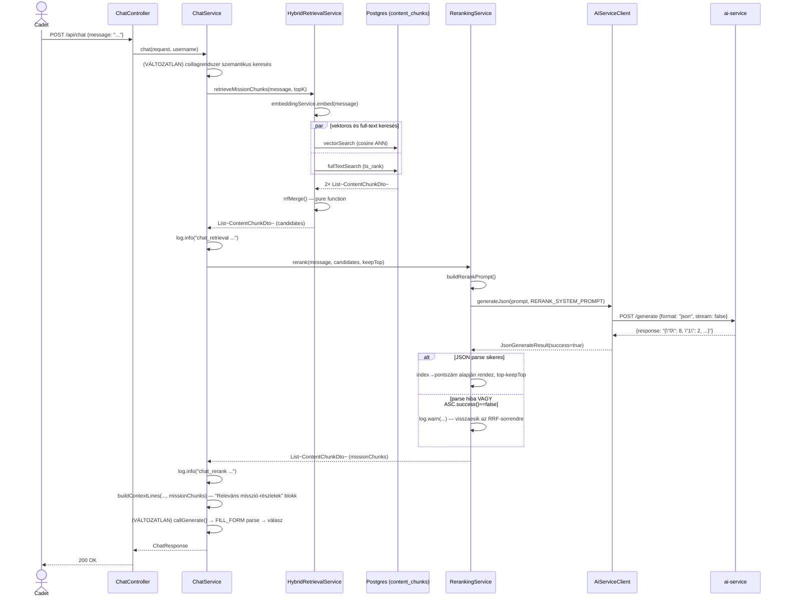

# PR #2 — Hibrid retrieval + reranking: implementációs architektúra-terv

> Ez a dokumentum a `plans/ai_chatbot_upgrade_2026.md` PR #2 szakaszát bontja le
> osztály/metódus-szintre, ugyanolyan mélységben, mint a
> [`pr1_rag_chunking_architecture_2026.md`](pr1_rag_chunking_architecture_2026.md). **Csak
> terv, nincs implementáció.** A PR #1-ben megtervezett `content_chunks` táblára és
> `ContentChunkDto`-ra épül — azt előbb érdemes elolvasni.

## 1. Új komponensek — csomag-elhelyezés

```
backend/src/main/java/com/legymernok/backend/
├── service/ai/
│   ├── AiEmbeddingService.java          (VÁLTOZATLAN — a fő terv explicit kéri, hogy ne
│   │                                     nyúljunk hozzá, ne kockáztassuk a működő embed-utat)
│   ├── AiServiceClient.java             (ÚJ)
│   └── ChatService.java                 (MÓDOSUL — 1 hook-pont, `chat()` bővítése)
└── service/rag/
    ├── ContentChunkingService.java      (PR #1, változatlan)
    ├── HybridRetrievalService.java      (ÚJ)
    └── RerankingService.java            (ÚJ)
```

**Tudatos döntés, a PR #1 mintáját követve**: a `HybridRetrievalService` is közvetlen
`JdbcTemplate`-tel dolgozik, nincs külön repository-osztály — ugyanaz az indoklás, mint a
`ContentChunkingService`-nél (nincs JPA entitás a `content_chunks` táblához).

## 2. `AiServiceClient` — az új ai-service hívás-forma

A meglévő `ChatService.callGenerate()` (privát metódus, `ChatService.java` jelenlegi
141-158. sor) és az `AiEmbeddingService.embed()` **változatlanul megmaradnak** — ez a PR
**nem** vonja össze őket egy közös klienssel, mert a fő terv explicit óvatosságra int
("az `AiEmbeddingService`-t érintetlenül hagyjuk"). Az `AiServiceClient` egy **harmadik,
párhuzamos** hívás-út, kifejezetten a `format:"json"` (strukturált kimenetet váró) hívásokra
— ezt használja majd a `RerankingService` (ez a PR) és PR #5-ben a tool-calling.

```java
package com.legymernok.backend.service.ai;

@Service
@RequiredArgsConstructor
@Slf4j
public class AiServiceClient {

    private final RestTemplate restTemplate;

    @Value("${ai.service.url:http://localhost:8081}")
    private String aiServiceUrl;

    public record JsonGenerateResult(String rawResponse, boolean success) {}

    @SuppressWarnings("unchecked")
    public JsonGenerateResult generateJson(String prompt, String systemPrompt) {
        try {
            var body = Map.of(
                    "prompt", prompt,
                    "system_prompt", systemPrompt,
                    "format", "json"
            );
            var req = RequestEntity
                    .post(aiServiceUrl + "/generate")
                    .contentType(MediaType.APPLICATION_JSON)
                    .body(body);
            var response = restTemplate.exchange(req, Map.class);
            if (response.getBody() == null) return new JsonGenerateResult(null, false);
            String raw = (String) response.getBody().get("response");
            return new JsonGenerateResult(raw, raw != null);
        } catch (Exception e) {
            log.warn("AiServiceClient.generateJson failed: {}", e.getMessage());
            return new JsonGenerateResult(null, false);
        }
    }
}
```

Ez szó szerint a `ChatService.callGenerate()` mintáját másolja (ugyanaz a
`RequestEntity.post(aiServiceUrl + "/generate")` + `restTemplate.exchange(req, Map.class)`
felépítés, ugyanaz a `@Value("${ai.service.url:http://localhost:8081}")`), csak egy
`format` mezővel bővítve a body-t, és egy típusos `JsonGenerateResult` rekordba csomagolva a
választ hiba/siker jelzéssel — a hívóknak (`RerankingService`) nem kell `null`-ellenőrzést
+ kivétel-kezelést duplikálniuk.

## 3. `ai-service/main.py` — `format` mező hozzáadása

A jelenlegi `GenerateRequest` (`ai-service/main.py`, 25-30. sor):

```python
class GenerateRequest(BaseModel):
    prompt: str
    context: list[str] = []
    model: str | None = None
    system_prompt: str | None = None
```

Bővítés:

```python
class GenerateRequest(BaseModel):
    prompt: str
    context: list[str] = []
    model: str | None = None
    system_prompt: str | None = None
    format: str | None = None          # ÚJ — pl. "json", átadva Ollamának változatlanul
```

A `/generate` handler (jelenlegi 68-80. sor) payload-építésének bővítése:

```python
payload: dict = {"model": model, "prompt": prompt, "stream": False}
if req.system_prompt:
    payload["system"] = req.system_prompt
if req.format:                          # ÚJ
    payload["format"] = req.format
```

Nincs új Python-függőség — az Ollama natív `/api/generate` végpontja már ma is támogatja a
`format` mezőt (ez Ollama saját funkciója, nem valami, amit az ai-service-nek implementálnia
kellene).

## 4. `HybridRetrievalService` — teljes metódustábla

| Metódus | Szignatúra | Mit csinál |
|---|---|---|
| `retrieveMissionChunks` | `List<ContentChunkDto> retrieveMissionChunks(String query, int topK)` | A fő belépési pont — embedeli a query-t, lefuttatja a két keresést, `rrfMerge()`-dzsel egyesíti. Ld. 4.1. |
| `vectorSearch` | `private List<ContentChunkDto> vectorSearch(String vectorStr, int limit)` | Koszinusz-ANN a `content_chunks.content_embedding`-en, a `StarSystemService.searchByEmbedding()` mintáját követve. Ld. 4.2. |
| `fullTextSearch` | `private List<ContentChunkDto> fullTextSearch(String query, int limit)` | Postgres full-text keresés a generált `search_vector` (PR #1 séma) oszlopon, `ts_rank` + `plainto_tsquery('simple', ?)`. Ld. 4.2. |
| `rrfMerge` | `static List<ContentChunkDto> rrfMerge(List<ContentChunkDto> a, List<ContentChunkDto> b, int topK)` | **Pure static function** — a fő unit-teszt célpont, nincs szüksége semmilyen mockra. Ld. 4.3. |
| `mapRow` | `private ContentChunkDto mapRow(ResultSet rs)` | Közös `RowMapper`-logika a két keresési metódushoz (ne duplikálódjon a mezőkiolvasás). |

### 4.1 `retrieveMissionChunks()` — a fő metódus

```java
public List<ContentChunkDto> retrieveMissionChunks(String query, int topK) {
    float[] vector = embeddingService.embed(query);
    List<ContentChunkDto> vectorResults = (vector != null)
            ? vectorSearch(embeddingService.toVectorString(vector), topK * 3)
            : List.of();   // embed-hiba esetén NEM dobunk kivételt, csak a full-text ágra esünk vissza

    List<ContentChunkDto> fullTextResults = fullTextSearch(query, topK * 3);

    return rrfMerge(vectorResults, fullTextResults, topK);
}
```

**Fontos, a fő tervhez képest pontosított részlet**: ha az embedelés hibázik (ai-service
kiesés), a vektoros ág üres listát ad, DE a full-text ág **továbbra is lefut** — a hibrid
keresés így degradáltan (csak full-text), de NEM teljesen hibázva működik tovább. Ez
konzisztens a `ChatService.chat()` jelenlegi mintájával, ahol egy sikertelen szemantikus
keresés (`try/catch`, 74-81. sor) sem állítja meg a teljes chat-választ, csak logol és
folytatja üres eredménnyel.

### 4.2 `vectorSearch()` / `fullTextSearch()` — pontos SQL

```java
private List<ContentChunkDto> vectorSearch(String vectorStr, int limit) {
    return jdbcTemplate.query(
        """
        SELECT id, source_type, source_id, file_path, chunk_index, chunk_text,
               1 - (content_embedding <=> ?::vector) AS score
        FROM content_chunks
        WHERE content_embedding IS NOT NULL
        ORDER BY score DESC
        LIMIT ?
        """,
        (rs, i) -> mapRow(rs),
        vectorStr, limit
    );
}

private List<ContentChunkDto> fullTextSearch(String query, int limit) {
    return jdbcTemplate.query(
        """
        SELECT id, source_type, source_id, file_path, chunk_index, chunk_text,
               ts_rank(search_vector, plainto_tsquery('simple', ?)) AS score
        FROM content_chunks
        WHERE search_vector @@ plainto_tsquery('simple', ?)
        ORDER BY score DESC
        LIMIT ?
        """,
        (rs, i) -> mapRow(rs),
        query, query, limit
    );
}
```

Ez 1:1 a `StarSystemService.searchByEmbedding()` (`StarSystemService.java`, 416-435. sor)
JDBC-mintáját követi (`1 - (embedding <=> ?::vector) AS similarity`-stílus), csak a
`content_chunks` táblára és a PR #1-ben már meglévő `search_vector` generált oszlopra
alkalmazva. A `?::vector` cast és a `plainto_tsquery('simple', ?)` (nem `english`/`hungarian`
szótár — a `search_vector` is `'simple'` konfigurációval lett generálva a PR #1 migrációban,
ennek egyeznie KELL, különben a full-text index nem használódik hatékonyan) pontosan
lekövetik a PR #1 séma-döntéseit.

### 4.3 `rrfMerge()` — pure function, a fő teszt-célpont

```java
static final int RRF_K = 60;

static List<ContentChunkDto> rrfMerge(List<ContentChunkDto> a, List<ContentChunkDto> b, int topK) {
    Map<UUID, Double> scoreById = new LinkedHashMap<>();
    Map<UUID, ContentChunkDto> chunkById = new LinkedHashMap<>();

    addRankedScores(a, scoreById, chunkById);
    addRankedScores(b, scoreById, chunkById);

    return scoreById.entrySet().stream()
            .sorted(Map.Entry.<UUID, Double>comparingByValue().reversed())
            .limit(topK)
            .map(e -> withScore(chunkById.get(e.getKey()), e.getValue()))
            .toList();
}

private static void addRankedScores(List<ContentChunkDto> list, Map<UUID, Double> scoreById, Map<UUID, ContentChunkDto> chunkById) {
    for (int rank = 0; rank < list.size(); rank++) {
        ContentChunkDto chunk = list.get(rank);
        scoreById.merge(chunk.id(), 1.0 / (RRF_K + rank + 1), Double::sum);
        chunkById.putIfAbsent(chunk.id(), chunk);
    }
}

private static ContentChunkDto withScore(ContentChunkDto chunk, double score) {
    return new ContentChunkDto(chunk.id(), chunk.sourceType(), chunk.sourceId(),
            chunk.filePath(), chunk.chunkIndex(), chunk.chunkText(), score);
}
```

**Algoritmus-megjegyzés**: standard Reciprocal Rank Fusion, `k=60` (a fő terv által is
megadott, szakirodalmi szokásos érték, nem paraméterezett — ha valaha hangolni kellene,
konstansból könnyen kiemelhető). A `rank + 1` azért kell, mert a `rank` 0-indexelt, az RRF
képlet viszont 1-indexelt pozíciót vár (`1/(k+rank)`, ahol az első helyezett `rank=1`). A
`chunkById.putIfAbsent()` biztosítja, hogy ha egy chunk mindkét listában szerepel, a
DTO-példány (és a benne lévő `chunkText`) az elsőként látott forrásból származzon — ez
irreleváns, mert a szöveg ugyanaz, csak a duplikált objektum-létrehozást kerüli el.

Mivel ez **statikus, side-effect-mentes függvény**, a `ContentChunkDto` listákat kézzel
összeállítva, mock nélkül tesztelhető — ld. 8. szakasz tesztterve.

## 5. `RerankingService` — teljes metódustábla

| Metódus | Szignatúra | Mit csinál |
|---|---|---|
| `rerank` | `List<ContentChunkDto> rerank(String query, List<ContentChunkDto> candidates, int keepTop)` | Egy `AiServiceClient.generateJson()` hívással pontszámoztatja a jelölteket, majd a pontszám szerint csökkenő sorrendben visszaadja a legjobb `keepTop` darabot. Hiba esetén visszaesik az RRF-sorrendre (nem dob kivételt). |
| `buildRerankPrompt` | `private String buildRerankPrompt(String query, List<ContentChunkDto> candidates)` | A jelölteket 0-tól indexelve felsorolja a promptban, hogy a modell index→pontszám JSON-t tudjon visszaadni. |

```java
private static final String RERANK_SYSTEM_PROMPT = """
        Egy keresési jelölt-listát kapsz egy kérdéshez. Minden jelöltet 0-tól 10-ig terjedő
        relevancia-pontszámmal kell értékelned a kérdéshez képest. VÁLASZOLJ KIZÁRÓLAG egy
        JSON objektummal, ahol a kulcsok a jelöltek sorszámai (stringként), az értékek a
        pontszámok. Példa: {"0": 8, "1": 2, "2": 9}. Ne írj semmilyen más szöveget.
        """;

public List<ContentChunkDto> rerank(String query, List<ContentChunkDto> candidates, int keepTop) {
    if (candidates.isEmpty()) return candidates;

    String prompt = buildRerankPrompt(query, candidates);
    AiServiceClient.JsonGenerateResult result = aiServiceClient.generateJson(prompt, RERANK_SYSTEM_PROMPT);

    if (!result.success()) {
        log.warn("Reranking call failed, falling back to pre-rerank (RRF) order");
        return candidates.stream().limit(keepTop).toList();
    }

    try {
        Map<String, Integer> scoresByIndex = objectMapper.readValue(
                result.rawResponse(), new TypeReference<Map<String, Integer>>() {});

        return IntStream.range(0, candidates.size())
                .boxed()
                .sorted(Comparator.comparingInt(
                        i -> -scoresByIndex.getOrDefault(String.valueOf(i), 0)))
                .limit(keepTop)
                .map(candidates::get)
                .toList();
    } catch (Exception e) {
        log.warn("Could not parse rerank JSON response, falling back to RRF order: {}", e.getMessage());
        return candidates.stream().limit(keepTop).toList();
    }
}

private String buildRerankPrompt(String query, List<ContentChunkDto> candidates) {
    StringBuilder sb = new StringBuilder("Kérdés: ").append(query).append("\n\nJelöltek:\n");
    for (int i = 0; i < candidates.size(); i++) {
        sb.append(i).append(". ").append(truncate(candidates.get(i).chunkText(), 300)).append("\n");
    }
    return sb.toString();
}
```

**Miért index-alapú, nem chunk-ID-alapú a rerank-válasz**: a chunk `UUID`-k hosszúak, a
modellnek feleslegesen nehéz/hibalehetőség-forrás lenne pontosan visszaírnia egy UUID-t
JSON-kulcsként — egy 0-tól induló sorszám sokkal megbízhatóbban kezelhető egy kisebb,
gyengébb LLM-mel is (`gemma3:8b-q4_K_M` a jelenlegi default modell, ld.
`docker-compose.yml`). A `truncate(chunkText, 300)` a rerank-prompt méretét korlátozza,
hogy sok jelölt esetén se fusson ki a kontextusablakból — ez egy új, kis privát helper
függvény, egyszerű string-vágás "..." jelzéssel, ha vágott.

## 6. `ChatService.chat()` bővítése — pontos hook-pont

A jelenlegi `chat()` metódus (`ChatService.java`, 42-56. sor) 1. lépése a csillagrendszer-
keresés, 2. lépése a `buildContextLines()` hívása. Az új hibrid+rerank hívás **e kettő közé**
kerül:

```java
public ChatResponse chat(ChatRequest request, String username) {
    // 1. Szemantikus keresés (VÁLTOZATLAN)
    List<StarSystemSearchResult> relevant = List.of();
    try {
        float[] vector = embeddingService.embed(request.message());
        if (vector != null) {
            relevant = starSystemService.searchByEmbedding(
                    embeddingService.toVectorString(vector), 3);
        }
    } catch (Exception e) {
        log.warn("Semantic search failed during chat: {}", e.getMessage());
    }

    // 1b. ÚJ — hibrid misszió-chunk retrieval + rerank
    long retrievalStart = System.currentTimeMillis();
    List<ContentChunkDto> missionChunks = List.of();
    try {
        List<ContentChunkDto> candidates = hybridRetrievalService.retrieveMissionChunks(request.message(), RETRIEVAL_TOP_K);
        long retrievalMs = System.currentTimeMillis() - retrievalStart;
        log.info("chat_retrieval query=\"{}\" candidate_count={} duration_ms={}",
                truncateForLog(request.message()), candidates.size(), retrievalMs);

        long rerankStart = System.currentTimeMillis();
        missionChunks = rerankingService.rerank(request.message(), candidates, RERANK_KEEP_TOP);
        long rerankMs = System.currentTimeMillis() - rerankStart;
        log.info("chat_rerank query=\"{}\" input_count={} output_count={} duration_ms={}",
                truncateForLog(request.message()), candidates.size(), missionChunks.size(), rerankMs);
    } catch (Exception e) {
        log.warn("Hybrid retrieval/rerank failed during chat: {}", e.getMessage());
        // missionChunks marad List.of() — a chat NEM áll meg emiatt
    }

    // 2. Kontextus összeállítása (BŐVÜL)
    List<String> contextLines = buildContextLines(request.context(), username, relevant, missionChunks);

    // 3-4. VÁLTOZATLAN
    ...
}
```

`buildContextLines()` (jelenleg `ChatService.java`, 98-125. sor) egy új paramétert kap
(`List<ContentChunkDto> missionChunks`), és a meglévő "Releváns csillagrendszerek" blokk
mintáját követve egy új "Releváns misszió-részletek" blokkot fűz hozzá:

```java
if (!missionChunks.isEmpty()) {
    StringBuilder sb = new StringBuilder("Releváns misszió-részletek:");
    for (ContentChunkDto chunk : missionChunks) {
        sb.append("\n  - ").append(truncate(chunk.chunkText(), 300));
    }
    lines.add(sb.toString());
}
```

**Log-formátum megjegyzés**: a `LoggingConfig.java` (jelenlegi 27. sor) `PatternLayoutEncoder`
mintája `%m` — nincs benne `%X{...}` (MDC), tehát a `key=value` szerkezetnek a log ÜZENET
szövegében kell lennie (ahogy fent, `log.info("chat_retrieval query=\"{}\" ...", ...)`), NEM
egy strukturált MDC-mezőként. Ez konfirmálja a fő terv 54-59. sorában (`ai_chatbot_upgrade_2026.md`)
leírt, "MDC-mezők láthatatlanok maradnának" megállapítást — ez a PR pontosan eszerint jár el.

**Új konstruktor-függőségek `ChatService`-ben**: `hybridRetrievalService`,
`rerankingService` — a `@RequiredArgsConstructor` automatikusan felveszi.

## 7. Class diagram

```mermaid
classDiagram
    class AiServiceClient {
        -RestTemplate restTemplate
        -String aiServiceUrl
        +generateJson(String prompt, String systemPrompt) JsonGenerateResult
    }

    class HybridRetrievalService {
        -AiEmbeddingService embeddingService
        -JdbcTemplate jdbcTemplate
        +retrieveMissionChunks(String query, int topK) List~ContentChunkDto~
        -vectorSearch(String vectorStr, int limit) List~ContentChunkDto~
        -fullTextSearch(String query, int limit) List~ContentChunkDto~
        +rrfMerge(List~ContentChunkDto~ a, List~ContentChunkDto~ b, int topK) List~ContentChunkDto~$
    }

    class RerankingService {
        -AiServiceClient aiServiceClient
        -ObjectMapper objectMapper
        +rerank(String query, List~ContentChunkDto~ candidates, int keepTop) List~ContentChunkDto~
        -buildRerankPrompt(String query, List~ContentChunkDto~ candidates) String
    }

    class ChatService {
        -HybridRetrievalService hybridRetrievalService
        -RerankingService rerankingService
        +chat(ChatRequest request, String username) ChatResponse
        -buildContextLines(...) List~String~
    }

    class ContentChunkDto {
        <<record>>
        +UUID id
        +String sourceType
        +UUID sourceId
        +String filePath
        +int chunkIndex
        +String chunkText
        +double score
    }

    ChatService --> HybridRetrievalService : retrieveMissionChunks()
    ChatService --> RerankingService : rerank()
    RerankingService --> AiServiceClient : generateJson()
    HybridRetrievalService ..> ContentChunkDto : termel
    RerankingService ..> ContentChunkDto : fogyaszt+termel
    HybridRetrievalService --> "content_chunks tábla" : JdbcTemplate (nyers SQL)
```

## 8. Sequence diagram — chat üzenet → hibrid retrieval → rerank → válasz



## 9. Tesztterv

| Teszteset | Osztály | Mit ellenőriz |
|---|---|---|
| `rrfMerge_disjointLists_combinesAllWithCorrectScores` | `HybridRetrievalServiceTest` | Két, közös elem nélküli lista → az összes elem szerepel, pontszám = `1/(60+rank)`, csökkenő sorrend |
| `rrfMerge_overlappingChunk_scoresAreSummed` | `HybridRetrievalServiceTest` | Egy chunk mindkét listában, eltérő ranggal → a két RRF-pontszám ÖSSZEADVA szerepel, ez emeli a chunkot a végső sorrendben |
| `rrfMerge_respectsTopKLimit` | `HybridRetrievalServiceTest` | `topK=3` mellett pontosan 3 elem jön vissza, akkor is, ha összesen 10 egyedi chunk volt |
| `rrfMerge_emptyLists_returnsEmpty` | `HybridRetrievalServiceTest` | Mindkét lista üres → üres eredmény, nem dob kivételt |
| `retrieveMissionChunks_embedFails_fallsBackToFullTextOnly` | `HybridRetrievalServiceTest` | Mockolt `embeddingService.embed()` `null`-t ad → a `jdbcTemplate` csak a full-text lekérdezéshez hívódik meg, a vektoros egyáltalán nem (vagy üres eredménnyel fut le) |
| `rerank_validJsonResponse_sortsByScoreDescending` | `RerankingServiceTest` | Mockolt `AiServiceClient` egy érvényes `{"0":2,"1":9,"2":5}`-öt ad → a visszaadott lista sorrendje `[1, 2, 0]` indexeknek megfelelő chunkokkal |
| `rerank_partialJsonResponse_missingIndexTreatedAsZero` | `RerankingServiceTest` | A válasz csak néhány indexre ad pontszámot → a hiányzók 0 pontszámmal, a lista végére kerülnek, NEM dob kivételt |
| `rerank_malformedJson_fallsBackToRrfOrder` | `RerankingServiceTest` | A modell nem-JSON szöveget ad vissza → `log.warn` + az eredeti (RRF) sorrend első `keepTop` eleme jön vissza |
| `rerank_aiServiceClientFailure_fallsBackToRrfOrder` | `RerankingServiceTest` | `AiServiceClient.generateJson()` `success=false`-t ad → ugyanaz a fallback, HTTP-hívás sem próbálkozik újra |
| `rerank_emptyCandidates_returnsEmptyWithoutCallingAiService` | `RerankingServiceTest` | Üres bemenet → `AiServiceClient`-et meg sem hívja (nincs felesleges LLM-hívás) |
| `generateJson_successfulCall_returnsSuccessResult` | `AiServiceClientTest` | Mockolt `RestTemplate` egy `{response: "..."}`  body-t ad → `JsonGenerateResult(raw, true)` |
| `generateJson_nullBody_returnsFailureResult` | `AiServiceClientTest` | Mockolt válasz body `null` → `JsonGenerateResult(null, false)`, nem dob kivételt |
| `generateJson_restTemplateThrows_returnsFailureResult` | `AiServiceClientTest` | `RestTemplate` kivételt dob (pl. connection refused) → elkapva, `success=false` |
| `test_generate_format_passesThroughToOllamaPayload` | `ai-service/tests/test_generate_format.py` | `httpx.MockTransport`-tal ellenőrzi, hogy a `format` mező bekerül az Ollamának küldött payloadba, ha meg van adva |
| `test_generate_noFormat_omittedFromPayload` | `ai-service/tests/test_generate_format.py` | `format=None` esetén a payload-ban EGYÁLTALÁN nincs `format` kulcs (nem `format: null`) — Ollama API-kompatibilitási finomság |

**Kézi ellenőrzés (Norbi, itt nem elvégezhető)**: élő chat-üzenet küldése olyan kérdéssel,
ami egy konkrét misszió tartalmára kérdez rá (pl. "hogyan kell megoldani az `add`
függvényes missziót?") — a `/admin/logs` nézetben ellenőrizhető, hogy a `chat_retrieval`/
`chat_rerank` sorok megjelennek-e, és hogy a végső válasz ténylegesen hivatkozik-e a
misszió tartalmára (nem csak a csillagrendszer-szintű névre, mint eddig).

## 10. Nyitott kérdések Norbertnek

1. **`RETRIEVAL_TOP_K` konkrét értéke** — a fő terv csak annyit mond, hogy a
   `retrieveMissionChunks()` `topK*3`-at hoz le mindkét ágon a RRF-fúzió elé, de a
   **végső, RRF utáni, rerank-nek átadott jelölt-számot** nem rögzíti konkrét számmal
   (csak "top ~10 RRF-jelölt" szerepel a fő tervben, hozzávetőlegesen). Javaslat: `topK=5`
   a `retrieveMissionChunks()`-hoz (a meglévő csillagrendszer-keresés is 3-at használ, ez
   nagyságrendileg illeszkedik), de ez egyeztetendő — nagyobb szám jobb recall-t adhat,
   de nagyobb rerank-prompt méretet és hosszabb választ is.
2. **`RERANK_KEEP_TOP` konkrét értéke** — hasonlóan, a fő terv nem mondja ki explicit,
   hány chunk kerüljön be VÉGÜL a chat-kontextusba a rerank UTÁN (ez különbözik a
   rerank-nek átadott jelölt-számtól). Javaslat: 3 (elég kontextus a válaszhoz, de nem
   dagasztja túl a promptot) — de ez közvetlenül befolyásolja a válaszminőség/
   promptméret-sebesség egyensúlyt, érdemes együtt eldönteni az 1. ponttal.
3. **Latencia-hatás, amiről tudnod kell, mielőtt élesíted**: ebben a PR-ban (PR #3
   streamingje előtt) a rerank egy **szinkron, plusz Ollama-hívás**, ami a MEGLÉVŐ generate-
   hívás ELŐTT fut le — tehát a felhasználó a válasz ELSŐ karakteréig két egymást követő
   LLM-hívást vár meg (rerank + generate), nem csak egyet. Ha ez érezhetően lassítja a
   chatet a saját gépeden mért Ollama-sebességgel, érdemes már itt eldönteni, hogy ez
   elfogadható-e addig, amíg a PR #3 streamingje élesedik, vagy esetleg a reranking
   opcionálissá/kikapcsolhatóvá tétele (pl. egy feature flag mögé) jobb átmeneti megoldás
   lenne.
