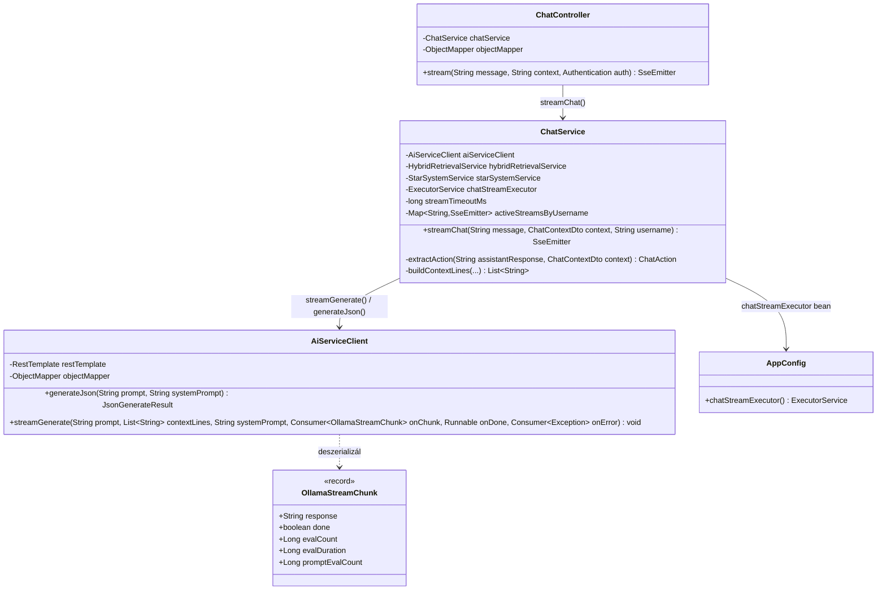
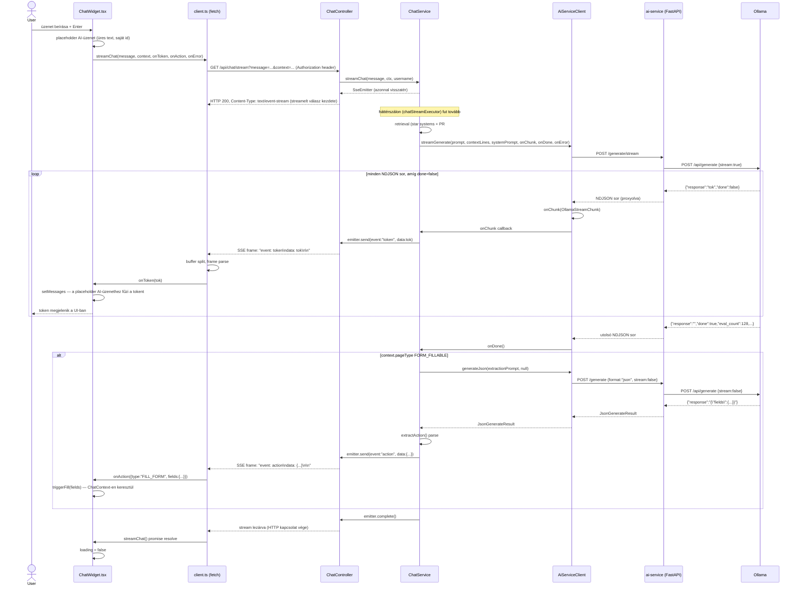

# PR #3 — Streaming + strukturált kimenet: implementációs architektúra-terv

> Ez a dokumentum a `plans/ai_chatbot_upgrade_2026.md` PR #3 szakaszát bontja le
> osztály/metódus-szintre: pontos service-metódusok, hook-pontok a meglévő kódban
> (frontend + backend + ai-service), class- és sequence-diagramok. Csak terv, nincs
> implementáció ebben a körben.

## 0. Függőség a PR #2-től

Ez a PR a `service/ai/AiServiceClient.java` osztályt bővíti (`streamGenerate(...)`
metódussal) — magát az osztályt és a `generateJson(String prompt, String systemPrompt)`
metódusát a PR #2 (Hibrid retrieval + reranking) vezeti be. Ha a PR #2 saját
architektúra-doksija (`plans/pr2_hybrid_retrieval_architecture_2026.md`) más
csomag-elhelyezést vagy szignatúrát rögzít, mint amit itt feltételezünk, **ezt a
dokumentumot ahhoz kell igazítani** — itt a fő terv (`ai_chatbot_upgrade_2026.md`,
"PR #2" szakasz) alapján dolgozunk: `service/ai/AiServiceClient.java`,
`JsonGenerateResult generateJson(String prompt, String systemPrompt)`.

## 1. Kontextus a meglévő kódból (2026-08-25-i állapot)

Mielőtt bármit tervezünk, ez a jelenlegi, valós állapot:

- **`ChatService.chat()`** (`service/ai/ChatService.java`): szinkron metódus, ami (1)
  szemantikus keresést végez a csillagrendszereken, (2) egy `callGenerate()` HTTP-hívást
  csinál közvetlenül `RestTemplate`-tel az `ai-service /generate`-re (`stream: false`
  hardkódolva az ai-service oldalán), (3) a válasz VÉGÉRŐL egy `FILL_FORM_PATTERN` regex-szel
  kivágja az esetleges akció-JSON-t (`parseAction()`), majd (4) a maradék szöveget
  (`removeActionJson()`) visszaadja. **Ezt a teljes (2)-(4) folyamatot váltja le ez a PR.**
- **`ChatController`** (`web/chat/ChatController.java`): egyetlen `POST /api/chat`
  endpoint, `@PreAuthorize("isAuthenticated()")`, `ChatRequest` body-t vár
  (`record ChatRequest(String message, ChatContextDto context)`), `ChatResponse`-t ad
  vissza (`record ChatResponse(String response, ChatAction action)`,
  `@JsonInclude(NON_NULL)`).
- **`ChatContextDto`**: `record ChatContextDto(String currentPage, String pageType,
  Map<String,String> formFields, String language)`.
- **`ai-service/main.py`**: a `/generate` endpoint `GenerateRequest`-et fogad
  (`prompt`, `context: list[str]`, `model?`, `system_prompt?`), Ollama `/api/generate`-et
  hívja `stream: False`-szal, egyetlen `GenerateResponse`-t ad vissza. A prompt-összeállítás:
  `f"Kontextus:\n{context_block}\n\nKérdés: {req.prompt}"`.
- **`frontend/src/api/client.ts`**: `chatApi.send(message, context)` — sima
  `apiClient.post("/chat", ...)` (Axios, a JWT-t az `apiClient` request-interceptora teszi
  rá `localStorage.getItem("token")`-ből, `baseURL = import.meta.env.VITE_API_URL || "/api"`).
- **`ChatWidget.tsx`**: `handleSend()` `await`-eli a `chatApi.send()`-et, utána egyszerre
  rakja be a teljes AI-választ a `messages`-be, `loading` állapot közben egy
  `CircularProgress` spinnert mutat.
- **`ChatContext.tsx`**: NEM változik ebben a PR-ban (megerősítve — csak a `triggerFill()`
  callback-mechanizmust adja, ami a `ChatAction.fields`-et fogadja, függetlenül attól,
  hogy az honnan érkezik).

## 2. Új/módosuló komponensek — csomag-elhelyezés

```
backend/src/main/java/com/legymernok/backend/
├── dto/chat/
│   └── OllamaStreamChunk.java          (ÚJ, record)
├── service/ai/
│   ├── AiServiceClient.java             (MÓDOSUL — PR #2-ben jön létre, itt: + streamGenerate())
│   └── ChatService.java                 (MÓDOSUL — chat() → streamChat(), extractAction() új)
├── web/chat/
│   └── ChatController.java              (MÓDOSUL — POST /api/chat törölve, GET /api/chat/stream új)
└── config/
    └── AppConfig.java                   (MÓDOSUL — + chatStreamExecutor() bean)

ai-service/
└── main.py                              (MÓDOSUL — + POST /generate/stream)

frontend/src/
├── api/client.ts                        (MÓDOSUL — chatApi.send() törölve, streamChat() új)
└── components/chat/ChatWidget.tsx       (MÓDOSUL — handleSend() átírva)
```

## 3. `ai-service/main.py` — `POST /generate/stream`

```python
@app.post("/generate/stream")
async def generate_stream(req: GenerateRequest):
    model = req.model or CHAT_MODEL
    context_block = "\n\n".join(req.context)
    prompt = f"Kontextus:\n{context_block}\n\nKérdés: {req.prompt}" if context_block else req.prompt

    async def ndjson_proxy():
        async with httpx.AsyncClient(timeout=600) as client:
            payload: dict = {"model": model, "prompt": prompt, "stream": True}
            if req.system_prompt:
                payload["system"] = req.system_prompt
            async with client.stream("POST", f"{OLLAMA_URL}/api/generate", json=payload) as r:
                async for line in r.aiter_lines():
                    if line:
                        yield line + "\n"

    return StreamingResponse(ndjson_proxy(), media_type="application/x-ndjson")
```

**Semmi új dependency** — `StreamingResponse` a FastAPI-ból, `httpx.AsyncClient.stream()`
a meglévő `httpx`-ből, pontosan ahogy a fő terv írja. A prompt-összeállítás logikája
(`context_block`/`prompt` felépítése) **szó szerint másolat** a meglévő `/generate`
endpointból — nincs ok eltérni tőle.

**Ollama natív NDJSON-formátuma** (`stream: true`), soronként egy JSON objektum:
```
{"model":"gemma3:8b-q4_K_M","created_at":"...","response":"Szia","done":false}
{"model":"gemma3:8b-q4_K_M","created_at":"...","response":"!","done":false}
...
{"model":"gemma3:8b-q4_K_M","created_at":"...","response":"","done":true,"total_duration":...,"prompt_eval_count":42,"eval_count":128,"eval_duration":...}
```
Az utolsó sor `done:true`, és **csak ekkor** vannak jelen a `prompt_eval_count`/`eval_count`/
`eval_duration` mezők (a köztes sorokban nincsenek).

## 4. `OllamaStreamChunk` — pontos mezők

```java
package com.legymernok.backend.dto.chat;

import com.fasterxml.jackson.annotation.JsonProperty;

public record OllamaStreamChunk(
    String response,
    boolean done,
    @JsonProperty("eval_count") Long evalCount,
    @JsonProperty("eval_duration") Long evalDuration,
    @JsonProperty("prompt_eval_count") Long promptEvalCount
) {}
```

**Miért kell explicit `@JsonProperty`**: a projektben eddig SEHOL nincs globális
snake_case↔camelCase Jackson-naming-stratégia beállítva (a `ChatService.callGenerate()`
kézzel, `Map.of("system_prompt", ...)`-tal snake_case-eli a KIMENŐ mezőket) — tehát az
`ObjectMapper` alapértelmezett, sima camelCase-t vár, enélkül az annotáció nélkül az
`eval_count` mező néma `null`-ra deszerializálódna.

## 5. `AiServiceClient.streamGenerate()` — az új streamelő hívás

```java
public void streamGenerate(
        String prompt,
        List<String> contextLines,
        String systemPrompt,
        Consumer<OllamaStreamChunk> onChunk,
        Runnable onDone,
        Consumer<Exception> onError) {
    try {
        restTemplate.execute(
            aiServiceUrl + "/generate/stream",
            HttpMethod.POST,
            request -> {
                request.getHeaders().setContentType(MediaType.APPLICATION_JSON);
                objectMapper.writeValue(request.getBody(), Map.of(
                    "prompt", prompt,
                    "context", contextLines,
                    "system_prompt", systemPrompt
                ));
            },
            response -> {
                try (BufferedReader reader = new BufferedReader(
                        new InputStreamReader(response.getBody(), StandardCharsets.UTF_8))) {
                    String line;
                    while ((line = reader.readLine()) != null) {
                        if (line.isBlank()) continue;
                        OllamaStreamChunk chunk = objectMapper.readValue(line, OllamaStreamChunk.class);
                        onChunk.accept(chunk);
                        if (chunk.done()) break;
                    }
                }
                onDone.run();
                return null;
            }
        );
    } catch (Exception e) {
        onError.accept(e);
    }
}
```

**`RestTemplate.execute(url, method, requestCallback, responseExtractor)`** — ez a
meglévő `RestTemplate` bean-t használja (`AppConfig.restTemplate()`, már létezik), a
`responseExtractor` lambda kapja meg a nyers, még streamelt `InputStream`-et, amit
soronként olvasunk — ez pontosan az a minta, amit a fő terv "nyers streamelt InputStream-et
ad a NDJSON-olvasó kódnak, új dependency nélkül" mondata ír le.

**Miért `Consumer`/`Runnable`-alapú callback-API, nem visszatérési érték**: mert ez a
metódus **blokkoló** (a `restTemplate.execute()` a teljes streamelést végigvárja a hívó
szálon), és a hívó (`ChatService.streamChat()`) egy külön executoron futtatja — a
callback-ek engedik, hogy minden egyes token azonnal, a teljes stream vége előtt eljusson
a hívóhoz (aki azonnal továbbküldi SSE-eseményként), ne kelljen megvárni a teljes választ.

## 6. `ChatController` — `GET /api/chat/stream`

```java
@GetMapping(value = "/stream", produces = MediaType.TEXT_EVENT_STREAM_VALUE)
@PreAuthorize("isAuthenticated()")
public SseEmitter stream(
        @RequestParam String message,
        @RequestParam(required = false) String context,
        Authentication authentication) throws JsonProcessingException {
    ChatContextDto ctx = (context != null && !context.isBlank())
            ? objectMapper.readValue(context, ChatContextDto.class)
            : null;
    return chatService.streamChat(message, ctx, authentication.getName());
}
```

A `POST /api/chat` (`@PostMapping`) **törlődik** — a fő terv explicit mondja: "nincs éles
forgalom, amit migrálni kéne" (a chatbot még nincs éles használatban). A `context`
query-paraméter egy **URL-encode-olt JSON string** (Spring a `@RequestParam`-ot már
URL-decode-olja, mire a metódusba ér, tehát az `objectMapper.readValue()` egy tiszta
JSON-stringet kap).

**Miért `GET`, nem `POST`**: a fő terv szerint ez a szokásos SSE-végpont-forma, és a
frontend natív `EventSource`-t ÚGYSEM használ (mert az nem tud `Authorization` fejlécet
küldeni) — helyette kézzel írt `fetch()`-et használunk (ld. 9. szakasz), ami GET-tel is
simán tud egyedi fejlécet küldeni, tehát a `GET`-only korlát itt nem releváns hátrány,
viszont így az endpoint konvencionális SSE-forma marad (böngésző dev-toolokban is jól
azonosítható, cache-elhető URL-struktúra, stb.).

## 7. `AppConfig` — `chatStreamExecutor` bean

```java
@Bean
public ExecutorService chatStreamExecutor() {
    return Executors.newCachedThreadPool();
}
```

Ugyanabba az `AppConfig.java`-ba kerül, mint a meglévő `restTemplate()`/`passwordEncoder()`
bean-ek. `newCachedThreadPool()` — a fő terv szerint "ezen a léptéken bőven elég" (nincs
elvárt nagy egyidejű chat-terhelés egy oktatási platformon).

## 8. `ChatService` — `streamChat()` + `extractAction()`

### 8.1 `FORM_FILLABLE_PAGE_TYPES` konstans

A meglévő `PAGE_TYPE_HINTS` map-ből azok a kulcsok, amiknél ma is "Kitölthető mezők"
szerepel a hint szövegében:

```java
private static final Set<String> FORM_FILLABLE_PAGE_TYPES = Set.of(
    "STAR_SYSTEM_CREATE", "STAR_SYSTEM_EDIT", "MISSION_CREATE", "MISSION_EDIT"
);
```

### 8.2 `streamChat()` — a teljes kör

**2026-08-25-i pontosítás — timeout konfigurálhatóvá téve, és csak egy aktív stream
engedélyezett felhasználónként** (Norbert döntése, ld. 14. szakasz):

```java
// ChatService mezői közé:
@Value("${chat.stream.timeout-ms:300000}")
private long streamTimeoutMs;

private final Map<String, SseEmitter> activeStreamsByUsername = new ConcurrentHashMap<>();
```

`application.properties`-be (a meglévő `ai.service.url=http://ai-service:8081` mintáját
követve, ugyanabban a fájlban):

```properties
chat.stream.timeout-ms=${CHAT_STREAM_TIMEOUT_MS:300000}
```

Alapérték **300 000 ms (5 perc)** a korábban feltételezett 120 másodperc helyett — Norbert
kérésére megnöveltük, mert lassabb helyi modelleknél a 120s szűknek bizonyulhat, és mivel
mostantól env-változóval (`CHAT_STREAM_TIMEOUT_MS`) felülírható, élesben bármikor
finomhangolható újraépítés nélkül.

**2026-08-26-i kiegészítés — az `SseEmitter` timeoutja önmagában NEM elég.** Az első teljes
lokális felállásnál kiderült, hogy a `frontend/nginx.conf` `/api/` blokkjában nincs
`proxy_read_timeout`, tehát az nginx **60 másodperces alapértéke** érvényes — ez jóval a
Java-oldali 300 000 ms előtt vágja el a kapcsolatot. A tünet félrevezető: a widgetben
*"hiba történt a válasz lekérésekor"* jelenik meg, miközben az ollama még dolgozik, és a
kérés utóbb sikeresen befejeződik. Ez 2026-08-26-án ténylegesen előfordult, mért
válaszidőkkel (`gemma4-coding:q8`: 1,44 token/mp; `llama2-13b:q4`: ~1 perc 50 mp/válasz) —
ld. `plans/ai_chatbot_upgrade_2026.md`, "Lokális futtatás — mért teljesítmény és a
timeout-lánc" szakasz.

Ezért az implementációnak az **egész láncot** kezelnie kell, a relációval együtt
(**nginx ≥ SseEmitter ≥ ai-service→ollama**):

- `frontend/nginx.conf` `/api/` blokk: explicit `proxy_read_timeout` és `proxy_send_timeout`
  a `CHAT_STREAM_TIMEOUT_MS`-hez igazítva vagy afölött, **valamint `proxy_buffering off;`** —
  enélkül az nginx kipufferelné a teljes választ, és a token-streaming értelmét vesztené.
- `ai-service/main.py`: a `httpx.AsyncClient(timeout=600)` hardkódolt értéke is
  env-változóból jöjjön.

Streameléssel a probléma enyhül, de nem szűnik meg: az nginx `proxy_read_timeout` az utolsó
adatcsomag óta eltelt időt méri, tehát folyamatos token-áram mellett elég egy jóval kisebb
érték is — de beállítani akkor is kell.

```java
public SseEmitter streamChat(String message, ChatContextDto context, String username) {
    // Csak egy aktív stream engedélyezett felhasználónként — ha már fut egy korábbi,
    // azt lezárjuk (nem elutasítjuk az újat), hogy egy elfeledett/beragadt tab ne
    // blokkolja a felhasználó következő kérdését, és ne fusson feleslegesen két
    // párhuzamos Ollama-hívás ugyanannak a usernek.
    SseEmitter previous = activeStreamsByUsername.remove(username);
    if (previous != null) {
        previous.complete();
    }

    SseEmitter emitter = new SseEmitter(streamTimeoutMs);
    activeStreamsByUsername.put(username, emitter);
    emitter.onCompletion(() -> activeStreamsByUsername.remove(username, emitter));
    emitter.onTimeout(() -> activeStreamsByUsername.remove(username, emitter));
    emitter.onError(e -> activeStreamsByUsername.remove(username, emitter));

    chatStreamExecutor.execute(() -> {
        try {
            // 1. Retrieval — csillagrendszer (meglévő) + PR #2 hibrid misszió-chunk keresés
            List<StarSystemSearchResult> relevantSystems = searchStarSystems(message); // ma is megvan
            List<ContentChunkDto> missionChunks = hybridRetrievalService != null
                    ? hybridRetrievalService.retrieveMissionChunks(message, 5)
                    : List.of(); // PR #2 hozza be a hybridRetrievalService-t

            List<String> contextLines = buildContextLines(context, username, relevantSystems, missionChunks);

            // 2. Streamelt generálás
            StringBuilder fullResponse = new StringBuilder();
            aiServiceClient.streamGenerate(
                message, contextLines, SYSTEM_PROMPT,
                chunk -> {
                    fullResponse.append(chunk.response());
                    sendSafely(emitter, "token", chunk.response());
                },
                () -> {
                    // 3. Feltételes akció-kinyerés — CSAK form-kitölthető oldalon
                    if (context != null && FORM_FILLABLE_PAGE_TYPES.contains(context.pageType())) {
                        ChatAction action = extractAction(fullResponse.toString(), context);
                        if (action != null) {
                            sendSafely(emitter, "action", action);
                        }
                    }
                    emitter.complete();
                },
                error -> emitter.completeWithError(error)
            );
        } catch (Exception e) {
            emitter.completeWithError(e);
        }
    });

    return emitter;
}

private void sendSafely(SseEmitter emitter, String eventName, Object data) {
    try {
        emitter.send(SseEmitter.event().name(eventName).data(data));
    } catch (IOException e) {
        // A kliens valószínűleg bezárta a kapcsolatot (pl. tab bezárva) — ez NEM
        // szerver-oldali hiba, csendben logolható warn szinten, nem kell completeWithError.
        log.debug("SSE send failed (client likely disconnected): {}", e.getMessage());
    }
}
```

### 8.3 `extractAction()` — a regex-parszolás lecserélése

```java
private ChatAction extractAction(String assistantResponse, ChatContextDto context) {
    String hint = PAGE_TYPE_HINTS.getOrDefault(context.pageType(), "");
    String extractionPrompt = """
            Az asszisztens az alábbi választ adta egy felhasználónak:
            "%s"

            %s

            Ha a válasz alapján a fenti mezők bármelyike kitölthető konkrét értékkel,
            add vissza JSON-ban: {"fields": {"mezőnév": "érték", ...}}.
            Csak azokat a mezőket szerepeltesd, amikhez van konkrét, a válaszból
            egyértelműen kiolvasható érték. Ha semmi nem tölthető ki, add vissza: {"fields": {}}.
            """.formatted(assistantResponse, hint);

    AiServiceClient.JsonGenerateResult result = aiServiceClient.generateJson(extractionPrompt, null);
    if (result == null) return null;

    try {
        Map<String, Object> parsed = objectMapper.readValue(result.json(), Map.class);
        Object fieldsObj = parsed.get("fields");
        if (!(fieldsObj instanceof Map<?, ?> fieldsMap) || fieldsMap.isEmpty()) return null;
        Map<String, String> fields = fieldsMap.entrySet().stream()
                .collect(Collectors.toMap(e -> String.valueOf(e.getKey()), e -> String.valueOf(e.getValue())));
        return new ChatAction("FILL_FORM", fields);
    } catch (Exception e) {
        log.warn("Could not parse extracted action JSON: {}", e.getMessage());
        return null;
    }
}
```

**Ez a metódus TELJESEN lecseréli** a mai `parseAction()`/`removeActionJson()`/
`FILL_FORM_PATTERN` hármast — a régi kód törlődik. Fontos különbség a régi mintához
képest: a régi rendszerben a modell **saját magától, kéretlenül** told bele egy JSON-t a
válasz végére (a `SYSTEM_PROMPT` 3. szabálya mondja neki, hogy tegye) — az új mintában a
látható válasz **teljesen tiszta, natural-language szöveg** marad (a `SYSTEM_PROMPT`-ból a
3-4. szabály, a FILL_FORM JSON-instrukció, **törlendő**), és az akció-kinyerés egy
**külön, dedikált, nem-streamelt hívás**, csak akkor, ha a `pageType` ezt indokolja.

⚠️ **A fenti `extractionPrompt` szövege egy első tervezet, NEM tesztelt élő modellel** —
ld. 12. szakasz, "Nyitott kérdés Norbertnek".

## 9. Frontend — `client.ts` `streamChat()`

```typescript
interface ChatStreamAction {
  type: string;
  fields: Record<string, string>;
}

export async function streamChat(
  message: string,
  context: ChatContextPayload,
  onToken: (token: string) => void,
  onAction: (action: ChatStreamAction) => void,
  onError: (error: Error) => void,
): Promise<void> {
  const token = localStorage.getItem("token");
  const baseURL = import.meta.env.VITE_API_URL || "/api";
  const url =
    `${baseURL}/chat/stream?message=${encodeURIComponent(message)}` +
    `&context=${encodeURIComponent(JSON.stringify(context))}`;

  try {
    const response = await fetch(url, {
      headers: token ? { Authorization: `Bearer ${token}` } : {},
    });
    if (!response.ok || !response.body) {
      throw new Error(`Chat stream request failed: HTTP ${response.status}`);
    }

    const reader = response.body.getReader();
    const decoder = new TextDecoder();
    let buffer = "";

    while (true) {
      const { done, value } = await reader.read();
      if (done) break;
      buffer += decoder.decode(value, { stream: true });

      // SSE-frame-ek dupla newline-nal elválasztva; az utolsó, esetleg még
      // csonka frame-et megtartjuk a buffer-ben a következő read()-ig.
      const frames = buffer.split("\n\n");
      buffer = frames.pop() ?? "";

      for (const frame of frames) {
        if (!frame.trim()) continue;
        let eventName = "message";
        let data = "";
        for (const line of frame.split("\n")) {
          if (line.startsWith("event:")) eventName = line.slice(6).trim();
          else if (line.startsWith("data:")) data += line.slice(5).trim();
        }
        if (eventName === "token") onToken(data);
        else if (eventName === "action") {
          try {
            onAction(JSON.parse(data) as ChatStreamAction);
          } catch {
            // hibás action-payload — csendben eldobjuk, a token-stream addig már megjelent
          }
        }
      }
    }
  } catch (err) {
    onError(err instanceof Error ? err : new Error(String(err)));
  }
}
```

**Miért `fetch()` + kézzel írt parser, nem natív `EventSource`**: a `frontend/CLAUDE.md`
és a fő terv is rögzíti — a JWT az `Authorization` fejlécben utazik (`localStorage`-ból,
ugyanúgy, mint az Axios-interceptor teszi ma), és a natív `EventSource` API **nem tud
egyedi fejlécet küldeni** — ez a projekt biztonsági mintája (`api/client.ts` request
interceptor), amit itt kézzel kell reprodukálni.

**A `Spring SseEmitter.event().name(x).data(y)` pontosan ezt a frame-formátumot
generálja**: `event: x\ndata: <JSON-szerializált y>\n\n` — a fenti parser erre van
felkészítve (dupla newline = frame-határ, `event:`/`data:` prefixek soronként).

`chatApi.send()` **törlődik** a `client.ts`-ből.

## 10. `ChatWidget.tsx` — `handleSend()` átírása

A mai `Message` interfész (`{ role, text }`) egy **stabil `id` mezővel bővül**, hogy a
streamelt token-frissítés ne tömb-indexre, hanem egy egyedi azonosítóra hivatkozzon (index
alapú frissítés React-ben törékeny, ha közben más állapotváltozás történik — pl. gyors
egymás utáni üzenetküldés — ez egy tudatos, apró robusztussági döntés ehhez a PR-hoz, nem
igényel Norbert-jóváhagyást):

```typescript
interface Message {
  id: string;   // ÚJ mező, pl. crypto.randomUUID()
  role: "user" | "ai";
  text: string;
}
```

```typescript
const handleSend = async () => {
  const text = input.trim();
  if (!text || loading) return;
  setInput("");
  setMessages((prev) => [...prev, { id: crypto.randomUUID(), role: "user", text }]);
  setLoading(true);

  const aiMessageId = crypto.randomUUID();
  setMessages((prev) => [...prev, { id: aiMessageId, role: "ai", text: "" }]);

  await streamChat(
    text,
    {
      currentPage: location.pathname,
      pageType: getPageType(location.pathname),
      formFields,
      language: i18n.language,
    },
    (token) => {
      setMessages((prev) =>
        prev.map((m) => (m.id === aiMessageId ? { ...m, text: m.text + token } : m)),
      );
    },
    (action) => {
      if (action.type === "FILL_FORM") triggerFill(action.fields);
    },
    (error) => {
      console.error("Chat stream error:", error);
      setMessages((prev) =>
        prev.map((m) =>
          m.id === aiMessageId
            ? { ...m, text: m.text || "Hiba történt a válasz lekérésekor. Próbáld újra!" }
            : m,
        ),
      );
    },
  );

  setLoading(false);
};
```

**Vizuális részlet**: a `loading` spinner (a meglévő `CircularProgress`) az első token
megérkezéséig látszódhat az üres AI-buborék helyén — ez apróság, nem igényel külön tervet,
a meglévő `loading` state-logika (ami most is `finally`-ben áll vissza `false`-ra) enélkül
is helyesen működik, csak most a streamelés VÉGÉN, nem a válasz elejéén áll vissza.

## 11. Class diagram



## 12. Sequence diagram — a teljes streamelési lánc (böngésző → ai-service → Ollama → vissza)



## 13. Tesztterv

| Teszteset | Osztály | Mit ellenőriz |
|---|---|---|
| `streamChat_nonFillablePage_neverCallsGenerateJson` | `ChatServiceTest` | `GENERAL`/`STAR_MAP` típusú oldalon `extractAction()`/`generateJson()` SOSEM hívódik, csak `token`-események + `emitter.complete()` |
| `streamChat_fillablePage_sendsTokenThenActionEvent` | `ChatServiceTest` | `MISSION_CREATE` oldalon a mockolt `streamGenerate()` több chunkot ad → mind `token`-eseményként megy ki, majd a mockolt `generateJson()` válasza alapján egy záró `action`-esemény, ebben a sorrendben |
| `streamChat_streamGenerateError_completesWithError` | `ChatServiceTest` | Mockolt `streamGenerate()` az `onError` callback-et hívja → `emitter.completeWithError()` fut, nem `emitter.complete()` |
| `streamChat_emptyExtractedFields_sendsNoActionEvent` | `ChatServiceTest` | `extractAction()` `{"fields":{}}`-t kap vissza → NINCS `action`-esemény, csak `complete()` |
| `extractAction_malformedJson_returnsNullGracefully` | `ChatServiceTest` | A `generateJson()` hibás/parse-olhatatlan JSON-t ad vissza → `null`, nem dob kivételt, a stream `complete()`-tel zár akció nélkül |
| `streamGenerate_multiLineNdjson_invokesOnChunkPerLine` | `AiServiceClientTest` (bővítve) | Mockolt `RestTemplate` egy több-soros NDJSON `InputStream`-et ad vissza → `onChunk` pontosan annyiszor hívódik, ahány sor, a `done=true` sorig |
| `streamGenerate_ioExceptionDuringRead_invokesOnError` | `AiServiceClientTest` | A streamelt olvasás közben dobott `IOException` az `onError` callback-et hívja, nem propagálódik kivételként a hívóhoz |
| `parseFrame_singleTokenEvent_callsOnToken` | `client.stream.test.ts` (ÚJ) | Mockolt `fetch` egy `"event: token\ndata: hello\n\n"` frame-et ad vissza → `onToken("hello")` hívva |
| `parseFrame_actionEvent_callsOnActionWithParsedJson` | `client.stream.test.ts` | `"event: action\ndata: {\"type\":\"FILL_FORM\",\"fields\":{\"name\":\"x\"}}\n\n"` → `onAction()` a helyes objektummal |
| `parseFrame_frameSplitAcrossTwoReads_stillParsesCorrectly` | `client.stream.test.ts` | Egy SSE-frame két külön `reader.read()` hívás byte-jaira van szétvágva (a valós hálózaton ez NORMÁL eset, nem edge case) → a buffer-logika helyesen összefűzi, mielőtt parse-olna |
| `parseFrame_httpErrorStatus_callsOnError` | `client.stream.test.ts` | `response.ok === false` → `onError()` hívva, `onToken`/`onAction` egyszer sem |
| `handleSend_incrementalTokens_updatesPlaceholderMessage` | `ChatWidget.test.tsx` (bővítve) | Mockolt `streamChat()` 3× hívja az `onToken`-t → a UI-ban a placeholder AI-buborék szövege fokozatosan nő, a `role:"user"` üzenet nem változik |
| `handleSend_actionEvent_callsTriggerFill` | `ChatWidget.test.tsx` | Mockolt `streamChat()` egy `onAction({type:"FILL_FORM",...})`-t hív → `triggerFill()` a helyes `fields`-szel meghívva |
| `handleSend_streamError_showsErrorInPlaceholder` | `ChatWidget.test.tsx` | Mockolt `streamChat()` `onError`-t hív → a placeholder buborék hibaüzenetre vált, nem marad örökre üres |
| `stream_withoutJwt_returns401` | `ChatControllerSecurityTest` (ÚJ) | `GET /api/chat/stream` JWT nélkül → 401, ugyanaz a minta, mint a többi `@PreAuthorize("isAuthenticated()")` végponton |

**Kézi ellenőrzés (kizárólag Norbi)**: valódi token-streaming élő Ollama ellen — vizuálisan
ellenőrizve, hogy a tokenek folyamatosan, nem "egyszerre kupacban" jelennek-e meg; hogy a
`FILL_FORM`-akció ténylegesen kitölti-e a formot egy valós `MISSION_CREATE` oldalon; hogy a
120s `SseEmitter`-timeout elég-e a saját modell sebességéhez (ld. 14. szakasz).

## 14. Nyitott kérdés Norbertnek

1. ~~`SseEmitter` timeout~~ — **ELDÖNTVE (2026-08-25): megnövelve 300 000 ms-re (5 perc),
   ÉS konfigurálhatóvá téve** (`chat.stream.timeout-ms` / `CHAT_STREAM_TIMEOUT_MS` env-
   változó, ld. 8.2 szakasz) — nem kell hozzá újrafordítás, ha élesben módosítani kell.
   **KIEGÉSZÍTÉS (2026-08-26):** ez önmagában nem elég — az nginx `/api/` blokkjának
   60 mp-es alapértéke előbb vág el. Az implementációnak a teljes láncot kezelnie kell
   (nginx `proxy_read_timeout` + `proxy_buffering off`, és az `ai-service` hardkódolt
   `httpx` timeoutja is env-változóból). Ld. 8.2 szakasz és
   `plans/ai_chatbot_upgrade_2026.md` "Lokális futtatás — mért teljesítmény és a
   timeout-lánc" szakasza.
2. ~~Kapcsolat-megszakadás kezelése~~ — **ELDÖNTVE (2026-08-25): NINCS resume-funkció
   ebben a körben.** Ha megszakad a stream, a válasz elvész, a felhasználónak újra kell
   küldenie az üzenetet — ez elfogadható, a "folytasd onnan, ahol abbamaradt" esetleg egy
   jövőbeli, külön kör tárgya lehet, ha valaha tényleg felmerül rá igény.
3. **MÉG NYITOTT — `extractAction()` prompt szövege (8.3 szakasz) egy első tervezet, NEM
   tesztelt élő modellel.** A JSON-kinyerés megbízhatósága csak élő iterációval dönthető
   el. **Norbert kérésére ez explicit bekerül a PR leírásának kézi teszt-listájába is**,
   hogy implementáció után ne maradjon ki a tesztelésből — ld. `ai_chatbot_upgrade_2026.md`
   "Ellenőrzés / verifikáció összefoglalva" szakasza, ahova ez a tétel bekerül.
4. ~~Egyidejű üzenetküldés~~ — **ELDÖNTVE (2026-08-25): igen, legyen "csak egy aktív
   stream/felhasználó" korlátozás.** Norbert indoklása: erőforrás-spórolás — implementáció
   ld. 8.2 szakasz (`activeStreamsByUsername` map, az új stream indulásakor a régi
   emitter lezárva, NEM elutasítva az újat).
