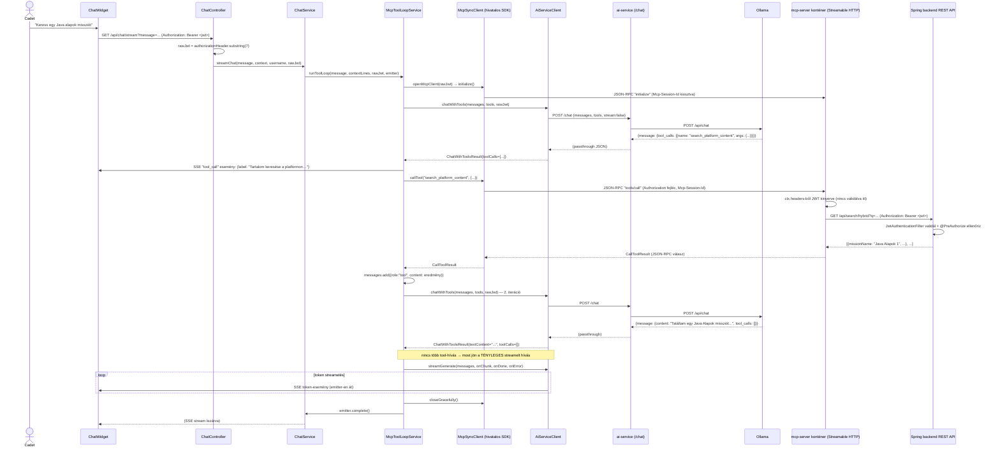
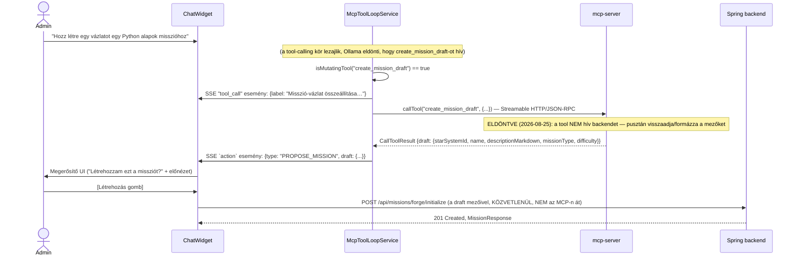

# PR #5 — MCP-szerver + tool-calling agent-hurok: implementációs architektúra-terv

> Ez a dokumentum a `plans/ai_chatbot_upgrade_2026.md` PR #5 szakaszát (és a 2026-08-25-i
> pontosítást az önálló `mcp-server` konténerről és HTTP/SSE transportról) bontja le
> osztály/metódus-szintre. Ugyanúgy **csak terv, nincs implementáció** — a `pr1_rag_chunking_
> architecture_2026.md` mintáját követi (numerikus szekciók, class/sequence diagramok,
> metódustáblák, pontos hook-pontok, tesztterv).
>
> **Előfeltétel más PR-októl**: ez a fázis a PR #2 (`HybridRetrievalService`,
> `AiServiceClient.generateJson()`) és a PR #3 (`ChatService.streamChat()`, `SseEmitter`-alapú
> streaming, `AiServiceClient.streamGenerate()`) meglévő infrastruktúrájára épül. Ahol ezekre
> hivatkozom, a saját architektúra-dokumentumaikra mutatok, nem duplikálom a leírásukat.

## 1. Új komponensek — csomag-elhelyezés

```
mcp-server/                                        (ÚJ, önálló top-level mappa + Docker service)
├── main.py                                         (mcp SDK v2, MCPServer + @mcp.tool(),
│                                                      Streamable HTTP, 4 tool — ld. 6. szakasz,
│                                                      2026-08-25-i SDK-doksi-kutatással pontosítva)
├── requirements.txt                                (mcp[cli]>=2.0,<3, httpx, uvicorn)
└── Dockerfile                                       (uvicorn-nal indít, ld. 7. szakasz)

backend/src/main/java/com/legymernok/backend/
├── service/ai/
│   ├── AiServiceClient.java                        (ÚJ — lásd PR #2, bővítve: chatWithTools()/
│   │                                                  streamGenerate(), DE **NEM** hív mcp-servert)
│   ├── ChatService.java                            (MÓDOSUL — streamChat() tool-hurokká bővül)
│   └── McpToolLoopService.java                      (ÚJ — a tool-hívó ciklus KÜLÖN osztályba
│                                                      szervezve, ld. 3. szakasz indoklás; a
│                                                      hivatalos Java MCP SDK-t használja, ld. 3.2)
├── web/chat/
│   └── ChatController.java                         (MÓDOSUL — a nyers JWT kinyerése + továbbadása)
├── web/cadet/
│   └── CadetController.java                        (MÓDOSUL — ÚJ `GET /api/users/{id}/progress`
│                                                      végpont, ld. 6.1 szakasz — ez a PR írja meg,
│                                                      Norbert kérésére, mert a feature-höz tartozik)
├── service/starsystem/
│   └── StarSystemService.java                      (MÓDOSUL — ÚJ `getStarSystemsWithProgressForCadet
│                                                      (UUID cadetId)` metódus, ld. 6.1 szakasz)
├── dto/chat/
│   ├── OllamaToolDefinition.java                    (ÚJ, record — Ollama saját tool-calling
│   │                                                  sémája, NEM az MCP-protokoll, ld. 4. szakasz)
│   └── OllamaToolCall.java                          (ÚJ, record)
```

**Maven-függőség (ÚJ, backend `pom.xml`)**: `io.modelcontextprotocol.sdk:mcp` — a hivatalos,
Spring AI-jal együttműködésben fejlesztett Java MCP SDK (`mcp-core` + Jackson3 bundle),
Maven Centralen (`io.modelcontextprotocol.sdk:mcp-bom` verzió-kezeléshez ajánlott). **Ez egy
2026-08-25-i, valós doksi-kutatással megerősített, alapvető architektúra-javítás** — ld. 3.2
szakasz, miért fontos, hogy a Java oldal EZT használja, nem egy kézzel gyártott REST-hívást.

**Tudatos döntés: a tool-hurok NEM közvetlenül a `ChatService`-be kerül, hanem egy külön
`McpToolLoopService`-be.** A `pr1_rag_chunking_architecture_2026.md` a `StarSystemService`
meglévő mintáját (JDBC-hívások közvetlenül a service-ben) követte, mert ott egy egyszerű,
lineáris logikáról volt szó. Itt viszont a `ChatService` a PR #2/#3 után már retrieval-t,
reranket, streamelést ÉS most egy több-körös, feltételes elágazásokkal teli tool-hurkot is
kombinálna egy metóduson belül — ez a `ChatService`-t túlterhelné egyetlen, nehezen tesztelhető
metódusba. A `McpToolLoopService` egyetlen felelőssége a "Ollama-tool_call → MCP-hívás →
üzenet-lista bővítése → újra-hívás" ciklus, a `ChatService` csak meghívja és a látható
szöveg-tokeneket streameli tovább. Ha inkább egybeépítve szeretnéd (kevesebb osztály, de
nagyobb `ChatService`), szólj — ez egy ízlés-döntés, nem kényszerítő technikai ok van mögötte.

## 2. Kritikus előfeltétel-vizsgálat: a nyers JWT jelenleg SEHOL nincs elmentve kérés-kiszolgálás közben

Megvizsgáltam a `JwtAuthenticationFilter.java`-t (`backend/src/main/java/com/legymernok/
backend/security/JwtAuthenticationFilter.java`), mert a PR #5 terve explicit megköveteli,
hogy minden tool-hívás **a beszélgető felhasználó saját JWT-jével** menjen a Spring REST
API felé. **Fontos felfedezés**: a filter kinyeri a nyers JWT-t (`jwt =
authHeader.substring(7)`, 41. sor), de csak arra használja, hogy betöltse a usert és
beállítsa a `SecurityContext`-et — a `UsernamePasswordAuthenticationToken` `credentials`
mezője **explicit `null`**-ra van állítva (65. sor: `new UsernamePasswordAuthenticationToken
(userDetails, null, ...)`). **A nyers JWT string sehol nincs elmentve** — sem a
`SecurityContext`-ben, sem request attribútumként — tehát a `ChatService`/`McpToolLoopService`
NEM tudja egyszerűen "kikérni" valahonnan a folyamat közepén.

**Megoldás (nem igényel a `JwtAuthenticationFilter` módosítást)**: a `ChatController` már
most is hozzáfér a nyers `HttpServletRequest`-hez (Spring MVC-ben `@RequestHeader` vagy
`HttpServletRequest` paraméterrel) — a JWT-t **közvetlenül a controller-szinten olvassuk ki
az `Authorization` fejlécből**, és paraméterként adjuk tovább egészen a tool-hívásig. Ez a
legkevesebb változtatással járó, legkevésbé kockázatos megoldás (nem nyúl a meglévő,
jól működő auth-filterhez), és konzisztens azzal, hogy a JWT amúgy is a kérés fejlécében van,
nem kell azt újra "kitalálni".

```java
// ChatController.java — bővítés
@GetMapping(value = "/stream", produces = MediaType.TEXT_EVENT_STREAM_VALUE)
@PreAuthorize("isAuthenticated()")
public SseEmitter streamChat(
        @RequestParam String message,
        @RequestParam(required = false) String context,
        @RequestHeader("Authorization") String authorizationHeader,   // "Bearer <jwt>"
        Authentication authentication) {
    String rawJwt = authorizationHeader.substring(7);  // ugyanaz a levágás, mint a filterben
    return chatService.streamChat(message, parseContext(context), authentication.getName(), rawJwt);
}
```

Ez **nem duplikálja** a `JwtAuthenticationFilter` validációs logikáját — mire ide eljut a
kérés, a `@PreAuthorize("isAuthenticated()")` már garantálja, hogy a JWT érvényes volt (a
filter validálta), a controller csak a MÁR validált nyers stringet olvassa ki újra, hogy
továbbadhassa.

## 3. `McpToolLoopService` — teljes metódustábla

| Metódus | Szignatúra | Mit csinál |
|---|---|---|
| `runToolLoop` | `void runToolLoop(String userMessage, List<String> contextLines, String userJwt, SseEmitter emitter)` | A fő belépési pont, `ChatService.streamChat()`-ből hívva. Ld. 3.1. |
| `buildToolDefinitions` | `List<OllamaToolDefinition> buildToolDefinitions()` | A 4 tool JSON-schema-alapú leírása, Ollama `/api/chat` `tools` mezőjéhez — statikus, nincs bemenete (a definíciók fixek). **Ez az Ollama saját tool-calling sémája, NEM az MCP-protokoll üzenetformátuma** — a kettő szándékosan különböző réteg, ld. 4. szakasz. |
| `openMcpClient` | `private McpSyncClient openMcpClient(String userJwt)` | **ÚJ (2026-08-25-i SDK-kutatás alapján)** — a hivatalos Java MCP SDK-val épít egy `McpSyncClient`-et, a `userJwt`-t a transport `HttpRequest.Builder`-jébe sütve, majd `initialize()`-t hív. Egy chat-körön (egy `runToolLoop()` híváson) belül **egyszer** hívódik, a kliens újrafelhasználható a kör összes tool-hívásához. Ld. 3.2. |
| `callMcpTool` | `CallToolResult callMcpTool(McpSyncClient client, String toolName, Map<String, Object> arguments)` | `client.callTool(CallToolRequest.builder(toolName).arguments(arguments).build())` — a hivatalos SDK JSON-RPC-hívása, NEM kézzel írt REST. Ld. 3.2. |
| `isMutatingTool` | `boolean isMutatingTool(String toolName)` | `true`, ha `toolName` = `"create_mission_draft"` — ez dönti el, hogy a tool eredménye SSE `action` eseményként megy-e a frontendnek (nem automatikus végrehajtás), vagy egyszerű `role:"tool"` üzenetként vissza Ollamának. |
| `friendlyToolLabel` | `String friendlyToolLabel(String toolName)` | **ÚJ (Norbert kérésére, 2026-08-25)** — magyar, felhasználóbarát felirat minden toolhoz (pl. `"search_platform_content"` → `"Tartalom keresése a platformon…"`), amit a `tool_call` SSE-esemény visz ki a UI-nak. Ld. 3.3. |

### 3.1 `runToolLoop()` — a hurok pontos logikája

```
bemenet: userMessage, contextLines, userJwt, emitter (a ChatController-ből kapott SseEmitter)

1. messages = [
     {role: "system", content: SYSTEM_PROMPT + kontextus-sorok},
     {role: "user", content: userMessage}
   ]
2. tools = buildToolDefinitions()
3. mcpClient = openMcpClient(userJwt)   // EGYSZER nyitva a teljes kör alatt, ld. 3.2
4. try:
     iteration = 0
     WHILE iteration < 10:
       a. response = aiServiceClient.chatWithTools(messages, tools, userJwt)
          (ld. 4. szakasz — ez NEM streamel, egy teljes Ollama-válasz jön vissza egyszerre,
          mert amíg a modell tool-hívásokat fontolgat, nincs mit a felhasználónak mutatni —
          CSAK az UTOLSÓ, tool-hívás nélküli végső válasz streamel, ld. 4.b lent)

       b. HA response.toolCalls() üres (a modell végleges, szöveges választ adott, nincs
          több tool-hívás):
            - A kör tokenjei MÁR ki lettek streamelve, ahogy érkeztek (ld. 3.1.5 —
              pufferelési szabály). Itt nincs második hívás.
            - HA a `ctx.pageType()` FORM_FILLABLE (a PR #3 mintája szerint): extractAction()
              hívása a végső szövegre, `action` SSE-esemény küldése
            - emitter.complete(); return

       c. KÜLÖNBEN, minden toolCall-ra a response.toolCalls()-ban:
            i.   **ÚJ (2026-08-25, Norbert kérésére — "legyen menő, írja ki melyik toolt
                 hívja"):** emitter.send(SseEmitter.event().name("tool_call")
                 .data(Map.of("label", friendlyToolLabel(toolCall.name())))) — ld. 3.3
            ii.  result = callMcpTool(mcpClient, toolCall.name(), toolCall.arguments())
                 (a hivatalos Java MCP SDK-val, ld. 3.2 — NEM kézzel írt REST-hívás)
            iii. HA isMutatingTool(toolCall.name()):
                    - NE fűzzük vissza a messages-be "sikeresen végrehajtva" formában —
                      helyette KÜLDJÜNK egy SSE `action` eseményt (`type: PROPOSE_MISSION`,
                      a tool eredménye mint payload), ÉS egy szintetikus tool-eredményt
                      fűzzünk a messages-be, ami jelzi a modellnek, hogy "a javaslat el lett
                      küldve a felhasználónak jóváhagyásra" (NEM hogy "létrehozva") — hogy a
                      modell a következő körben ne higgye tévesen, hogy a misszió már létezik
                 KÜLÖNBEN (olvasó tool):
                    - messages.add({role: "tool", tool_call_id: toolCall.id(),
                                     content: result.content()})   // CallToolResult.content()
            iv.  HA toolCall.name() == "navigate_to":
                    - KÜLÖN, azonnali SSE `action` esemény (`type: NAVIGATE`), NEM várjuk meg
                      a hurok végét — ez egy UI-vezérlő jel, nem adatot visszaadó tool (ld. a
                      fő terv megjegyzése: "technikailag nem egy adatot visszaadó tool")
       d. iteration++

     HA a hurok 10 iteráció után sem jutott végleges válaszhoz:
       - log.warn("Tool loop max iteráció elérve, felhasználó: {}", username)
       - **ELDÖNTVE (2026-08-25): egyszerű, generikus hibaüzenet** — SSE hibaüzenet-esemény,
         szöveg: **"Hiba történt az oldalunkon. Próbáld újra később."** (Norbert kérése:
         ne legyen technikai/konkrét, egy sima, felhasználóbarát hiba elég)
       - emitter.complete()
5. finally:
     mcpClient.closeGracefully()   // MINDIG lezárva, akár siker, akár hiba/max-iteráció volt
```

### 3.1.5 Pufferelési szabály — csak a végső válasz streamel (2026-08-26, ELDÖNTVE)

**Ez a szakasz 2026-08-26-án váltotta le a korábbi dupla-hívásos tervet.** A régi terv szerint
a tool-döntő körök egy szinkron `chatWithTools()` hívással mentek, a végső válasz pedig egy
MÁSODIK, streamelő hívással — ami **kétszer generáltatta volna le ugyanazt a választ, eltérő
mintavétellel**, tehát a felhasználó nem azt látta volna, amit a tool-hurok „eldöntött".
Ráadásul a hivatkozott `streamGenerate()` `prompt`+`context` mezőket vár, nem
üzenetlistát — a dupla hívás így technikailag sem lett volna kivitelezhető.

**Megoldás**: a PR #3 2026-08-26 óta eleve `/api/chat`-re épül és `streamChat(messages,
tools, ...)` a szignatúrája (ld. `pr3_streaming_architecture_2026.md` 3. és 5. szakasz) —
tehát **minden kör ugyanazon a streamelő végponton megy**, a tool-döntő körök is. Nincs
`chatWithTools()`, nincs dupla generálás, nincs második végpont.

**A megtervezendő rész: mikor kezdjük mutatni a tokeneket.** Norbert döntése: *„a végén a
választ streameljük csak, és pufferelünk a tokeneket addig."* Egy tool-körben a modell
elvileg írhat szöveget, mielőtt eldönti, hogy toolt hív — azt a szöveget nem szabad
megjeleníteni, mert egy eldobott körhöz tartozik.

```
körönként:
    buffer = ""
    committed = false           // elköteleztük-e magunkat, hogy ez a végső kör

    minden beérkező chunk-ra:
        HA chunk.hasToolCalls():
            - buffer eldobva (NEM megy ki a felhasználónak)
            - tool_call SSE-esemény a friendlyToolLabel()-lel (3.3 szakasz)
            - ez egy TOOL-kör -> kilépés a chunk-ciklusból, tool végrehajtása
        HA NEM committed:
            buffer += chunk.contentOrEmpty()
            HA buffer hossza >= COMMIT_THRESHOLD (128 karakter):
                - committed = true
                - a teljes buffer kimegy egyetlen token-eseményként
        KÜLÖNBEN:
            - a chunk azonnal kimegy token-eseményként (élő streamelés)

    a kör VÉGÉN (done=true), HA nem volt tool_call ÉS NEM committed:
        - a buffer kimegy (rövid válasz, sosem érte el a küszöböt)
```

**Miért küszöb és nem „a kör végéig pufferelünk"**: ha a teljes végső kört puffereljük, a
streamelés értelmét veszti — a mért 1 perc 50 másodperces válaszidőnél (ld.
`ai_chatbot_upgrade_2026.md` „Lokális futtatás") a felhasználó ugyanúgy két percig üres
képernyőt nézne, csak most bonyolultabb kóddal. A 128 karakteres küszöb azt jelenti, hogy a
késleltetés a gyakorlatban **néhány token**, utána élő a stream.

**A gyakorlatban a puffer többnyire üres marad**: Ollama a `tool_calls`-t üres `content`
mellett küldi, tehát egy tool-körben az első chunk már eldönti a kérdést, mielőtt bármi
szöveg gyűlne össze. A küszöb csak védőháló arra a ritka esetre, amikor a modell előbb
elkezd írni, aztán mégis toolt hív.

**A néma tool-döntő körök továbbra is `tool_call` SSE-eseménnyel vannak kompenzálva** (3.3
szakasz) — a felhasználó pontosan látja, melyik tool fut éppen, nem csak egy generikus
„Dolgozom…" feliratot.

### 3.2 `openMcpClient()` + `callMcpTool()` — a hivatalos Java MCP SDK-val (2026-08-25-i doksi-kutatás)

**Ez a szakasz a legnagyobb változás a mai egyeztetés során.** Az eredeti terv egy kézzel
írt, REST-szerű HTTP POST-ot feltételezett (`mcp-server/tools/{name}/call`) — ez **hibás
feltételezés volt**, mert az MCP Streamable HTTP transport valójában egy **JSON-RPC 2.0
protokoll egyetlen `/mcp` végponton**, session-kezeléssel — nem egy REST API tool-onként
külön útvonallal. Ahelyett, hogy ezt a JSON-RPC-t kézzel implementálnánk Java-ban, a
**hivatalos Java MCP SDK-t** (`io.modelcontextprotocol.sdk:mcp`, Spring AI-jal
együttműködésben fejlesztve, Maven Centralen) kell használni — ez pontosan erre való, van
benne szinkron kliens-facade ("blokkoló" API, nem kell reaktív programozást tanulni hozzá).

**Miért pont most derült ez ki**: Norbert kérte, hogy implementáció előtt olvassam el a
tényleges `mcp` Python SDK doksiját — eközben derült ki (a `py.sdk.modelcontextprotocol.io`
és a `java-sdk` GitHub repó tényleges dokumentációjából, nem találgatásból), hogy létezik
egy hivatalos Java kliens SDK is, ami ezt sokkal egyszerűbbé és helyesebbé teszi, mint amit
korábban terveztünk.

```java
// McpToolLoopService.java

private McpSyncClient openMcpClient(String userJwt) {
    var requestBuilder = HttpRequest.newBuilder()
            .header("Authorization", "Bearer " + userJwt);

    var transport = HttpClientStreamableHttpTransport
            .builder(mcpServerUrl)          // pl. "http://mcp-server:8082"
            .endpoint("/mcp")                // az MCP-szerver rögzített útvonala
            .requestBuilder(requestBuilder)  // ide sül bele a JWT minden kérésre
            .build();

    McpSyncClient client = McpClient.sync(transport).build();
    client.initialize();   // az MCP-protokoll kötelező kézfogás-lépése az első hívás előtt
    return client;
}

private CallToolResult callMcpTool(McpSyncClient client, String toolName, Map<String, Object> arguments) {
    try {
        return client.callTool(
                CallToolRequest.builder(toolName).arguments(arguments).build());
    } catch (Exception e) {
        // mcp-server elérhetetlen / hálózati hiba — NEM omlik össze a hurok, a modell egy
        // hiba-tartalmú "eredményt" kap, hogy a saját belátása szerint reagálhasson
        log.error("MCP tool call failed: {} — {}", toolName, e.getMessage());
        return CallToolResult.builder()
                .isError(true)
                .addTextContent("A(z) " + toolName + " eszköz jelenleg nem érhető el.")
                .build();
    }
}
```

**Miért egy `McpSyncClient`/chat-kör, nem egy megosztott, alkalmazás-szintű kliens**: a
JWT a transport `requestBuilder()`-jébe van sütve **kliens-építéskor**, tehát egyetlen
kliens-példány csak EGY felhasználó JWT-jével tud dolgozni. Mivel minden kadét saját JWT-vel
chatel, a kliens életciklusa **egy `runToolLoop()` hívás** (= egy felhasználói üzenetre adott
válasz, a benne lévő összes tool-körrel együtt) — nem hosszabb, de nem is rövidebb. A
`finally`-ágban lezárt (`closeGracefully()`) kliens biztosítja, hogy ne szivárogjanak
HTTP-kapcsolatok, ha a hurok hibával áll le.

**Session-kezelés**: a Streamable HTTP transport az `initialize()` hívás után egy
`Mcp-Session-Id` headert kap a szervertől, amit a transport minden további kérésnél
automatikusan visszaküld — ezt a hivatalos SDK **belsőleg kezeli**, nem kell nekünk vele
foglalkoznunk.

### 3.3 `tool_call` SSE-esemény és `friendlyToolLabel()` — "melyik toolt hívja épp" (Norbert kérésére, 2026-08-25)

```java
private static final Map<String, String> TOOL_LABELS = Map.of(
    "search_platform_content", "Tartalom keresése a platformon…",
    "get_cadet_progress",      "Kadét haladásának lekérdezése…",
    "create_mission_draft",    "Misszió-vázlat összeállítása…",
    "navigate_to",             "Navigáció előkészítése…"
);

private String friendlyToolLabel(String toolName) {
    return TOOL_LABELS.getOrDefault(toolName, "Dolgozom a kérésen…");   // fallback, ha valaha
                                                                          // új tool kerül be
                                                                          // címke nélkül
}
```

A frontend (`ChatWidget.tsx`, PR #3 mintáját követve) egy `onToolCall(label: string)`
callback-et kap a `streamChat()`-től (ugyanúgy, mint az `onToken`/`onAction`) — minden
`tool_call` SSE-eseményre lecseréli a "gondolkodik…" indikátort a kapott felirat-szövegre
(pl. egy kis pörgő ikon + "Tartalom keresése a platformon…"). Több egymást követő tool-hívás
esetén a felirat **soronként frissül** (nem halmozódik lista formában) — mindig csak a
JELENLEG futó tool látszik, ez tartja a UI-t egyszerűnek.

(A tényleges `callMcpTool()` implementációt ld. a 3.2 szakaszban — a hivatalos Java MCP
SDK-val, nem kézzel írt REST-hívással.)

## 4. `AiServiceClient.chatWithTools()` — pontos szignatúra és NDJSON→objektum leképezés

```java
public record OllamaToolCall(String id, String name, Map<String, Object> arguments) {}
public record ChatWithToolsResult(String textContent, List<OllamaToolCall> toolCalls) {}

public ChatWithToolsResult chatWithTools(
        List<Map<String, Object>> messages,
        List<OllamaToolDefinition> tools,
        String userJwt   // NEM a Spring backend felé megy innen — csak azért kapja meg,
                          // hogy a McpToolLoopService egységesen adja át, ténylegesen a
                          // callMcpTool()-ban használódik, ide csak "átfut"
) {
    var payload = Map.of(
        "model", chatModel,
        "messages", messages,
        "tools", tools,
        "stream", false   // <-- ld. 3.1 indoklás: a tool-döntő kör NEM streamel
    );
    var req = RequestEntity.post(aiServiceUrl + "/chat")
            .contentType(MediaType.APPLICATION_JSON)
            .body(payload);
    var response = restTemplate.exchange(req, Map.class);
    // az Ollama /api/chat válasza: {"message": {"content": "...", "tool_calls": [...]}}
    // a parse-olás pontos részletei az ai-service oldali /chat proxy-végpont válasz-
    // formátumától függenek — ld. 5. szakasz, ÚJ végpont az ai-service-ben
}
```

**Ez egy ÚJ metódus az `AiServiceClient`-en**, ami a PR #2-ben bevezetett osztályt bővíti
(`generateJson()` már ott van) — nem hoz létre új osztályt.

## 5. `ai-service/main.py` — NINCS új végpont (2026-08-26)

**Ez a szakasz 2026-08-26-án okafogyottá vált.** A korábbi terv egy új, nem-streamelő
`POST /chat` proxy-végpontot írt elő, mert az `ai-service` akkori `/generate/stream`-je
Ollama `/api/generate`-jére épült, a tool-calling viszont `/api/chat`-et igényel.

Mivel a PR #3 azóta **eleve `/api/chat`-re épül** (`POST /chat/stream`, `messages` + opcionális
`tools`, ld. `pr3_streaming_architecture_2026.md` 3. szakasz), a PR #5-nek **nem kell új
végpontot bevezetnie** — ugyanazt hívja, csak kitöltött `tools` mezővel.

Ez egyben megszünteti azt a következetlenséget is, amit a korábbi terv maga jelzett
(„a fő terv Függőségek táblázata és a PR #5 fájllistája jelenleg NEM sorolja fel explicit") —
nincs mit felsorolni, mert nincs új végpont.

**Következmény a 4. szakaszra**: a `chatWithTools()` metódus sem kell — a
`streamChat(messages, tools, ...)` (PR #3) mindkét esetet lefedi, a tool-hívásokat a
`OllamaStreamChunk.hasToolCalls()` jelzi a chunk-callbackben.

## 6. `mcp-server/main.py` — a 4 tool, a VALÓDI `mcp` v2 SDK API-jával (2026-08-25-i doksi-kutatás)

**A korábbi terv itt is hibás API-t feltételezett** (`mcp.server.Server` + `mcp.server.sse.
SseServerTransport` — ez a v1-es, alacsonyszintű, stdio-közeli API, amit az `ai-os` is
használ). A `py.sdk.modelcontextprotocol.io` hivatalos doksijából (ténylegesen lekérve,
nem találgatva) kiderült: a `legymernok` már a **v2 SDK-t** kéri (`mcp[cli]>=2.0,<3`,
ugyanaz a pinning, mint az `ai-os`-nál), aminek van egy **sokkal egyszerűbb, magas szintű
API-ja** (`MCPServer` + `@mcp.tool()` dekorátor) — nincs szükség kézzel írt JSON-schema-
listára, a Python type hint-ekből és a docstringből automatikusan generálódik.

```python
import os
from urllib.parse import urlencode

import httpx
from mcp.server import MCPServer
from mcp.server.mcpserver import Context
from mcp.server.mcpserver.exceptions import ToolError
from mcp.server.transport_security import TransportSecuritySettings

BACKEND_URL = os.environ.get("BACKEND_URL", "http://backend:8080")

mcp = MCPServer("legymernok-tools")


def _auth_header(ctx: Context) -> str:
    """Kinyeri a Java backend felé továbbküldendő nyers JWT-t a bejövő kérés fejlécéből.

    FONTOS, TUDATOS DÖNTÉS: ez a szerver NEM validálja a JWT-t (nincs `auth=`/
    `token_verifier=` beállítva az MCPServer-en) — a JWT aláírás-ellenőrzését és a
    permission-alapú jogosultság-ellenőrzést KIZÁRÓLAG a Spring backend végzi (ahol a
    JWT-titok ténylegesen létezik). Ha itt is bevezetnénk egy TokenVerifier-t, az vagy
    duplikálná a titkot (rossz), vagy egy hamis, validálás nélküli "pass-through" verifier
    lenne (ami biztonságilag megtévesztő látszatot keltene). A helyes modell: az MCP-szerver
    egy néma proxy, a tényleges biztonsági határ a Spring `@PreAuthorize`.
    """
    auth = (ctx.headers or {}).get("authorization")
    if not auth:
        raise ToolError("Hiányzó hitelesítés — jelentkezz be újra.")
    return auth


async def _call_backend(method: str, path: str, auth_header: str, json_body: dict | None = None) -> dict:
    async with httpx.AsyncClient() as client:
        resp = await client.request(
            method, f"{BACKEND_URL}{path}",
            headers={"Authorization": auth_header},
            json=json_body, timeout=30,
        )
        if resp.status_code == 403:
            raise ToolError("Nincs jogosultságod ehhez a művelethez.")
        resp.raise_for_status()
        return resp.json()


@mcp.tool()
async def search_platform_content(ctx: Context, query: str, top_k: int = 5) -> dict:
    """Keresés a platform tartalmában (missziók, csillagrendszerek) — hibrid vektor+szöveges kereséssel."""
    auth = _auth_header(ctx)
    # 2026-08-26: urlencode KÖTELEZŐ — a korábbi f-string interpoláció egy "&" vagy "#"
    # karaktertől eltört volna a kérdésben (a modell által adott `query` tetszőleges szöveg).
    qs = urlencode({"q": query, "topK": top_k})
    return await _call_backend("GET", f"/api/search/hybrid?{qs}", auth)


@mcp.tool()
async def get_cadet_progress(ctx: Context, cadet_id: str) -> dict:
    """Egy kadét teljes misszió-haladásának lekérdezése (csak admin jogosultsággal sikeres)."""
    auth = _auth_header(ctx)
    # ÚJ backend-végpont, ezzel a PR-ral együtt megírva — ld. 6.1 szakasz
    return await _call_backend("GET", f"/api/users/{cadet_id}/progress", auth)


@mcp.tool()
async def create_mission_draft(
    ctx: Context, star_system_id: str, name: str, mission_type: str, difficulty: str,
    description_markdown: str | None = None,
) -> dict:
    """Misszió-vázlat összeállítása JAVASLATKÉNT — NEM hoz létre semmit, csak formázza az adatokat."""
    # ELDÖNTVE (2026-08-25): ez a tool SOSEM hív backendet — kizárólag visszaadja a modell
    # által megadott mezőket, hogy a frontend egy PROPOSE_MISSION SSE-akcióként megjeleníthesse
    # jóváhagyásra. A tényleges `POST /api/missions/forge/initialize` csak a felhasználó
    # explicit jóváhagyása UTÁN, a frontendből fut le — ld. 10.1 szakasz (ez volt a nyitott
    # kérdés, Norbert megerősítette: "határozottan egyetértek, hogy ne hívhassa a backendet").
    return {
        "starSystemId": star_system_id, "name": name, "missionType": mission_type,
        "difficulty": difficulty, "descriptionMarkdown": description_markdown,
    }


@mcp.tool()
def navigate_to(page: str) -> dict:
    """UI-navigáció javaslata egy adott oldalra (nem adatlekérdezés, nincs Context/JWT sem kell hozzá)."""
    return {"navigate": page}


security = TransportSecuritySettings(
    # A Java backend a belső Docker-hálózaton "mcp-server" hostnéven éri el — enélkül a
    # beállítás nélkül a kérés 421 Misdirected Request hibával elhasalna, ld. 7. szakasz.
    allowed_hosts=["mcp-server", "mcp-server:*"],
)
app = mcp.streamable_http_app(transport_security=security)
```

**Amit ez a valódi doksi-kutatás tisztázott** (a korábbi terv ezeket vagy elhibázta, vagy
nyitva hagyta):

- A tool-függvények **type hint-jei ÉS a docstring** adják a JSON-schema-t és a leírást —
  nincs kézzel írt `inputSchema`-lista, mint a korábbi tervben.
- A bejövő HTTP-fejlécekhez (`Authorization`) a `ctx.headers` ad hozzáférést — `ctx: Context`
  paraméterként kérve automatikusan injektálódik (nem kell semmilyen extra dekorátor).
- Hibák: `raise ToolError("...")` a modellnek/felhasználónak látható, értelmes hibaüzenethez
  (`is_error=True` + a szöveg) — bármilyen MÁS, el nem kapott kivétel a szerver `ERROR`
  logjába kerül, a modell csak egy generikus "Error executing tool" üzenetet lát. Ezért
  minden, a felhasználónak érdemi hibaüzenetet igénylő esetben (`403`, hiányzó JWT)
  explicit `ToolError`-t dobunk, nem hagyjuk a nyers kivételt kiszivárogni.
- **`navigate_to`-nak NINCS szüksége `Context`/JWT-re** — tisztán UI-jel, nem hív backendet.

### 6.1 ✅ MEGVALÓSÍTVA ebben a PR-ban: `GET /api/users/{id}/progress` — az új backend-végpont

Norbert döntése (2026-08-25): mivel ez a hiányzó végpont a `get_cadet_progress` toolhoz
tartozik, ne egy külön, előzetes PR-ban készüljön el, hanem **ebben a körben**. Íme a pontos
terv, a valódi kódra alapozva:

**Fontos korrekció a fájlnál/útvonalnál**: a `CadetController.java` ténylegesen a
`/api/users` alap-útvonalra van mappelve (`@RequestMapping("/api/users")`, NEM
`/api/admin/cadets`, ahogy a korábbi, nem-ellenőrzött terv feltételezte) — az új végpont
tehát ebbe a mintába illeszkedik: `GET /api/users/{id}/progress`.

```java
// CadetController.java — új endpoint
@GetMapping("/{id}/progress")
@PreAuthorize("hasAuthority('user:read')")
public ResponseEntity<List<StarSystemWithProgressResponse>> getCadetProgress(@PathVariable UUID id) {
    return ResponseEntity.ok(starSystemService.getStarSystemsWithProgressForCadet(id));
}
```

**Miért `StarSystemService`-be kerül a logika, nem `CadetService`-be**: a haladás-
aggregáló logika (misszió/csoport-státuszok összegzése csillagrendszerenként) MÁR LÉTEZIK
a `StarSystemService`-ben (`getAllStarSystemsWithProgress()` + a privát `mapToResponseWithProgress
(StarSystem system, UUID cadetId)` helper, `StarSystemService.java:102-162`) — és ez a
privát helper **már most is `cadetId` paramétert vár**, nem a `SecurityContext`-ből olvassa
ki! Az egyetlen ok, amiért ma csak a bejelentkezett userre működik, hogy a PUBLIKUS
`getAllStarSystemsWithProgress()` belül `getCurrentAuthenticatedUser()`-t hív, és ANNAK az
ID-jét adja át. Egy tetszőleges kadétre kiterjesztő végpont tehát **minimális, alacsony
kockázatú kiegészítés**, nem egy új aggregáló logika megírása:

```java
// StarSystemService.java — új publikus metódus, a meglévő privát helperre építve
@Transactional(readOnly = true)
public List<StarSystemWithProgressResponse> getStarSystemsWithProgressForCadet(UUID cadetId) {
    if (!cadetRepository.existsById(cadetId)) {
        throw new ResourceNotFoundException("Cadet", "id", cadetId);
    }
    return starSystemRepository.findAll().stream()
            .map(system -> mapToResponseWithProgress(system, cadetId))   // MEGLÉVŐ privát helper,
            .collect(Collectors.toList());                                // változatlanul újrahasznosítva
}
```

Ez a felfedezés jelentősen csökkenti a korábban feltételezett "plusz munkát" — nem egy
teljesen új aggregáló algoritmus kell, csak egy vékony, publikus belépési pont a már
meglévő, paraméterezhető logikára.

## 7. `docker-compose.yml` + `Dockerfile` — a `mcp-server` service (2026-08-25-i pontosítással)

```yaml
mcp-server:
  build:
    context: ./mcp-server
    dockerfile: Dockerfile
  container_name: legymernok-mcp-server
  restart: always
  # 2026-08-26: NINCS `ports:` blokk. A korábbi terv "8082:8082"-t publikált a hosztra,
  # ami ellentmond a gyökér CLAUDE.md biztonsági ellenőrzőlistájának ("új service portot
  # alapból NE publikálj kifelé"). A backend a legymernok-net-en `http://mcp-server:8082`
  # néven eléri, hoszt felőli hozzáférésre nincs szükség — és mivel ez a szerver
  # SZÁNDÉKOSAN nem validálja a JWT-t (csak továbbítja, ld. 6. szakasz), kifelé publikálva
  # egy fölösleges támadási felület lenne.
  environment:
    BACKEND_URL: http://backend:8080
  depends_on:
    - backend
  networks:
    - legymernok-net
```

Ez a fő tervben (`ai_chatbot_upgrade_2026.md`) már így szerepel, nincs rajta változtatás.

**`mcp-server/Dockerfile` — ÚJ, konkrét tartalom** (a doksi-kutatásból, a hivatalos
`streamable_http_app()` mintát követve, `uvicorn`-nal futtatva, `ai-service/Dockerfile`
stílusát megtartva):

```dockerfile
FROM python:3.12-slim
WORKDIR /app
COPY requirements.txt .
RUN pip install --no-cache-dir -r requirements.txt
COPY main.py .
CMD ["uvicorn", "main:app", "--host", "0.0.0.0", "--port", "8082"]
```

`mcp-server/requirements.txt`:
```
mcp[cli]>=2.0,<3
httpx
uvicorn
```

**A `transport_security` (421 Misdirected Request elleni védelem) a `main.py`-ban van
beállítva** (6. szakasz `TransportSecuritySettings(allowed_hosts=["mcp-server", "mcp-server:*"])`),
nem itt — ez egy valós, dokumentált gotcha, amit a doksi-kutatás nélkül könnyen elfelejtettünk
volna: alapból a Streamable HTTP szerver **csak a `127.0.0.1`/`localhost`/`[::1]` Host-fejlécet
fogadja el**, egy Docker-hálózaton belüli `mcp-server` hostnév-hívás enélkül 421-gyel
elhasalna, és a hiba oka egyáltalán nem lenne nyilvánvaló egy fejlesztőnek, aki nem tudja,
hogy ez a védelem egyáltalán létezik.

## 8. Class diagram

```mermaid
classDiagram
    class ChatController {
        +streamChat(String message, String context, String authorizationHeader, Authentication auth) SseEmitter
    }

    class ChatService {
        -McpToolLoopService toolLoopService
        +streamChat(String message, ChatContextDto context, String username, String userJwt) SseEmitter
    }

    class McpToolLoopService {
        -AiServiceClient aiServiceClient
        -String mcpServerUrl
        +runToolLoop(String userMessage, List~String~ contextLines, String userJwt, SseEmitter emitter) void
        +buildToolDefinitions() List~OllamaToolDefinition~
        -openMcpClient(String userJwt) McpSyncClient
        -callMcpTool(McpSyncClient client, String toolName, Map arguments) CallToolResult
        -isMutatingTool(String toolName) boolean
        -friendlyToolLabel(String toolName) String
    }

    class AiServiceClient {
        +chatWithTools(List messages, List~OllamaToolDefinition~ tools, String userJwt) ChatWithToolsResult
        +streamGenerate(...) void
        +generateJson(String prompt, String systemPrompt) JsonGenerateResult
    }

    class McpSyncClient {
        <<hivatalos Java MCP SDK, io.modelcontextprotocol.sdk:mcp>>
        +initialize() void
        +callTool(CallToolRequest) CallToolResult
        +closeGracefully() void
    }

    class McpServerContainer {
        <<external Python/mcp v2 SDK, Streamable HTTP>>
        +POST /mcp  (JSON-RPC 2.0 — tools/call metódus, NEM REST-per-tool)
    }

    class SpringBackendRestApi {
        <<self-reference, meglévő + ÚJ REST endpointok>>
        +GET /api/search/hybrid
        +GET /api/users/{id}/progress
        +POST /api/missions/forge/initialize
    }

    ChatController --> ChatService : streamChat()
    ChatService --> McpToolLoopService : runToolLoop()
    McpToolLoopService --> AiServiceClient : chatWithTools()
    McpToolLoopService --> McpSyncClient : openMcpClient() / callTool()
    McpSyncClient --> McpServerContainer : Streamable HTTP (JSON-RPC), JWT a request-headerben
    McpServerContainer --> SpringBackendRestApi : HTTP, userJwt-vel (kizárólag proxy, nem validál)
```

## 9. Sequence diagram — kadét megkérdezi a chatbotot, ami tool-t hív



## 10. Sequence diagram — mutáló tool (`create_mission_draft`) javaslat-folyamata



### 10.1 ~~⚠️ Nyitott kérdés~~ — ELDÖNTVE (2026-08-25): a `create_mission_draft` tool NEM hívja a backendet

Norbert válasza: **"határozottan egyetértek, hogy ne hívhassa a backendet a modell."** A tool
implementációja (6. szakasz) tehát **kizárólag a modell által megadott mezőket formázza és
adja vissza** — nincs `_call_backend()` hívás benne, ellentétben a másik két olvasó tool-lal.
A tényleges `POST /api/missions/forge/initialize` KIZÁRÓLAG a felhasználó explicit
jóváhagyása UTÁN, a frontendből fut le (ahogy a fenti diagram mutatja). Ha a tool maga hívná
a backendet egy "dry-run" módban, ahhoz a `MissionController`/`MissionService`-nek egy ÚJ,
validáló-de-nem-mentő módot kellene kapnia — ez jelentősen nagyobb munka lenne, amire
nincs szükség.

## 11. Tesztterv

| Teszteset | Osztály | Mit ellenőriz |
|---|---|---|
| `runToolLoop_noToolCalls_streamsDirectly` | `McpToolLoopServiceTest` | Ha az első `chatWithTools()` válasz üres `toolCalls`-t ad, azonnal `streamGenerate()`-re vált, nincs plusz iteráció |
| `runToolLoop_oneReadTool_appendsResultAndContinues` | `McpToolLoopServiceTest` | Egy olvasó tool-hívás után a `messages` lista bővül egy `role:"tool"` bejegyzéssel, és újra hívja `chatWithTools()`-t |
| `runToolLoop_sendsToolCallSseEventBeforeEachCall` | `McpToolLoopServiceTest` | **ÚJ** — minden tool-hívás előtt egy `tool_call` SSE-esemény megy ki, a helyes `friendlyToolLabel()` szöveggel |
| `runToolLoop_mutatingTool_sendsProposeMissionAction_neverCallsBackendDirectly` | `McpToolLoopServiceTest` | `create_mission_draft` esetén SSE `action` esemény megy, DE a `McpToolLoopService` maga SOSEM hív `POST /api/missions/forge/initialize`-t automatikusan |
| `runToolLoop_navigateToTool_sendsImmediateNavigateAction` | `McpToolLoopServiceTest` | `navigate_to` azonnali, önálló SSE-eseményt vált ki, nem várja meg a hurok végét |
| `runToolLoop_maxIterationsExceeded_sendsGenericErrorAndCompletes` | `McpToolLoopServiceTest` | 10 iteráció után, ha még mindig van `toolCalls`, a **pontos, eldöntött** "Hiba történt az oldalunkon. Próbáld újra később." szöveg megy ki + `emitter.complete()`, nem végtelen ciklus |
| `runToolLoop_alwaysClosesClientEvenOnException` | `McpToolLoopServiceTest` | Egy váratlan kivétel a hurok közben is `mcpClient.closeGracefully()`-t eredményez (`finally`-ág lefut) |
| `openMcpClient_bakesJwtIntoRequestBuilder` | `McpToolLoopServiceTest` | A `HttpClientStreamableHttpTransport.builder()`-nek átadott `HttpRequest.Builder` tartalmazza a helyes `Authorization: Bearer <jwt>` fejlécet |
| `callMcpTool_mcpServerUnreachable_returnsErrorResultNotException` | `McpToolLoopServiceTest` | Mockolt `McpSyncClient.callTool()` kivételt dob → a hurok nem áll le, egy `isError=true` `CallToolResult`-tal folytatódik, amit a modell lát |
| `chatWithTools_parsesToolCallsFromOllamaResponse` | `AiServiceClientTest` | A `/chat` végpont mock-válaszából helyesen parse-olja a `tool_calls` listát |
| `test_search_platform_content_forwardsAuthHeader` | `mcp-server/tests/test_tools.py` (pytest, mockolt `httpx` + mockolt `Context`) | A `ctx.headers["authorization"]` helyesen kerül továbbításra a backend-hívásnál |
| `test_search_platform_content_missingAuth_raisesToolError` | `mcp-server/tests/test_tools.py` | Hiányzó `Authorization` header → `ToolError`, nem egy nyers `KeyError`/crash |
| `test_create_mission_draft_neverCallsBackend` | `mcp-server/tests/test_tools.py` | **ELDÖNTÖTT viselkedés tesztje** — a tool implementációja garantáltan nem hív `httpx`-et semmilyen körülmények között (mockolt `httpx.AsyncClient` sosem hívódik) |
| `test_navigate_to_requiresNoContext` | `mcp-server/tests/test_tools.py` | A `navigate_to` tool `Context` paraméter nélkül is helyesen működik (nincs JWT-igénye) |
| `test_forbidden_raisesToolError_notRawException` | `mcp-server/tests/test_tools.py` | Backend 403 → `ToolError`, a modell egy értelmes üzenetet lát, nem egy nyers crash-logot |
| `test_transport_security_allowsDockerHostname` | `mcp-server/tests/test_server.py` | A `TransportSecuritySettings(allowed_hosts=["mcp-server", "mcp-server:*"])` mellett egy `Host: mcp-server:8082` fejléces kérés NEM kap 421-et (regressziós teszt a felfedezett gotchára) |
| `getCadetProgress_returnsProgressForArbitraryCadet` | `StarSystemServiceTest` | **ÚJ** — `getStarSystemsWithProgressForCadet(cadetId)` egy MÁSIK (nem bejelentkezett) kadét ID-jére is helyes eredményt ad |
| `getCadetProgress_unknownCadetId_throwsNotFound` | `StarSystemServiceTest` | Ismeretlen `cadetId` → `ResourceNotFoundException` |
| `CadetControllerSecurityTest_progressEndpointRequiresUserRead` | — | `GET /api/users/{id}/progress` a meglévő `CadetControllerSecurityTest` mintája szerint `user:read` nélkül 403 |

**Kézi ellenőrzés (Norbi, itt nem elvégezhető)**: valódi többkörös tool-használat élő
Ollamával, function-calling-képes modellel (`qwen2.5`/`llama3.1`), ahogy a fő terv is írja —
plusz explicit annak ellenőrzése, hogy (1) a `create_mission_draft` UI-jóváhagyás nélkül
TÉNYLEG nem hoz létre semmit, (2) a `tool_call` SSE-esemény ténylegesen látszik a widget-en
minden tool-hívás előtt, élő, több-körös beszélgetésnél, (3) a Docker-hálózaton belüli
`mcp-server` hostnév-hívás valóban nem hasal el 421-gyel.

## 12. Nyitott kérdések — állapot 2026-08-25 után

**Minden korábbi nyitott kérdés eldőlt vagy megvalósult ebben a körben:**

1. ~~A `create_mission_draft` tool hívjon-e backendet~~ — **ELDÖNTVE: nem**, ld. 10.1.
2. ~~A `get_cadet_progress` hiányzó backend-végpontja~~ — **MEGVALÓSÍTVA ebben a PR-ban**
   (`GET /api/users/{id}/progress`, ld. 6.1), a becsült munka a StarSystemService meglévő
   privát helperére épülve a vártnál kisebb.
3. ~~Köztes UI-jelzés a néma tool-döntő körök alatt~~ — **MEGVALÓSÍTVA: `tool_call` SSE-
   esemény, ami toolonként eltérő, magyar feliratot mutat** (nem csak egy generikus
   "Dolgozom…"), ld. 3.3.
4. ~~A max-iteráció hibaüzenete~~ — **ELDÖNTVE: "Hiba történt az oldalunkon. Próbáld újra
   később."** — egyszerű, generikus, nem technikai szöveg.
5. ~~Az `mcp` SDK HTTP/SSE-transportjának pontos API-ja~~ — **TISZTÁZVA, a hivatalos
   Python- és Java-SDK doksijából ténylegesen lekérve** (nem találgatva): `ctx.headers` a
   Python-oldali JWT-olvasáshoz, `HttpClientStreamableHttpTransport`/`McpSyncClient` a
   Java-oldali híváshoz, `TransportSecuritySettings` a Docker-hálózatos 421-gotcha ellen.
   **Ez a kutatás egy korábban NEM ismert, jelentős tervezési hibát is feltárt**: a Java
   oldal eredeti terve egy kézzel írt REST-hívást feltételezett (`/tools/{name}/call`),
   miközben az MCP Streamable HTTP valójában JSON-RPC 2.0 egyetlen `/mcp` végponton — ezt
   a hivatalos Java MCP SDK (`io.modelcontextprotocol.sdk:mcp`) használata oldja meg,
   amit szintén ebben a kutatásban találtam meg (korábban nem tudtunk a létezéséről).
