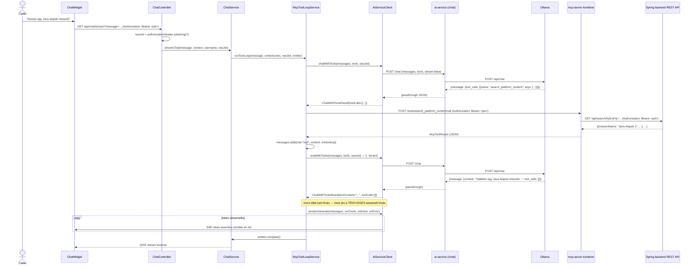
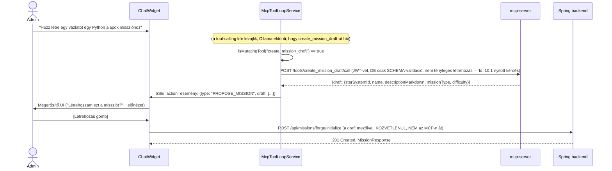

# PR #5 — MCP-szerver + tool-calling agent-hurok: implementációs architektúra-terv

> Ez a dokumentum a `plans/ai_chatbot_upgrade_2026.md` PR #5 szakaszát (és a 2026-08-25-i
> pontosítást az önálló `mcp-server` konténerről és HTTP/SSE transportról) bontja le
> osztály/metódus-szintre. Ugyanúgy **csak terv, nincs implementáció** — a `pr1_rag_chunking_
> architecture_2026.md` mintáját követi (numerikus szekciók, class/sequence diagramok,
> metódustáblák, pontos hook-pontok, tesztterv).
>
> **Előfeltétel más PR-októl**: ez a fázis a PR #2 (`HybridRetrievalService`,
> `AiServiceClient.generateJson()`) és a PR #3 (`ChatService.streamChat()`, `SseEmitter`-alapú
> streaming, `AiServiceClient.streamGenerate()`) meglévő infrastruktúrájára épül. Ahol ezekre
> hivatkozom, a saját architektúra-dokumentumaikra mutatok, nem duplikálom a leírásukat.

## 1. Új komponensek — csomag-elhelyezés

```
mcp-server/                                        (ÚJ, önálló top-level mappa + Docker service)
├── main.py                                         (mcp SDK-val épített HTTP/SSE szerver, 4 tool)
├── requirements.txt                                (mcp, httpx, uvicorn)
└── Dockerfile                                       (az ai-service/Dockerfile mintáját követve)

backend/src/main/java/com/legymernok/backend/
├── service/ai/
│   ├── AiServiceClient.java                        (ÚJ — lásd 12.2, PR #2-ben már bevezetett)
│   ├── ChatService.java                            (MÓDOSUL — streamChat() tool-hurokká bővül)
│   └── McpToolLoopService.java                      (ÚJ — a tool-hívó ciklus KÜLÖN osztályba
│                                                      szervezve, ld. 3. szakasz indoklás)
├── web/chat/
│   └── ChatController.java                         (MÓDOSUL — a nyers JWT kinyerése + továbbadása)
├── dto/chat/
│   ├── OllamaToolDefinition.java                    (ÚJ, record)
│   ├── OllamaToolCall.java                          (ÚJ, record)
│   └── McpToolResult.java                           (ÚJ, record)
```

**Tudatos döntés: a tool-hurok NEM közvetlenül a `ChatService`-be kerül, hanem egy külön
`McpToolLoopService`-be.** A `pr1_rag_chunking_architecture_2026.md` a `StarSystemService`
meglévő mintáját (JDBC-hívások közvetlenül a service-ben) követte, mert ott egy egyszerű,
lineáris logikáról volt szó. Itt viszont a `ChatService` a PR #2/#3 után már retrieval-t,
reranket, streamelést ÉS most egy több-körös, feltételes elágazásokkal teli tool-hurkot is
kombinálna egy metóduson belül — ez a `ChatService`-t túlterhelné egyetlen, nehezen tesztelhető
metódusba. A `McpToolLoopService` egyetlen felelőssége a "Ollama-tool_call → MCP-hívás →
üzenet-lista bővítése → újra-hívás" ciklus, a `ChatService` csak meghívja és a látható
szöveg-tokeneket streameli tovább. Ha inkább egybeépítve szeretnéd (kevesebb osztály, de
nagyobb `ChatService`), szólj — ez egy ízlés-döntés, nem kényszerítő technikai ok van mögötte.

## 2. Kritikus előfeltétel-vizsgálat: a nyers JWT jelenleg SEHOL nincs elmentve kérés-kiszolgálás közben

Megvizsgáltam a `JwtAuthenticationFilter.java`-t (`backend/src/main/java/com/legymernok/
backend/security/JwtAuthenticationFilter.java`), mert a PR #5 terve explicit megköveteli,
hogy minden tool-hívás **a beszélgető felhasználó saját JWT-jével** menjen a Spring REST
API felé. **Fontos felfedezés**: a filter kinyeri a nyers JWT-t (`jwt =
authHeader.substring(7)`, 41. sor), de csak arra használja, hogy betöltse a usert és
beállítsa a `SecurityContext`-et — a `UsernamePasswordAuthenticationToken` `credentials`
mezője **explicit `null`**-ra van állítva (65. sor: `new UsernamePasswordAuthenticationToken
(userDetails, null, ...)`). **A nyers JWT string sehol nincs elmentve** — sem a
`SecurityContext`-ben, sem request attribútumként — tehát a `ChatService`/`McpToolLoopService`
NEM tudja egyszerűen "kikérni" valahonnan a folyamat közepén.

**Megoldás (nem igényel a `JwtAuthenticationFilter` módosítást)**: a `ChatController` már
most is hozzáfér a nyers `HttpServletRequest`-hez (Spring MVC-ben `@RequestHeader` vagy
`HttpServletRequest` paraméterrel) — a JWT-t **közvetlenül a controller-szinten olvassuk ki
az `Authorization` fejlécből**, és paraméterként adjuk tovább egészen a tool-hívásig. Ez a
legkevesebb változtatással járó, legkevésbé kockázatos megoldás (nem nyúl a meglévő,
jól működő auth-filterhez), és konzisztens azzal, hogy a JWT amúgy is a kérés fejlécében van,
nem kell azt újra "kitalálni".

```java
// ChatController.java — bővítés
@GetMapping(value = "/stream", produces = MediaType.TEXT_EVENT_STREAM_VALUE)
@PreAuthorize("isAuthenticated()")
public SseEmitter streamChat(
        @RequestParam String message,
        @RequestParam(required = false) String context,
        @RequestHeader("Authorization") String authorizationHeader,   // "Bearer <jwt>"
        Authentication authentication) {
    String rawJwt = authorizationHeader.substring(7);  // ugyanaz a levágás, mint a filterben
    return chatService.streamChat(message, parseContext(context), authentication.getName(), rawJwt);
}
```

Ez **nem duplikálja** a `JwtAuthenticationFilter` validációs logikáját — mire ide eljut a
kérés, a `@PreAuthorize("isAuthenticated()")` már garantálja, hogy a JWT érvényes volt (a
filter validálta), a controller csak a MÁR validált nyers stringet olvassa ki újra, hogy
továbbadhassa.

## 3. `McpToolLoopService` — teljes metódustábla

| Metódus | Szignatúra | Mit csinál |
|---|---|---|
| `runToolLoop` | `void runToolLoop(String userMessage, List<String> contextLines, String userJwt, SseEmitter emitter)` | A fő belépési pont, `ChatService.streamChat()`-ből hívva. Ld. 3.1. |
| `buildToolDefinitions` | `List<OllamaToolDefinition> buildToolDefinitions()` | A 4 tool JSON-schema-alapú leírása, Ollama `/api/chat` `tools` mezőjéhez — statikus, nincs bemenete (a definíciók fixek). |
| `callMcpTool` | `McpToolResult callMcpTool(String toolName, Map<String, Object> arguments, String userJwt)` | HTTP POST a `mcp-server` konténerre (`http://mcp-server:8082/tools/{toolName}/call`), a JWT-t `Authorization` fejlécként továbbítva. Ld. 3.2. |
| `isMutatingTool` | `boolean isMutatingTool(String toolName)` | `true`, ha `toolName` = `"create_mission_draft"` — ez dönti el, hogy a tool eredménye SSE `action` eseményként megy-e a frontendnek (nem automatikus végrehajtás), vagy egyszerű `role:"tool"` üzenetként vissza Ollamának. |

### 3.1 `runToolLoop()` — a hurok pontos logikája

```
bemenet: userMessage, contextLines, userJwt, emitter (a ChatController-ből kapott SseEmitter)

1. messages = [
     {role: "system", content: SYSTEM_PROMPT + kontextus-sorok},
     {role: "user", content: userMessage}
   ]
2. tools = buildToolDefinitions()
3. iteration = 0
4. WHILE iteration < 10:
   a. response = aiServiceClient.chatWithTools(messages, tools, userJwt)
      (ld. 4. szakasz — ez NEM streamel, egy teljes Ollama-válasz jön vissza egyszerre,
      mert amíg a modell tool-hívásokat fontolgat, nincs mit a felhasználónak mutatni —
      CSAK az UTOLSÓ, tool-hívás nélküli végső válasz streamel, ld. 4.b lent)

   b. HA response.toolCalls() üres (a modell végleges, szöveges választ adott, nincs
      több tool-hívás):
        - EZ a válasz KERÜL STREAMELÉSRE a felhasználónak — de mivel a `chatWithTools()`
          nem streamel (4. szakasz indoklás), itt egy MÁSODIK, immár streamelő hívás
          szükséges: aiServiceClient.streamGenerate(...) UGYANAZZAL a messages-listával,
          hogy a válasz tokenenként jusson el a UI-hoz (ld. 6. szakasz "Nyitott kérdés" —
          ez egy tudatosan felvállalt dupla-hívás, ami extra latenciát/költséget jelent)
        - HA a `ctx.pageType()` FORM_FILLABLE (a PR #3 mintája szerint): extractAction()
          hívása a végső szövegre, `action` SSE-esemény küldése
        - emitter.complete(); return

   c. KÜLÖNBEN, minden toolCall-ra a response.toolCalls()-ban:
        i.   result = callMcpTool(toolCall.name(), toolCall.arguments(), userJwt)
        ii.  HA isMutatingTool(toolCall.name()):
                - NE fűzzük vissza a messages-be "sikeresen végrehajtva" formában —
                  helyette KÜLDJÜNK egy SSE `action` eseményt (`type: PROPOSE_MISSION`,
                  a tool eredménye mint payload), ÉS egy szintetikus tool-eredményt
                  fűzzünk a messages-be, ami jelzi a modellnek, hogy "a javaslat el lett
                  küldve a felhasználónak jóváhagyásra" (NEM hogy "létrehozva") — hogy a
                  modell a következő körben ne higgye tévesen, hogy a misszió már létezik
             KÜLÖNBEN (olvasó tool):
                - messages.add({role: "tool", tool_call_id: toolCall.id(),
                                 content: result.contentAsJson()})
        iii. HA toolCall.name() == "navigate_to":
                - KÜLÖN, azonnali SSE `action` esemény (`type: NAVIGATE`), NEM várjuk meg
                  a hurok végét — ez egy UI-vezérlő jel, nem adatot visszaadó tool (ld. a
                  fő terv megjegyzése: "technikailag nem egy adatot visszaadó tool")
   d. iteration++

5. HA a hurok 10 iteráció után sem jutott végleges válaszhoz:
   - log.warn("Tool loop max iteráció elérve, felhasználó: {}", username)
   - SSE hibaüzenet-esemény küldése a felhasználónak (ld. 6. szakasz nyitott kérdés —
     a pontos szöveg Norberttel egyeztetendő)
   - emitter.complete()
```

**Fontos, amit a fenti (4.b pont) explicit kimond, mert a fő terv nem tér ki rá**: az Ollama
natív tool-calling API-ja (`/api/chat`, nem `/api/generate`) **NEM streamel jól tool-hívásokkal
kombinálva** egyszerű módon — amíg a modell tool-hívásokat fontolgat, nincs "látható" szöveg,
amit érdemes lenne streamelni. Ezért a terv szerint **csak a végső, tool-hívás nélküli kör**
streamel ténylegesen (a `streamGenerate()`-en keresztül, PR #3-ból), a köztes tool-döntő
körök egy szinkron `chatWithTools()` hívással mennek. Ez azt jelenti, hogy egy több-körös
tool-használat esetén a felhasználó egy darabig **semmilyen visszajelzést nem lát** (amíg a
tool-hívások lezajlanak), majd egyszerre kezdődik a streamelt végső válasz — ez UX-szempontból
lehet, hogy egy köztes "Keresek..."/"Dolgozom rajta..." típusú jelzést igényelne, amit a terv
jelenleg NEM specifikál (ld. 6. szakasz).

### 3.2 `callMcpTool()` — pontos HTTP-hívás

```java
private McpToolResult callMcpTool(String toolName, Map<String, Object> arguments, String userJwt) {
    try {
        var req = RequestEntity
                .post(mcpServerUrl + "/tools/" + toolName + "/call")
                .contentType(MediaType.APPLICATION_JSON)
                .header("Authorization", "Bearer " + userJwt)
                .body(Map.of("arguments", arguments));
        var response = restTemplate.exchange(req, McpToolResult.class);
        return response.getBody();
    } catch (HttpClientErrorException.Forbidden e) {
        // A Spring backend 403-at adott a tool által hívott REST endpointra —
        // ez azt jelenti, hogy a felhasználónak nincs joga az adott művelethez
        return McpToolResult.forbidden(toolName);
    } catch (Exception e) {
        log.error("MCP tool call failed: {} — {}", toolName, e.getMessage());
        return McpToolResult.error(toolName, "A(z) " + toolName + " eszköz jelenleg nem érhető el.");
    }
}
```

**A `mcp-server` elérhetetlensége** (a konténer nem fut/nem válaszol) ugyanide fut be
(generic `catch (Exception e)`) — a tool-hurok NEM omlik össze, a modell egy hiba-eredményt
kap a tool-hívásra, és a saját belátása szerint tovább válaszolhat anélkül, vagy jelezheti a
felhasználónak, hogy egy funkció nem elérhető. Ez összhangban van az `ai-os` `max_tool_
iterations` védőhálójával — egyetlen tool-hiba nem állítja meg a teljes beszélgetést.

## 4. `AiServiceClient.chatWithTools()` — pontos szignatúra és NDJSON→objektum leképezés

```java
public record OllamaToolCall(String id, String name, Map<String, Object> arguments) {}
public record ChatWithToolsResult(String textContent, List<OllamaToolCall> toolCalls) {}

public ChatWithToolsResult chatWithTools(
        List<Map<String, Object>> messages,
        List<OllamaToolDefinition> tools,
        String userJwt   // NEM a Spring backend felé megy innen — csak azért kapja meg,
                          // hogy a McpToolLoopService egységesen adja át, ténylegesen a
                          // callMcpTool()-ban használódik, ide csak "átfut"
) {
    var payload = Map.of(
        "model", chatModel,
        "messages", messages,
        "tools", tools,
        "stream", false   // <-- ld. 3.1 indoklás: a tool-döntő kör NEM streamel
    );
    var req = RequestEntity.post(aiServiceUrl + "/chat")
            .contentType(MediaType.APPLICATION_JSON)
            .body(payload);
    var response = restTemplate.exchange(req, Map.class);
    // az Ollama /api/chat válasza: {"message": {"content": "...", "tool_calls": [...]}}
    // a parse-olás pontos részletei az ai-service oldali /chat proxy-végpont válasz-
    // formátumától függenek — ld. 5. szakasz, ÚJ végpont az ai-service-ben
}
```

**Ez egy ÚJ metódus az `AiServiceClient`-en**, ami a PR #2-ben bevezetett osztályt bővíti
(`generateJson()` már ott van) — nem hoz létre új osztályt.

## 5. `ai-service/main.py` — új `/chat` proxy-végpont

A fő terv nem tér ki rá explicit, de szükséges: az `ai-service` jelenlegi `/generate`
végpontja Ollama `/api/generate`-jét hívja (szöveg-kiegészítés), a natív tool-calling viszont
Ollama **`/api/chat`** végpontján érhető el (üzenet-lista + `tools` mező, más válasz-formátum).
Ehhez az `ai-service`-nek szüksége van egy **új, dedikált proxy-végpontra**:

```python
@app.post("/chat")
async def chat(request: ChatWithToolsRequest):
    payload = {
        "model": request.model,
        "messages": request.messages,
        "tools": request.tools,
        "stream": False,
    }
    async with httpx.AsyncClient() as client:
        resp = await client.post(f"{OLLAMA_URL}/api/chat", json=payload, timeout=120)
        return resp.json()  # egyszerű passthrough, nincs transzformáció
```

Ez egy egyszerű, statikus (nem streamelő) passthrough — nincs hozzá új dependency
(`httpx` már megvan a PR #3 miatt). **Ezt a fő terv "Függőségek" táblázata és a PR #5
fájllistája jelenleg NEM sorolja fel explicit** — érdemes a fő tervbe is bejegyezni, hogy ne
maradjon ki implementáláskor.

## 6. `mcp-server/main.py` — a 4 tool JSON-schema + implementáció

```python
from mcp.server import Server
from mcp.server.sse import SseServerTransport   # HTTP/SSE transport, nem stdio (ld. fő terv)
import httpx, os

BACKEND_URL = os.environ["BACKEND_URL"]  # http://backend:8080

server = Server("legymernok-tools")

TOOLS = [
    {
        "name": "search_platform_content",
        "description": "Keresés a platform tartalmában (missziók, csillagrendszerek) — hibrid vektor+szöveges kereséssel.",
        "inputSchema": {
            "type": "object",
            "properties": {"query": {"type": "string"}, "topK": {"type": "integer", "default": 5}},
            "required": ["query"],
        },
    },
    {
        "name": "get_cadet_progress",
        "description": "Egy kadét haladásának lekérdezése (csak admin JWT-vel sikeres).",
        "inputSchema": {
            "type": "object",
            "properties": {"cadetId": {"type": "string"}},
            "required": ["cadetId"],
        },
    },
    {
        "name": "create_mission_draft",
        "description": "Misszió-vázlat LÉTREHOZÁSÁNAK JAVASLATA — nem hajtja végre automatikusan.",
        "inputSchema": {
            "type": "object",
            "properties": {
                "starSystemId": {"type": "string"},
                "name": {"type": "string"},
                "descriptionMarkdown": {"type": "string"},
                "missionType": {"type": "string", "enum": ["CODING", "QUIZ", "CONTENT", "FILL_IN_BLANK", "CIRCUIT_SIMULATION"]},
                "difficulty": {"type": "string", "enum": ["EASY", "MEDIUM", "HARD", "EXPERT"]},
            },
            "required": ["starSystemId", "name", "missionType", "difficulty"],
        },
    },
    {
        "name": "navigate_to",
        "description": "UI-navigáció javaslata egy adott oldalra (NEM adatlekérdezés).",
        "inputSchema": {
            "type": "object",
            "properties": {"page": {"type": "string"}},
            "required": ["page"],
        },
    },
]

async def call_backend(method: str, path: str, jwt: str, json_body: dict | None = None) -> dict:
    async with httpx.AsyncClient() as client:
        resp = await client.request(
            method, f"{BACKEND_URL}{path}",
            headers={"Authorization": f"Bearer {jwt}"},
            json=json_body, timeout=30,
        )
        if resp.status_code == 403:
            return {"error": "forbidden", "message": "Nincs jogosultságod ehhez a művelethez."}
        resp.raise_for_status()
        return resp.json()

@server.call_tool()
async def handle_tool_call(name: str, arguments: dict, jwt: str) -> dict:
    match name:
        case "search_platform_content":
            return await call_backend("GET", f"/api/search/hybrid?q={arguments['query']}&topK={arguments.get('topK', 5)}", jwt)
        case "get_cadet_progress":
            # ⚠️ LD. 6.1 — NINCS MA ILYEN BACKEND-VÉGPONT, ÚJAT KELL HOZZÁ ÍRNI
            return await call_backend("GET", f"/api/admin/cadets/{arguments['cadetId']}/progress", jwt)
        case "create_mission_draft":
            return await call_backend("POST", "/api/missions/forge/initialize", jwt, json_body=arguments)
        case "navigate_to":
            return {"navigate": arguments["page"]}  # nincs backend-hívás, tisztán UI-jel
```

**A fenti kód-vázlat illusztráció, nem végleges implementáció** — a pontos `mcp` SDK
HTTP/SSE-transport bekötési módja (`SseServerTransport` API-ja, hogyan adjuk át neki a JWT-t
a `call_tool` handlerbe) implementáció közben, a tényleges `mcp` csomag dokumentációjának
elolvasásával pontosítandó — ezt **nem tudom innen, kódolvasásból** megállapítani, mert a
`legymernok` repóban egyáltalán nincs `mcp` SDK-t használó kód (az `ai-os` mintája stdio-t
használ, más API-felület).

### 6.1 ⚠️ Fontos hiányosság, amit a kódvizsgálat talált: nincs `get_cadet_progress` backend-végpont

Végignéztem a meglévő admin-facing endpointokat (`CadetController.java`,
`MissionController.java`, `StarSystemController.java`) — van `GET /api/users` (lista),
`GET /api/users/{id}` (egy user alapadata), és a jelenleg BEJELENTKEZETT userre vonatkozó
`GET /api/missions/my-missions` / `GET /api/star-systems/with-progress`. **Nincs olyan
admin-facing végpont, ami egy TETSZŐLEGES kadét (nem a hívó saját maga) teljes
misszió-haladását adná vissza egyben.** Ez azt jelenti, hogy a `get_cadet_progress` tool
implementálásához **egy ÚJ Spring-endpoint is kell** (pl. `GET /api/admin/cadets/{cadetId}/
progress`, `@PreAuthorize("hasAuthority('user:read')")`, a `CadetMissionRepository` és a
`MissionGroupProgressRepository` meglévő lekérdezéseit újrahasznosítva, hasonlóan a
`StarSystemService.mapToResponseWithProgress()` mintájához, csak egy tetszőleges `cadetId`-ra
paraméterezve, nem a jelenlegi userre). **Ez a fő terv PR #5 szakaszában NINCS
megemlítve** — ott implicit feltételezi, hogy "meglévő admin `user`/`mission` lekérdező
végpontok" elegendők, de ez tévedés, egy új endpoint tényleges backend-munkát igényel.

## 7. `docker-compose.yml` — a `mcp-server` service (a fő tervből átvéve, változatlan)

```yaml
mcp-server:
  build:
    context: ./mcp-server
    dockerfile: Dockerfile
  container_name: legymernok-mcp-server
  restart: always
  ports:
    - "8082:8082"
  environment:
    BACKEND_URL: http://backend:8080
  depends_on:
    - backend
  networks:
    - legymernok-net
```

Ez már a fő tervben (`ai_chatbot_upgrade_2026.md`) pontosan meg van adva — itt csak
megismételve a teljesség kedvéért, nincs változtatás rajta.

## 8. Class diagram

```mermaid
classDiagram
    class ChatController {
        +streamChat(String message, String context, String authorizationHeader, Authentication auth) SseEmitter
    }

    class ChatService {
        -McpToolLoopService toolLoopService
        +streamChat(String message, ChatContextDto context, String username, String userJwt) SseEmitter
    }

    class McpToolLoopService {
        -AiServiceClient aiServiceClient
        -RestTemplate restTemplate
        +runToolLoop(String userMessage, List~String~ contextLines, String userJwt, SseEmitter emitter) void
        +buildToolDefinitions() List~OllamaToolDefinition~
        -callMcpTool(String toolName, Map arguments, String userJwt) McpToolResult
        -isMutatingTool(String toolName) boolean
    }

    class AiServiceClient {
        +chatWithTools(List messages, List~OllamaToolDefinition~ tools, String userJwt) ChatWithToolsResult
        +streamGenerate(...) void
        +generateJson(String prompt, String systemPrompt) JsonGenerateResult
    }

    class McpServerContainer {
        <<external Python/mcp SDK container>>
        +POST /tools/search_platform_content/call
        +POST /tools/get_cadet_progress/call
        +POST /tools/create_mission_draft/call
        +POST /tools/navigate_to/call
    }

    class SpringBackendRestApi {
        <<self-reference, meglévő REST endpointok>>
        +GET /api/search/hybrid
        +GET /api/admin/cadets/{id}/progress
        +POST /api/missions/forge/initialize
    }

    ChatController --> ChatService : streamChat()
    ChatService --> McpToolLoopService : runToolLoop()
    McpToolLoopService --> AiServiceClient : chatWithTools()
    McpToolLoopService --> McpServerContainer : HTTP (callMcpTool)
    McpServerContainer --> SpringBackendRestApi : HTTP, userJwt-vel
```

## 9. Sequence diagram — kadét megkérdezi a chatbotot, ami tool-t hív



## 10. Sequence diagram — mutáló tool (`create_mission_draft`) javaslat-folyamata



### 10.1 ⚠️ Nyitott kérdés Norbertnek — a `create_mission_draft` tool TÉNYLEGESEN hívja-e a backendet, vagy csak "előnézetet" ad?

A fő terv szerint a tool "NEM hívja meg automatikusan" a `POST /api/missions/forge/
initialize`-t — de **nem specifikálja egyértelműen**, hogy a tool implementációja
(`mcp-server` oldalon) egyáltalán HÍVJA-e a backendet egy "csak validálás, nem mentés" módban
(pl. hogy ellenőrizze, létezik-e a `starSystemId`, van-e jogosultsága az adminnak), vagy a
tool **kizárólag a paramétereket adja vissza változtatás nélkül**, és a TÉNYLEGES backend-hívás
csak a felhasználó explicit jóváhagyása UTÁN, a frontendből történik (ahogy a 10. szakasz
diagramja feltételezi — ez a biztonságosabb, egyszerűbb út, amit javaslok, de Norbertnek kell
megerősítenie). Ha a tool maga hívná a backendet egy "dry-run" módban, ahhoz a
`MissionController`/`MissionService`-nek egy ÚJ, validáló-de-nem-mentő módot kellene kapnia —
ez jelentősen nagyobb munka, és a fő terv sehol nem jelzi, hogy ezt akarnák. **Javasolt
válasz, amit megerősítésre várok**: a tool NE hívjon semmilyen backendet, pusztán
visszaadja/formázza a modell által megadott mezőket, a tényleges `POST .../initialize`
kizárólag a felhasználó jóváhagyása után, a frontendből fusson.

## 11. Tesztterv

| Teszteset | Osztály | Mit ellenőriz |
|---|---|---|
| `runToolLoop_noToolCalls_streamsDirectly` | `McpToolLoopServiceTest` | Ha az első `chatWithTools()` válasz üres `toolCalls`-t ad, azonnal `streamGenerate()`-re vált, nincs plusz iteráció |
| `runToolLoop_oneReadTool_appendsResultAndContinues` | `McpToolLoopServiceTest` | Egy olvasó tool-hívás után a `messages` lista bővül egy `role:"tool"` bejegyzéssel, és újra hívja `chatWithTools()`-t |
| `runToolLoop_mutatingTool_sendsProposeMissionAction_neverCallsBackendDirectly` | `McpToolLoopServiceTest` | `create_mission_draft` esetén SSE `action` esemény megy, DE a `McpToolLoopService` maga SOSEM hív `POST /api/missions/forge/initialize`-t automatikusan |
| `runToolLoop_navigateToTool_sendsImmediateNavigateAction` | `McpToolLoopServiceTest` | `navigate_to` azonnali, önálló SSE-eseményt vált ki, nem várja meg a hurok végét |
| `runToolLoop_maxIterationsExceeded_sendsErrorAndCompletes` | `McpToolLoopServiceTest` | 10 iteráció után, ha még mindig van `toolCalls`, hibaüzenet + `emitter.complete()`, nem végtelen ciklus |
| `callMcpTool_mcpServerUnreachable_returnsErrorResultNotException` | `McpToolLoopServiceTest` | Mockolt `RestTemplate` `ResourceAccessException`-t dob → a hurok nem áll le, `McpToolResult.error(...)`-t kap a modell |
| `callMcpTool_backendReturns403_returnsForbiddenResult` | `McpToolLoopServiceTest` | Egy nem-admin kadét `get_cadet_progress`-t próbál → a Spring backend 403-at ad, ezt a `McpToolResult` helyesen jelzi, nem dob kivételt a hívó felé |
| `chatWithTools_parsesToolCallsFromOllamaResponse` | `AiServiceClientTest` | A `/chat` végpont mock-válaszából helyesen parse-olja a `tool_calls` listát |
| `test_search_platform_content_forwardsJwt` | `mcp-server/tests/test_tools.py` (pytest, mockolt `httpx`) | A JWT helyesen kerül `Authorization` fejlécbe a backend-hívásnál |
| `test_create_mission_draft_neverPersistsAutomatically` | `mcp-server/tests/test_tools.py` | A tool implementációja (a 10.1 nyitott kérdés eldöntött válasza szerint) nem hív mentő endpointot |
| `test_forbidden_propagates_as_error_not_exception` | `mcp-server/tests/test_tools.py` | Backend 403 → a tool eredménye egy strukturált hiba, nem egy elszállt exception |
| `test_health_check` | `mcp-server/tests/test_health.py` | A HTTP/SSE szerver ténylegesen elindul és válaszol egy alap health-endpointra |

**Kézi ellenőrzés (Norbi, itt nem elvégezhető)**: valódi többkörös tool-használat élő
Ollamával, function-calling-képes modellel (`qwen2.5`/`llama3.1`), ahogy a fő terv is írja —
plusz explicit annak ellenőrzése, hogy a `create_mission_draft` UI-jóváhagyás nélkül TÉNYLEG
nem hoz létre semmit (ez egy biztonságkritikus viselkedés, amit élőben is látni kell, nem
elég a mockolt teszt).

## 12. Nyitott kérdések Norbertnek — összefoglalva

1. **(10.1)** A `create_mission_draft` tool hívjon-e egyáltalán backendet (akár csak
   validáló módban), vagy pusztán adatot formázzon, és a tényleges mentés csak a
   felhasználói jóváhagyás után, a frontendből történjen? **Javasolt válasz: az utóbbi.**
2. **(6.1)** A `get_cadet_progress` toolhoz **nincs meglévő backend-végpont** — kell egy új
   `GET /api/admin/cadets/{cadetId}/progress`-szerű endpoint. Ez a fő tervben nincs
   beárazva/megemlítve — érdemes-e ezt is felvenni a PR #5 becslésébe (plusz óra), vagy ezt
   egy külön, kisebb PR-ban intézzük el előbb?
3. **(3.1)** A tool-döntő körök (amíg a modell tool-hívásokat fontolgat) NEM streamelnek —
   a felhasználó egy darabig semmilyen visszajelzést nem lát. Kell-e egy köztes "Keresek a
   platformon..."/"Dolgozom rajta..." típusú UI-jelzés minden tool-hívás előtt (ez a
   frontend + a `McpToolLoopService` egy plusz SSE-eseményét igényelné), vagy elfogadható,
   hogy a felhasználó csak a végső válasznál lát mozgást?
4. **(3.1, hurok-vég)** A 10 iterációs limit elérésekor pontosan milyen szöveget lásson a
   felhasználó? (Pl. "Sajnálom, nem sikerült befejeznem a kérésed feldolgozását." — vagy
   valami konkrétabb.)
5. Az `mcp` Python SDK HTTP/SSE-transportjának **pontos API-ja** (hogyan adjuk át a JWT-t a
   `call_tool` handlerbe, session-kezelés stb.) implementáció közben, a csomag aktuális
   dokumentációjából pontosítandó — ezt kódolvasásból nem lehetett megállapítani, mert a
   repóban nincs rá meglévő minta (az `ai-os` stdio-t használ, más felület).
